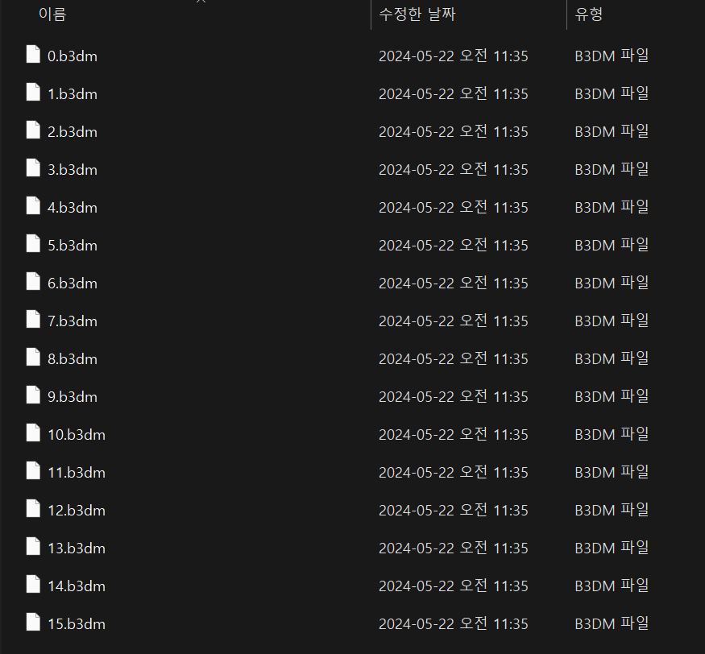

# 3D Tiles 개념정리 

---

>[참고 사이트1](https://github.com/CesiumGS/3d-tiles)

## 3D Tiles

### 정의

1. 3D Tiles는 데스크톱, 웹 및 모바일 애플리케이션 전반에 걸쳐 대규모의 이기종 3D 지리 공간 콘텐츠를 공유, 시각화, 융합 및 상호 작용하기 위한 개방형 사양이다. 
2. 복잡한 3D 정보에 더 쉽게 액세스하고 상호 운용 가능하며 유용하게 만들 수 있다. 

### 구조


### tileset.json

1. 3D 타일셋의 루트 파일로, 타일셋의 계층 구조와 메타데이터를 정의한다. 

2. 타일셋을 구성하는 각 타일의 위치, 범위, 레벨 오브 디테일(LOD), 그리고 해당 타일이 참조하는 실제 3D 콘텐츠 파일(`.b3dm`, `.i3dm`, `.pnts`, `.cmpt` 등)을 설명한다. 

3. 구조

   1. `asset`: 타일셋의 버전 정보 등 메타데이터를 포함
   2. `geometricError`: 타일셋의 전체 기하학적 오류 허용 범위를 정의한다. 
   3. `root`: 타일셋의 루트 타일을 정의하며, 하위 타일들이 중첩된 구조를 가집니다. 루트 타일은 다음과 같은 속성을 가진다. 
      - `boundingVolume`: 타일의 경계 영역을 정의
      - `geometricError`: 해당 타일의 기하학적 오류 허용 범위를 정의
      - `refine`: 타일의 정제 방법을 정의 (`ADD` 또는 `REPLACE`).
      - `content`: 타일의 실제 3D 콘텐츠 파일에 대한 참조 (주로 `.b3dm` 파일).
      - `children`: 하위 타일들에 대한 배열로, 계층 구조를 형성

4. 예제 

   ```js
   {
     "asset": {
       "version": "1.0"
     },
     "geometricError": 500,
     "root": {
       "boundingVolume": {
         "region": [
           -1.31968, 0.69887, -1.31945, 0.69912, 0, 88
         ]
       },
       "geometricError": 250,
       "refine": "REPLACE",
       "content": {
         "uri": "root.b3dm"
       },
       "children": [
         {
           "boundingVolume": {
             "region": [
               -1.31968, 0.69887, -1.31956, 0.69899, 0, 44
             ]
           },
           "geometricError": 125,
           "content": {
             "uri": "child.b3dm"
           }
         }
       ]
     }
   }
   ```

### tiles 

1. b3dm 으로 구성되어 있다. 
2. b3dm은 실제 3D 모델 데이터를 포함하는 바이너리 파일이다. 
   1. 여러 개의 3D 모델을 배치(batch) 형식으로 포함할 수 있어, 렌더링 효율을 높이고 스트리밍 성능을 향상시킨다.



