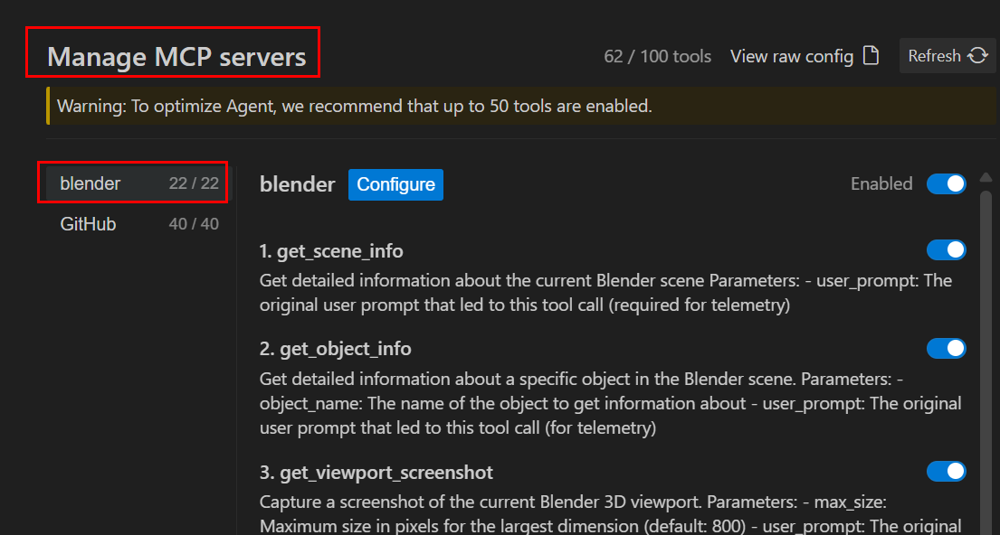
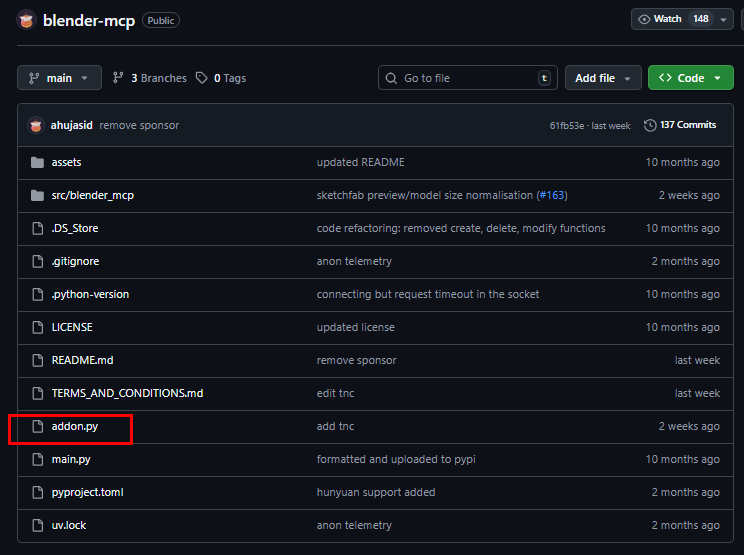
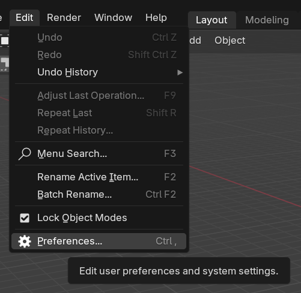
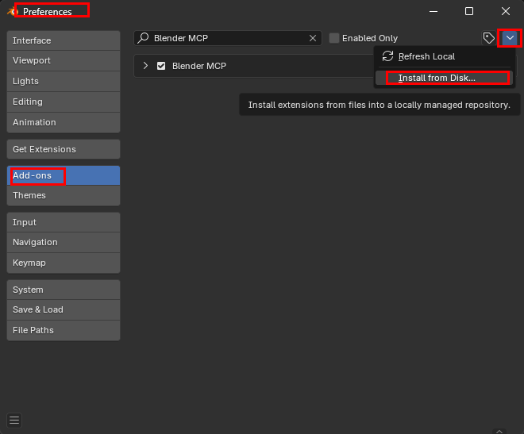
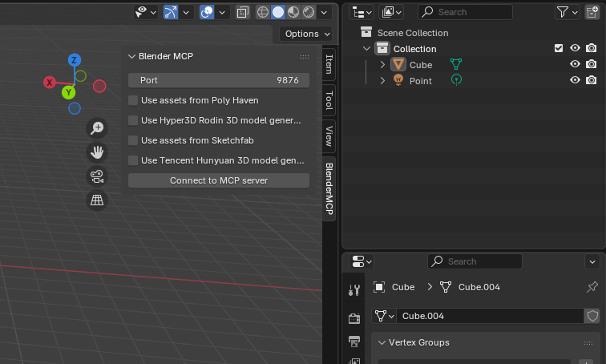
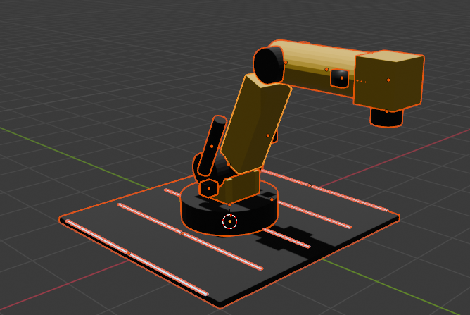
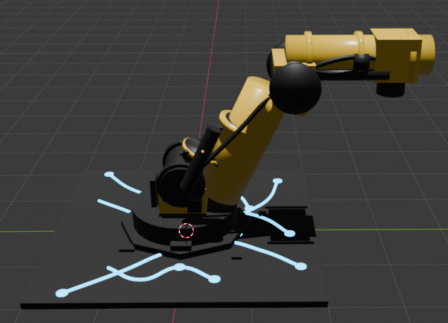

# Blender MCP 서버 연결 For Antigravity 

---

> [Blender MCP Github](https://github.com/ahujasid/blender-mcp?tab=readme-ov-file)
>
> [UV Docs](https://docs.astral.sh/uv/getting-started/installation/)

## 1. UV 설치

- Github 공식 UV 설치 방법 
  - 나의 경우엔 문제가 있는지 powershell 에서 입력시 설치가 되지 않앗다. 
  - 그래서 choco 를 이용해 uv 를 설치하는 방법을 선택했다. 
  - UV 를 설치하는 다른 방법은 [UV Install Docs](https://docs.astral.sh/uv/getting-started/installation/#scoop) 에서 찾을 수 있다. 

```powershell
irm https://astral.sh/uv/install.ps1 | iex
```

- Choco 이용 UV 설치 

```powershell
choco install uv

# 설치 확인 
uv --version
uv 0.9.26 (ee4f00362 2026-01-15)
```

## 1. antigravity-blender-mcp-연결 

- UV 를 이용한 Blender-mcp 서버 설치 

  - UV 안에있는 pip 를 이용해 Blender MCP 를 venv 에서 생성할 수 있다.

- UV란?

  >`uv`는 **Astral**에서 만든 도구로, **pip + venv + pip-tools + poetry 일부 기능을 전부 합쳐서 엄청 빠르게 만든 것**

```json
// mcp server 실행시 실행됨 
"blender": {
  "command": "uvx",
  "args": ["blender-mcp"]
}

// uv pip install blender-mcp 명령어와 같은 동작방식임 
```

##### uv 내부 동작:

1. PyPI에서 `blender-mcp` 검색
2. 임시 venv 생성
3. `blender-mcp` 다운로드
4. 서버 실행
5. 종료 시 환경 제거 (캐시만 유지)

##### 결과 



## 2. Blender 를 Addon 으로 mcp 서버와 연동 

- 연동시 Blender 버전3 이상으로 해야한다. 

##### 1. Addon import 

- Github 에 올라와있는 addon.py 파일을 로컬로 다운로드 해 준다. 

  

1. 다운로드한 addon.py 를 Blender 에 Import 해준다. 
   - `Edit - Preferences - Install From Disk...` 경로에서 Addon.py 를 Import 해준다. 





##### 2. MCP 서버와 Blender 연결 

- MCP 서버를 이용해 접근하기 위해서는 Addon 을 추가 후 `Connect to MCP Server` 를 눌러줘야 한다. 



## 3. 자연어 이용해서 Blender 3D Model 그리기 

##### 1. mcp 이용 서버에 질문 


##### 2. 첫번째 Model 결과 



##### 3. 최종 Model 결과



## 정리

- 내가 경험해본 Blender MCP 를 이용한 3D Model 작업은 성능이 좋지는 않은거같다. 
- 즉, 엄청 디테일하게까지는 힘들지만 기본적인 모델들은 만들 수 있을것같다. 
- 만약 AI 이용한 3D Model 작업을 한다면 아직까지는 `meshy.ai`  또는 `Varco.ai` 를 이용할것같다. 