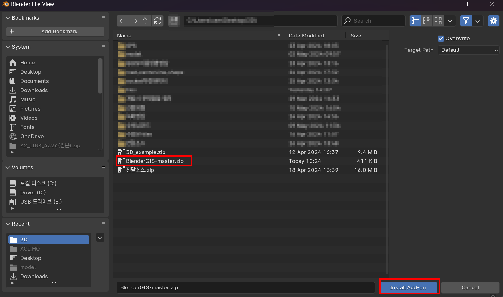
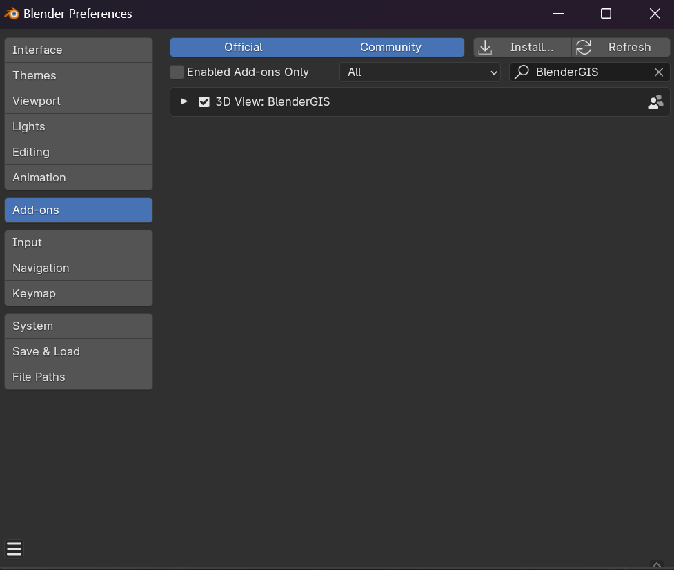
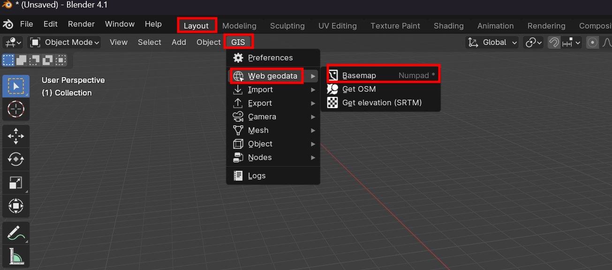
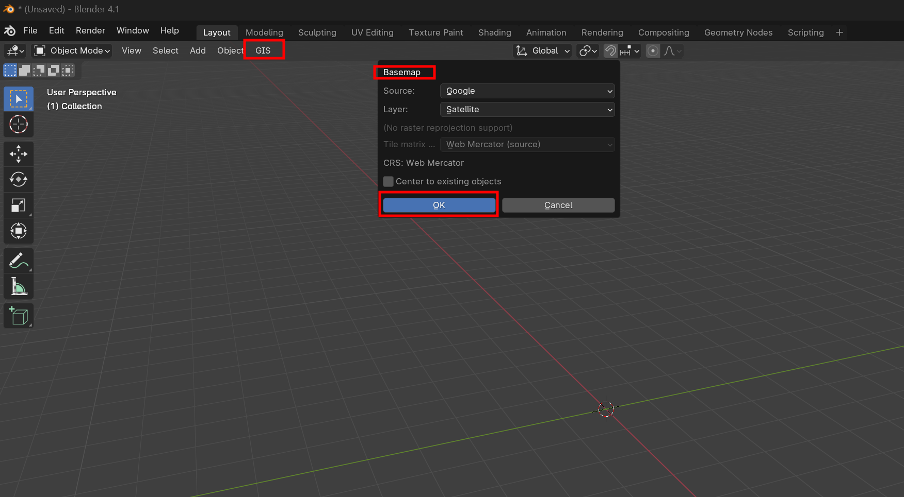
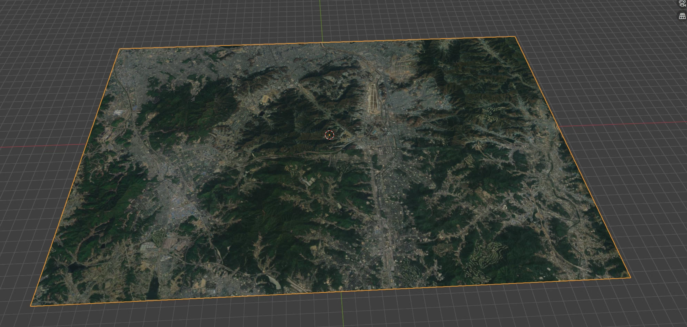

# BlenderGIS 사용법 정리

---

>[한국어 블랜더 기초 영상](https://www.youtube.com/watch?v=lUkiP31l-jQ)
>
>[블랜더 gis 영상](https://www.youtube.com/watch?v=u8Fg-u-VWUE)
>
>[블랜더 gis export 영상](https://www.youtube.com/watch?v=iRX50ETCWIU)

## 1. Blender gis 플러그인 다운로드

1. [https://github.com/domlysz/BlenderGIS](블랜더 깃허브 주소)
   1. code -> download Zip 클릭 

## 2. Blender 에 플러그인 추가 

1. blender 의 File 목록 클릭 -> Preferences -> Add-Ons -> Install an add-on -> Blender GIS Zip 선택 후 install 





## 3. GIS 이용해 Map 추가 

1. Blender 의 Layout으로 이동 -> GIS 플러그인 -> Web geodata -> BaseMap -> 자신이 원하는 Map 선택 
   1. 단축키 `G` 
      1. 검색 가능 
      2. ex) seoul
   2. 단축키 `E * 3` 
      1. 해당지역 Fix







## 4. 지형높이 추가 

1. Layout 탭 선택 -> gis -> Web geodata -> Get elevation (SRTM) -> Marine-geo.org GMRT 선택 
   1. get elevation 의 다른 Server는 API Key가 필요함 


## 5-1. Building 및 road 추가 

1. Layout 탭 선택 -> gis -> Web geodata -> Get OSM -> Ways탭 -> 필요 요소 선택 후 OK 
   1. 여기서 `Elevation from object` 을 선택해야 **지형**에 맞게 요소가 추가된다. 


## 5-2 `too large extend` Error 

1. `too large extend` Error 
   1. [에러 내용 참고 사이트](https://github.com/domlysz/BlenderGIS/issues/160)
   2. [blender gis 파일 편집 참고 영상](https://www.youtube.com/watch?v=29OyueqXdvQ)
   3. OSM 건물 추가시 해당 에러가 발생할 수 있다. 
   4. 이 에러는 너무 많은 범위에 대한 OSM 추가시 발생한다. 
2. 해결방법
   1. 범위를 좁게 변경 
   2. OSM범위 제한 코드 변경 
      1. [코드 변경 부분](https://github.com/domlysz/BlenderGIS/blob/0c00bc361d05599467174b8721d4cfeb4c3db608/operators/io_import_osm.py#L655)


## 6. 편집모드 

### 건물 윤곽선 

1. 건물 object 선택 -> 오른쪽 상단의 `viewport shading` -> Cavity -> type을 screen 으로 변경 


### 개별 건물 높이 조절 

1. 건물 object 선택 -> 편집모드 단축키 `Tab` -> Mode를 `Face Mode` 로 변경 -> 원하는 건물 표면 선택 후 조절 


## 7. 좌표계 설정 

### 주의할점

1. Blender는 자체 Python 환경을 사용하므로, Blender에서 제공하는 Python 실행 파일을 사용하여 라이브러리를 설치해야 한다. 
   1. [blender python API](docs.blender.org/api/current/info_quickstart.html)

### CRS 추가 

1. 요소들의 좌표정보가 필요한데, 이때 좌표계 CRS (Coordinate Reference Systems) 가 필요하다. 
   1. 좌표계는 공간상에서 객체의 위치를 표현하기 위한 방법이다. 

2. 좌표체계는 크게 **지리좌표계**와 **평면좌표계**로 분류된다. 
3. 지리좌표계 (geographical coordinate system)
   1. **경도, 위도**로 나타내는 절대 위치 좌표계
   2. 본초자오선과 적도면을 기준으로 경도, 위도를 결정
   3. 고도 정보를 통해 3차원으로 나타낼 수도 있음
4. 평면좌표계 (planar coordinate system)
   1. **X-Y축**으로 구성된 평면-직각 좌표계가 일반적으로 사용됨
   2. 다양한 투영법에 따라 평면 좌표를 정의
   3. 3차원 지구를 2차원에 투영하면 왜곡이 발생 --> 분석하고자 하는 좁은 지역 (관심지역)에서 좌표를 정의할 때 사용
   4. 투영 방법에 따라 지역별로 왜곡의 정도가 달라지는데, 왜곡이 발생하지 않을 수는 없어 최소화 시켜야 함

### 새로운 좌표계 추가 

1. BlenderGIS -> Preferences -> Spatial Reference Systems -> Add -> Search체크 -> Query 에 추가할 좌표계 입력 (ex. EPSG:4326)
2. 새 좌표계 추가된것은 BaseMap => CRS에서 확인 가능 


### GDAL연결 

1. 연결이유 

   1. GDAL (Geospatial Data Abstraction Library)은 지리 공간 데이터의 처리 및 변환을 위한 오픈 소스 라이브러리이다. 
   2. GIS의 Basemap에 있는 CRS 를 WGS84 lation 으로 변경하려면 GDAL 을 설치해야 한다. 
      1. `Please install gdal to enable raster reprojection support` 에러가 발생해서 GDAL을 설치해야함 

2. 관련 설치 방법

   1. [BlenderGIS 의 GDAL 설치 방법](https://github.com/domlysz/BlenderGIS/wiki/How-to-install-GDAL)
   2. [윈도우 GDAL 설치 방법](https://velog.io/@dailylifecoding/how-to-install-gdal-with-gisinternals-gdal-binary)

3. blender 내에 있는 python에 GDAL 을 설치해야한다. 

   1. blender의 `/python/bin` 위치에서 `PowerShell 관리자` 이용해서 다음 명령어 사용 

      1. `/python/bin` 위치에 GDAL, numpy 관련 whl 파일을 다운로드 한 다음 명령어 사용 

   2. GDAL 설치 

      ```bash
      // 현재 python 버전에 맞는 GDAL 찾아서 다운로드 해야함 
      // => 여기서 cp311 이 python 3.11 버전을 뜻함 
      ./python.exe -m pip install GDAL-3.4.3-cp311-cp311-win_amd64.whl
      ```

   3. numpy 설치

      1. [numpy whl 파일 다운로드](https://mirrors.aliyun.com/pypi/simple/numpy/)

         ```bash
         // 버전에 맞는 numpy 찾아서 다운로드 해야함 
         ./python.exe -m pip install numpy-1.23.2-cp311-cp311-win_amd64.whl
         ```

4. Error 발생 

   1. `pip install gdal` 시 발생 에러 

      ```cmd
      note: This error originates from a subprocess, and is likely not a problem with pip.
      ERROR: Failed building wheel for gdal
      Failed to build gdal
      ERROR: Could not build wheels for gdal, which is required to install pyproject.toml-based projects
      ```

   2. `GDAL is already installed with the same version as the provided wheel.`

      ```bash
      // 이미 gdal 설치되어있다고 하면 해당 명령어사용해서 다시 설치 
      ./python.exe -m pip install --force-reinstall GDAL-3.4.3-cp311-cp311-win_amd64.whl
      ```

      

