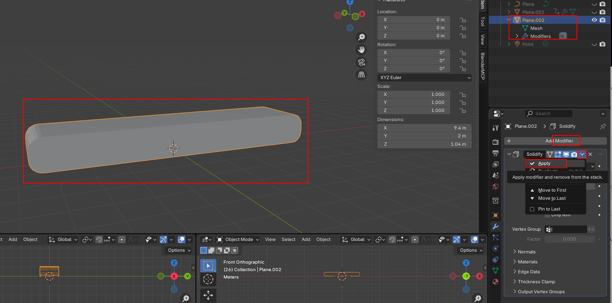
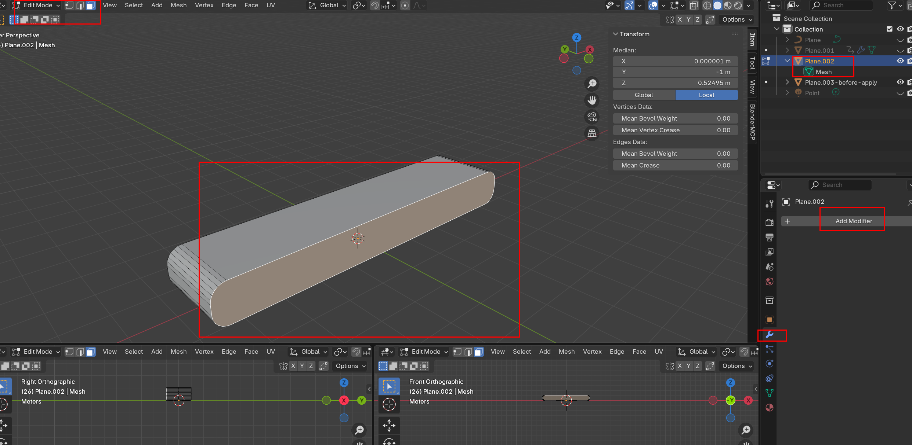

# Modifier의 Solidify를 Apply 하는 이유

---

>

## 1. Apply의 의미

- Blender에서 `Apply`는 **Modifier로 보이기만 하던 결과를 실제 Mesh 데이터로 굳히는 작업**
  - Apply 전  = Modifier 효과가 화면에만 적용된 상태
  - Apply 후  = 그 결과가 실제 Vertex / Edge / Face가 된 상태

## 2. Solidify Apply 전 상태

- `Solidify`를 적용하기 전에는 원본 Mesh가 그대로 남아 있고, 두께는 Modifier가 임시로 보여주는 결과이다. 
  - 원본 Mesh = 얇은 면 1개
  - Solidify = 화면상으로 두께 / 옆면 / 뒷면을 만들어 보여줌
- 그래서 Edit Mode에서 Face Select 하면 
  - 선택 가능   → 원래 있던 앞면
  - 선택 어려움 → Solidify가 만든 뒷면 / 옆면 / 두께 부분



## 3. Solidify Apply 후 상태

- `Solidify`를 Apply하면 Modifier가 만든 두께가 실제 Mesh로 변환된다. 
- 모든 면을 Edit Mode에서 직접 선택할 수 있게 된다.

```
앞면
뒷면
옆면
두께 부분
```



## 4. Apply 하는 이유

- 컨베이어 벨트처럼 앞면, 뒷면, 옆면에 다른 Material을 주려면 Solidify 결과가 실제 Face여야 햇기 때문이다. 

```
앞면   → 움직이는 벨트 텍스처 Material
뒷면   → 어두운 고정 Material
옆면   → 고무 옆면 Material
```

## 5. Apply의 장점

- Solidify로 생긴 면을 직접 선택 가능
- Face별 Material Assign 가능
- UV 작업 가능
- GLB Export 시 결과가 예측 가능
- Three.js에서 안정적으로 사용 가능

## 6. Apply의 단점

- 두께 값을 나중에 Modifier처럼 쉽게 수정하기 어려움
- 원래 얇은 면 상태로 되돌리기 어려워 Apply 전에 복사본을 남겨두는 것이 좋다.

## 핵심 정리

```
Apply 전 = 두께가 보이지만 실제 편집 가능한 Face는 아님
Apply 후 = 두께가 실제 Mesh가 되어 Face 선택 / Material 지정 / UV 편집 가능
```

- 나같은 경우 컨베이어 벨트처럼 **Three.js에서 텍스처만 움직일 완성된 Mesh**를 만들 목적이라 Apply 로 Modifier 를 합쳐줬다. 