# 로봇팔 Rigging 적용하기

---

>[유튜브 - 로봇팔 Rigging 튜토리얼](https://www.youtube.com/watch?v=QqOShvk4Ne8)

## 명령어 정리 

##### **1. 기본 조작 및 선택**

- **Z**: 뷰포트 표시 모드 전환 (Wireframe 등)
- **Numpad 3**: 측면 뷰로 전환 (Side View)

##### **2. 모드 전환 및 메쉬/본 편집**

- **Shift + A**: 새로운 오브젝트나 본 추가 (Add Bone/Object)
- **E**: 돌출시키기 (Extrude) - 본을 새로 뽑아낼 때 사용
- **Ctrl + A**: 회전 및 스케일 적용 (Apply Rotation and Scale) - 리깅 전 필수 작업
- **Alt + P**: 부모 관계 해제 또는 본 연결 끊기 (Clear Parent / Disconnect Bone)

##### **3. 스냅 및 위치 제어**

- **Shift + S**: 스냅 메뉴 (Cursor to Selected, Selection to Cursor 등) - **3D 커서나 오브젝트를 특정 위치로 이동**
- **Alt + G**: 위치 초기화 (Reset Location)
- **Alt + R**: 회전 초기화 (Reset Rotation)

##### **4. 리깅 및 계층 구조(Parenting)**

- **Ctrl + P**: 부모 설정 (Set Parent) - 메쉬를 본에 종속시키거나 본끼리 계층 구조를 만들 때 사용
- **R + Y + Y (Y 두 번)**: 로컬 Y축 기준으로 회전 - 본의 고유 방향으로 회전시킬 때 유용

##### **5. 애니메이션 및 기타**

- **K**: 키프레임 삽입 (Insert Keyframe) - 위치나 회전 값을 타임라인에 기록
- **I (일반적인 키프레임 단축키)**: 영상에서는 특정 설정에 따라 K를 사용하기도 하지만, 보통 I키로 키프레임 메뉴를 호출합니다.

## Bone 정렬

- Bone 축 (Roll) 완벽 정렬

1. **Edit Mode**
2. 정렬할 본 전부 선택
3. 상단 메뉴:

```
Armature → Bone Roll → Recalculate Roll
```

4. 옵션 선택
   - **Global +Z Axis** (가장 무난)
   - 또는 **Local Tangent**

## 순서

##### Tip. 안전한 작업 순서

```
1. Armature Edit Mode
2. Bone 축 (Roll) 완벽 정렬
3. 저장 (버전)
4. 그 다음에
   - Parent
   - Weight
   - IK
   - Limit Rotation
```

##### 1. 3D Model 정규화 

- `메쉬만 A (전체선택)-> Ctrl + A -> Rotation & Scale`  을 통해 3D Model 의 기준을 초기화 한다. ( 위치 및 Rotation 으로 틀어진 값들을 0 으로 만듬)
  - “현재 로컬 축을 월드 축에 맞춰서 0으로 굳힌다” 는 뜻 (로컬축들이 글로벌 축으로 통일됨 )

- 추후 Rigging 설정시 이상하게 회전하는 문제 및 크기 문제를 정규화해서 제대로 동작하게 하기 위함 

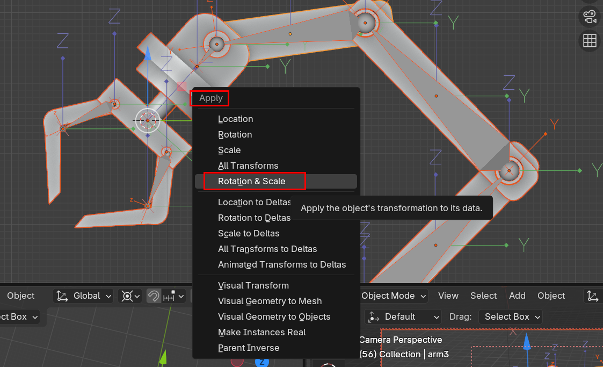

##### 2. Bone 요소 추가

1. `Ctrl + a` 
   - 도형추가 메뉴에서 Amature 선택으로 Bone 추가 
2. Bone 을 앞으로 표출
   - `Amature 항목 선택 후 설정창 -> Object Data -> ViewPort Display -> In Front` 
   - 선택하면 모델에 가려져있던 Bone이 앞으로 표출되는것을 볼 수 있다. ( 웹 요소의 Z-index 같은거)

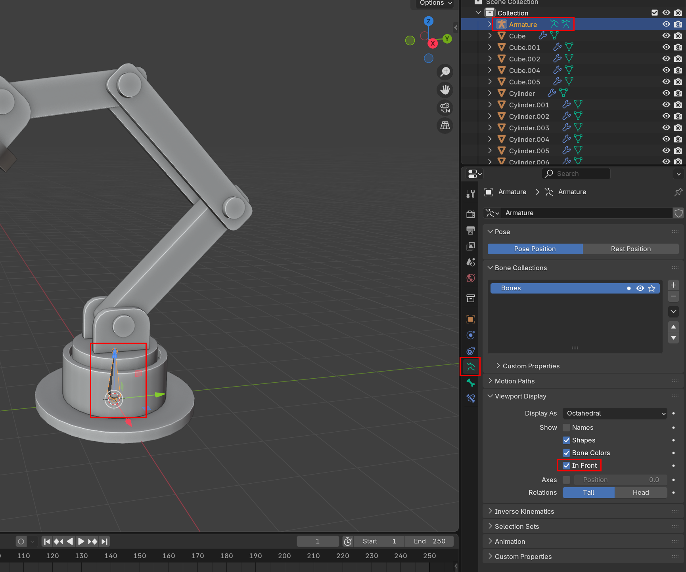

#### 3. origin Born 설정

1. 중심이 될 Object 선택
2. `마우스 오른쪽 -> Set Origin -> Origin to Geometry`
   - **Origin to Geometry:** 물체는 가만히 있고, **중심점만** 물체의 중앙으로 이동. (가장 많이 사용)
   - **Geometry to Origin:** 중심점은 가만히 있고, **물체 전체가** 중심점이 있는 곳으로 텔레포트

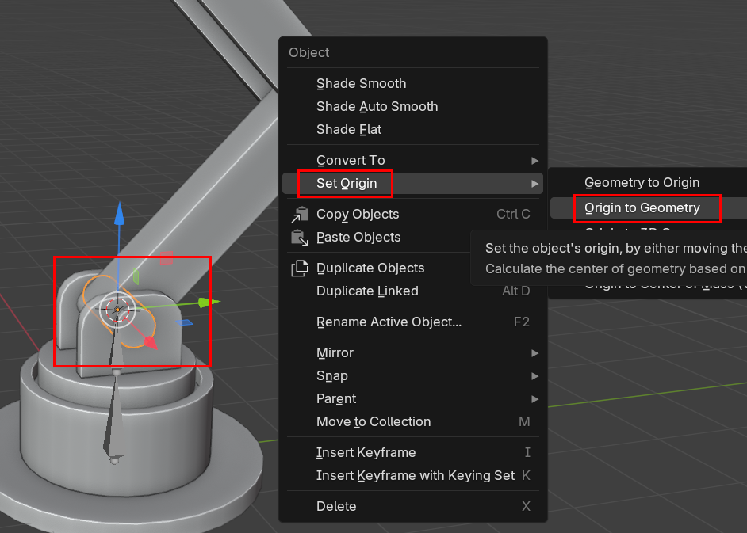

##### 4.  Bone 관절 설정

1. `Edit Mode` 
   1. Bone 의 Tail 선택 후 `Ctrl + E` 로 Bone 붙여서 생성
2. `Object Mode` (밑에 이미지의 1번)
   1. `관절부분 선택 -> Shift + S -> Cusor To Selected (원점을 관절로 이동)`
3. `Edit Mode` (밑에 이미지의 2번)
   1. Bone 선택 후 Edit Mode
   2. `Bone Tail -> Shift + S -> Selected To Cursor (object를 원점에 붙임)`
4. 이러한 과정을 관절부분만큼 진행하면 된다. 

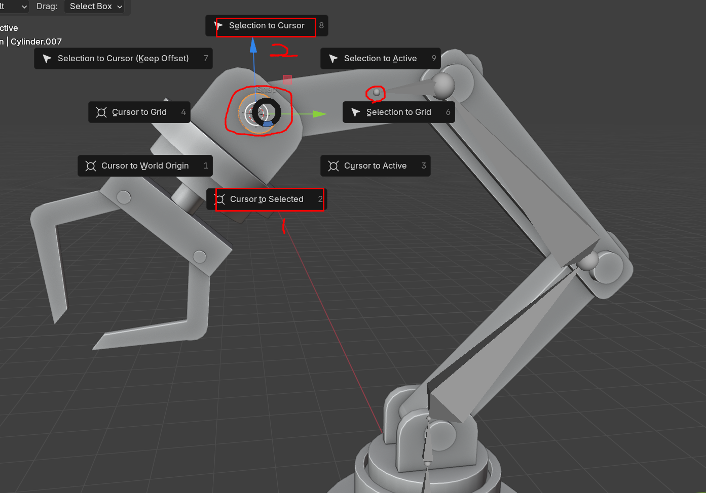

##### 5. 관절 분리 

- `Bone 선택 -> Alt + P -> Disconnect BOne` 
- 뼈를 분리하면 점선으로 이어진 뼈를 볼 수 있다. 
  - 점선으로 이어진 뼈는 부모-자식 관계에 여전히 종속된다. 
- 또한 Post Mode 를 통해 관절이 중심축으로 회전하는것을 볼 수있다. 

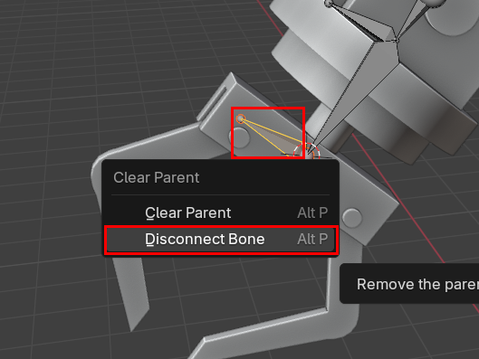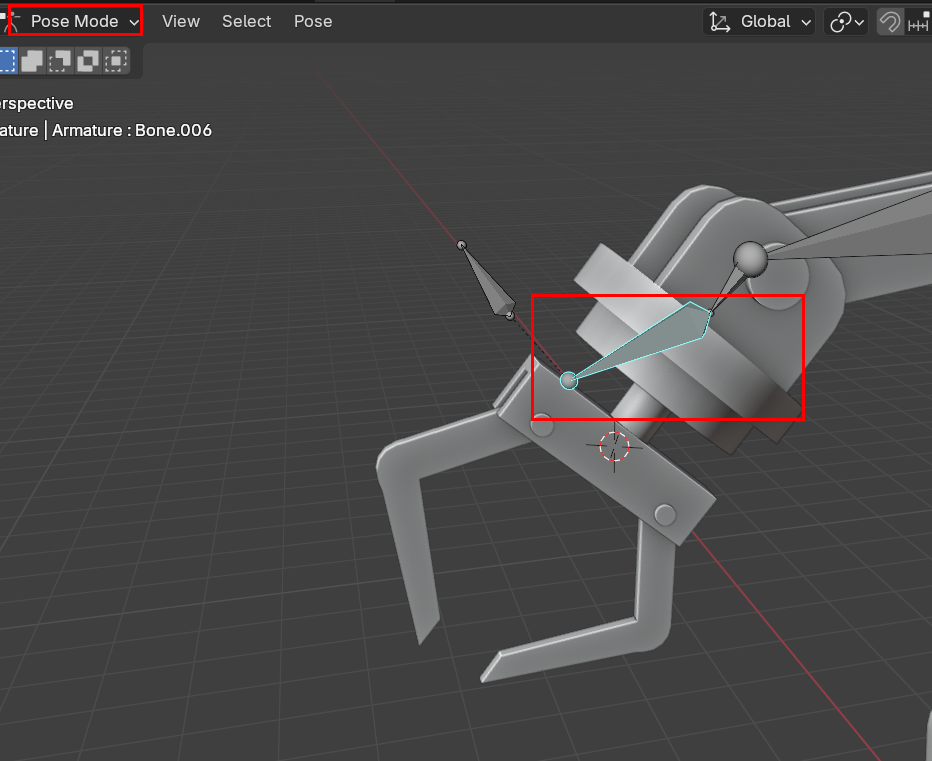


##### 6. Object와 Bone 연결

1. Post Mode 에서 동시 선택 가능 하도록 설정 변경 

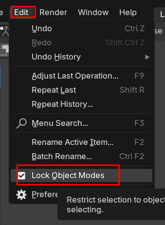

2. `Pose Mode -> Object + Bone 선택 → Ctrl + P → Bone`
   - “이 오브젝트를 특정 본의 움직임에 종속시키겠다” 는 의미
   - 즉, Bone 을 본격적으로 Object 에 종속시켜 같이 움직이게 한다. 
3. 종속 확인 방법 
   - `종속 건 Bone 선택 -> R -> Y + Y(Bone 축의 Y로 움직임)` 

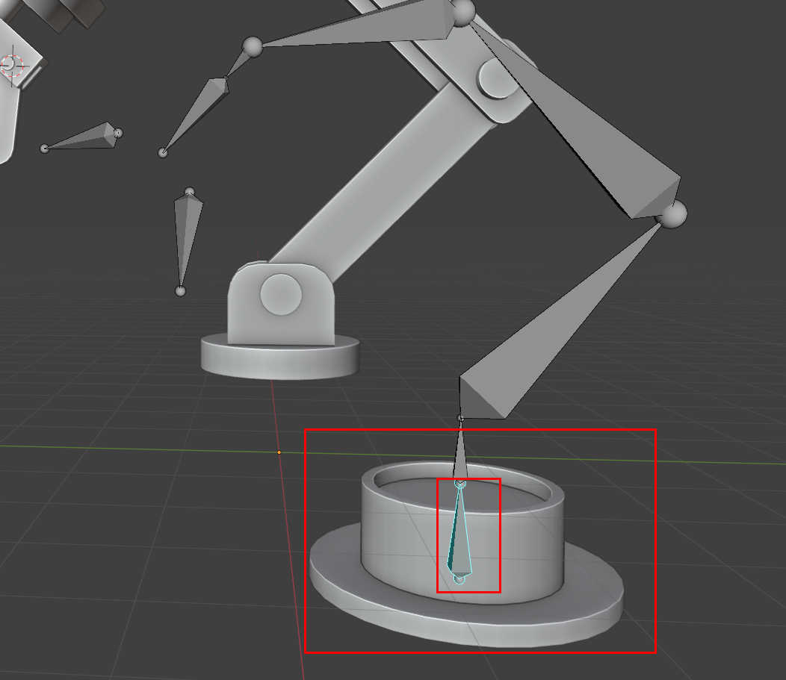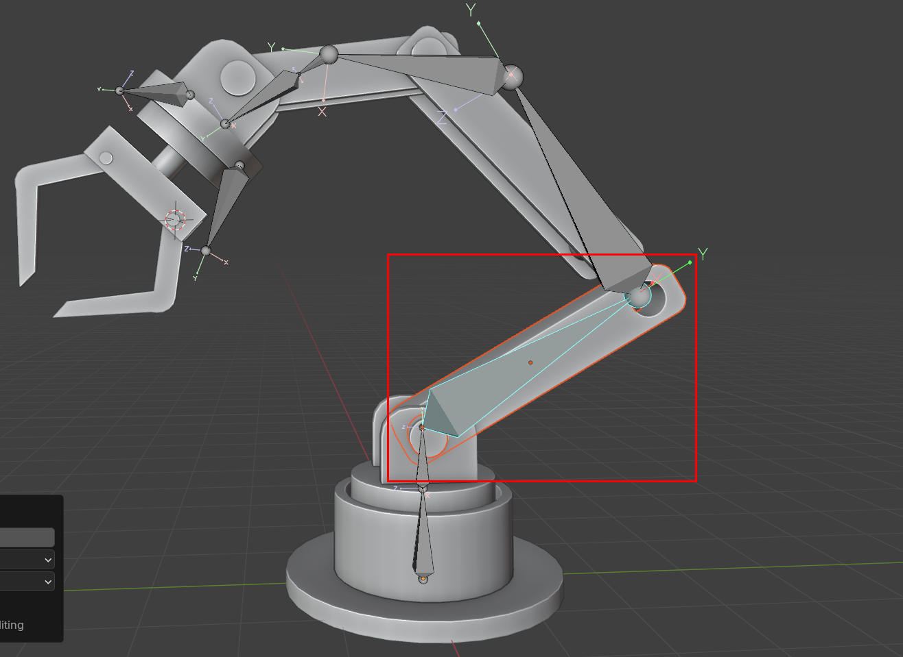

##### 7. Axeis 표시 및 세팅

- Bone 의 위쪽을 Y 축으로 세팅 (보여주는 위치 세팅)
  - `Axeis -> Position : 1.0`
  - 실제 회전축은 **본의 Tail 쪽**에 있기 때문에 축을 Tail에 보이게 하면 **직관적으로 이해 가능**

- Position 값의 의미

| 값      | 의미                             |
| ------- | -------------------------------- |
| **0.0** | 본의 **Head(시작점)** 에 축 표시 |
| **0.5** | 본의 **중앙**                    |
| **1.0** | 본의 **Tail(끝점)** 에 축 표시   |

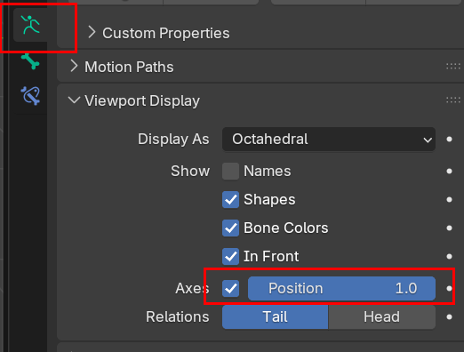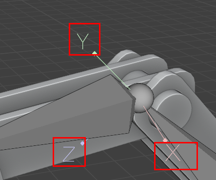

##### 8. IK Bone 설정

- IK : 끝(Bone)을 움직이면, 중간 관절들이 자동으로 계산돼서 따라 움직이게 만드는 본 제어 방식

  - Inverse Kinematics (역기구학)
  - 즉, **기본 Bone 을 `IK Bone` 으로 만들면 IK Bone 만 움직여도 연결되어있는 Bone 구조가 같이 움직이게 된다.** 

- 설정

  1. Post Mode 에서 사용가능
  2. 움직일 뼈 부분(IK Bone)을 생성 후 `Ctrl + P` 를 이용해 기존 뼈와 분리시킨다. 
  3. `기존 뼈에서 중심이 될 Bone 을 선택 -> Inverse Kinematics -> IK Bone 과 연결`
  4. 연결되면 IK Bone 을 이동했을 때 따라 움직이는 것을 확인할 수 있음 

  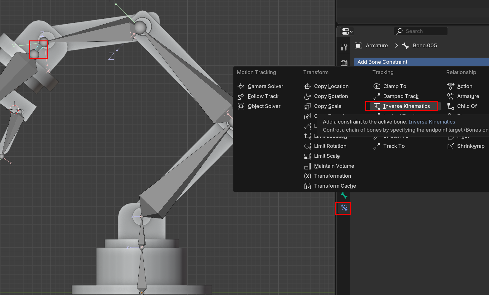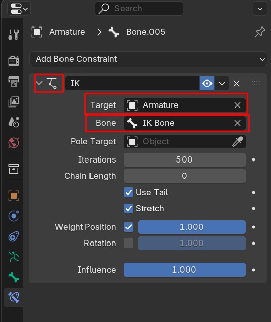

  4. IK Bone Chain 조절

     - 4으로 설정시 Bone 4개까지만 IK Bone 이 적용된다. 

     - 사용 이유 : 받침대 부분의 관절은 고정되고 움직이면 안되기 때문에 

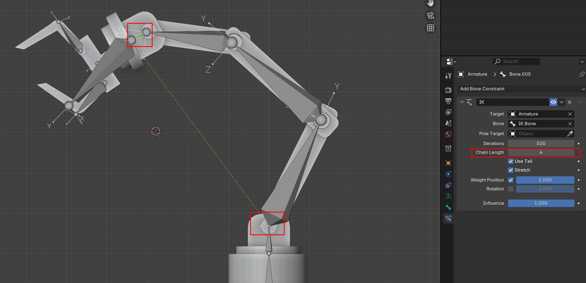

##### 9. 축 고정  

- Pose 초기화 방법
  1. rotation 초기화 : `Alt + R`
  2. Move 초기화 : ` Alt + G`
- 축
  - X축 = 관절이 접히는 방향 ( 해당 방향으로만 움직이도록 할거임)
  - Y/Z = 비틀림 / 옆으로 꺾임 ( 해당 방향으로 이동하면 안됨 -> Limit 대상 )
- **Rotation ( Y, Z 축 Limit )**
  - Bone 의 회전축이 X 만 자유로움 
- **Location ( X 축 Mininum 적용)**
  - **본(Bone)이나 오브젝트가 특정 축 방향으로 “이 이상 이동 못 하게” 제한하는 제약(Constraint)**

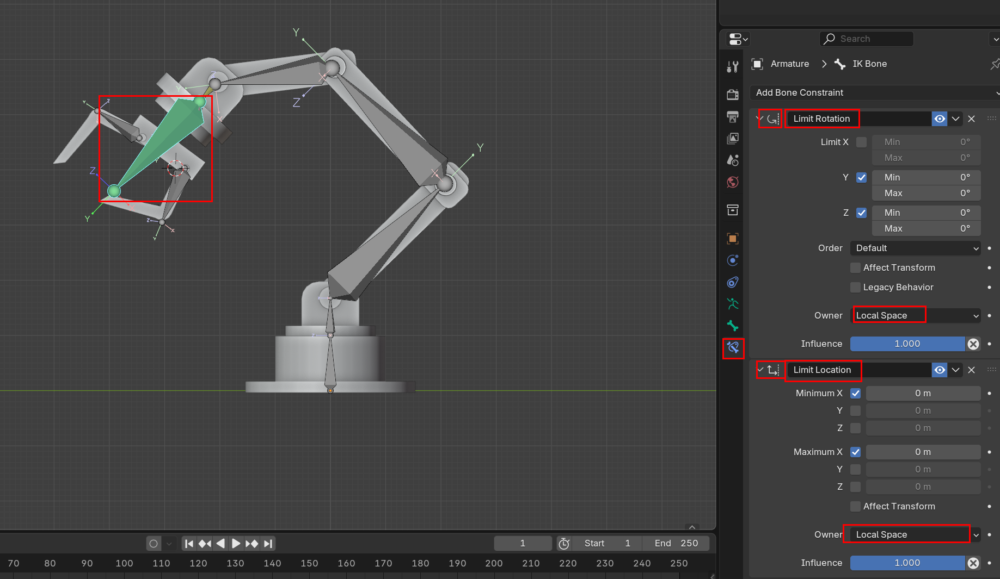

##### 10. Offset 설정

- 개념
  - IK Bone 이 아닌 축의 기준(기둥) 을 움직일 때 IK Bone 이 같이 따라 움직여줘야한다. 
  - 연결 안하면 `IK Bone + Bone Chain Length` 만큼의 연결된 부분과 연결되지 않은 나머지 Bone 이 따로 움직인다. 
  - 이때 필요한것이 Offset 설정으로, Keep Offset = “현재 위치/회전 차이를 “그대로 유지한 채” 연결할지 여부” 
- 방법
  - `Edit Mode -> IK bone 선택 + 축 (기둥) Bone 선택 -> Ctrl + P (Offset 설정)`

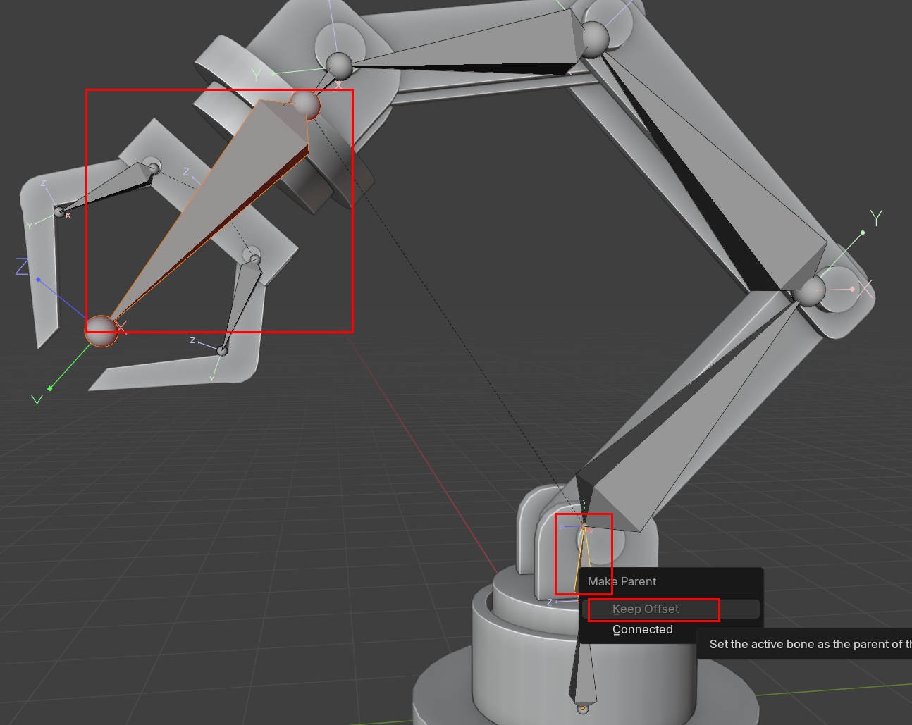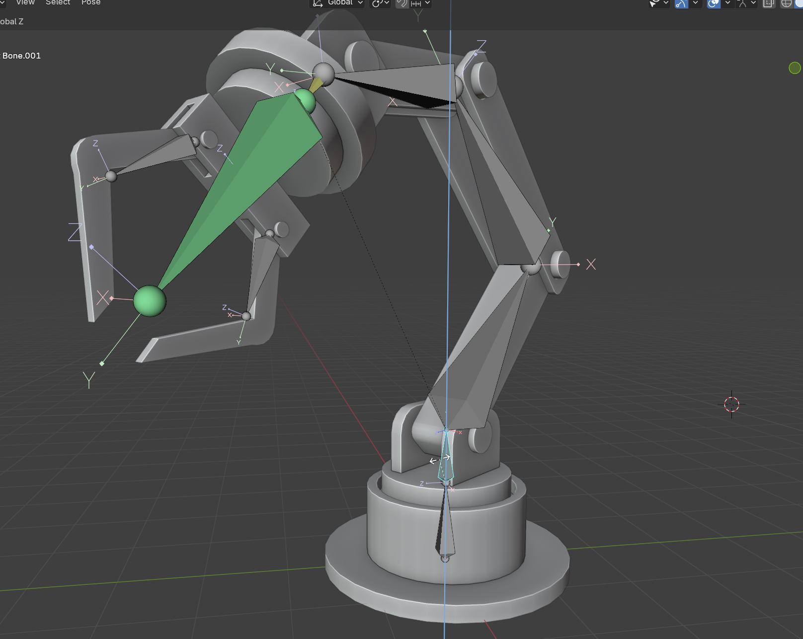

##### 11. Base Bone Fix 

- 기본 축이 되는 밑에 받침부분을 고정시켜야 한다.
- `고정시킬 Obj + Bone 선택 -> N -> 잠그고 싶은 축 잠구기` 

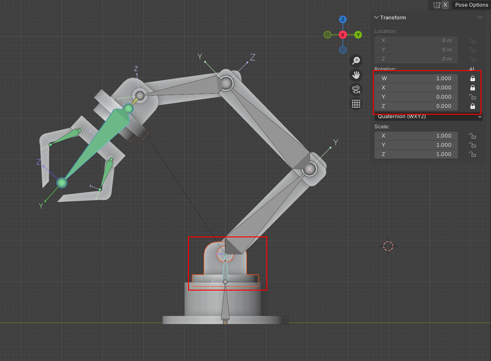

