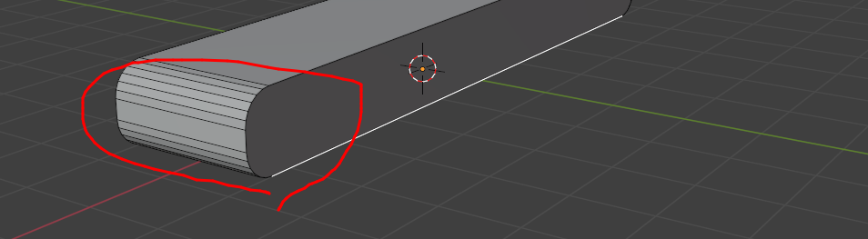
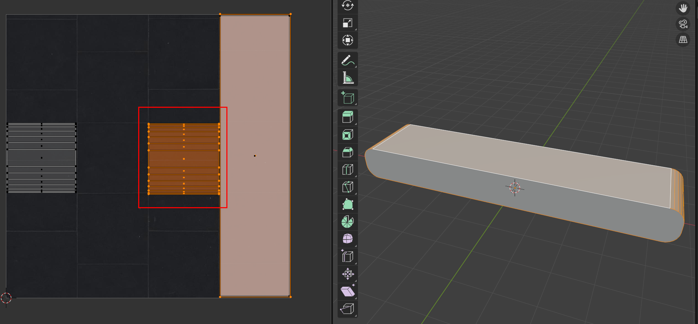

# UV 방향 문제 정리

## 1. 문제점

- 3D Conveyor-belt 의 표면 Texture 로 움직임을 구현하려고 Texture 를 적용했다. 
  - Three.js에서 `texture.offset.x`로 UV Scrolling을 적용하면, 모든 면의 텍스처가 UV의 **U 방향**으로 이동하는 기능을 이용해서 움직임을 구현할 수 있었다. 
- 하지만 옆면과 밑에면의 Texture 가 움직이는 방향이 윗면에 적용된 Texutre 방향과 반대로 움직이는 문제점이 있었다. 
  - 문제점을 찾아보던 중 Blender에서 면마다 UV 방향이 다르게 잡혀 있으면 이런 문제가 발생한다는 것을 알게되었다. 

```js
 if (isRunning && beltTextures.length > 0) {
      const moveSpeed = config.beltForce.x || 2
      const speedMultiplier = 0.2

      beltTextures.forEach((texture) => {
        const deltaOffset = moveSpeed * deltaTime * speedMultiplier
        texture.offset.y = (texture.offset.y - deltaOffset) % 1 // y 축으로 texture 를 끊김없이(RepeatWrapping 속성이용) 이동
      })
 }
```

```
윗면은 정상 방향으로 움직임 ( Offset y 를 -로 이동시)
옆면은 다른 방향으로 움직임
둥근 면은 반대로 움직이거나 옆으로 흐름
```

- 즉, 같은 텍스처를 사용해도 면마다 UV Island 방향이 다르면 움직임이 서로 다르게 보인다.



## 2. 문제 해결

- Blender의 UV Editor에서 방향이 다른 UV Island를 직접 회전시켜 맞춘다.

```
Edit Mode
→ 문제되는 Face 선택
→ UV Editor에서 해당 UV Island 선택
→ R 90 / R 180 등으로 회전
```

- 필요하면 뒤집기도 사용한다.
- 핵심 기준은 다음과 같다.
  - 모든 움직이는 면의 UV 가로 방향 = 벨트 진행 방향
- Three.js에서 `texture.offset.x`를 사용할 경우, UV Editor에서 벨트가 움직일 방향이 가로 방향으로 맞춰져 있어야 한다.

```
S X -1  → 좌우 뒤집기
S Y -1  → 상하 뒤집기
```


## 3. 결과

- UV 방향을 통일하면 하나의 텍스처를 사용해도 모든 면에서 같은 방향으로 자연스럽게 움직인다.
- 정리하면, UV Scrolling의 이동 방향은 Three.js 코드만으로 결정되는 것이 아니라 **Blender에서 잡힌 UV 방향**의 영향을 받는다.

