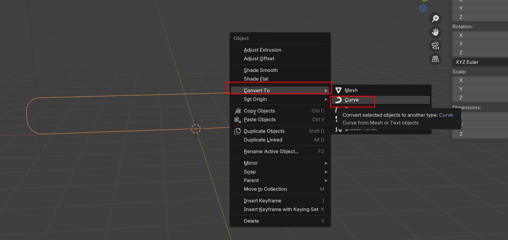
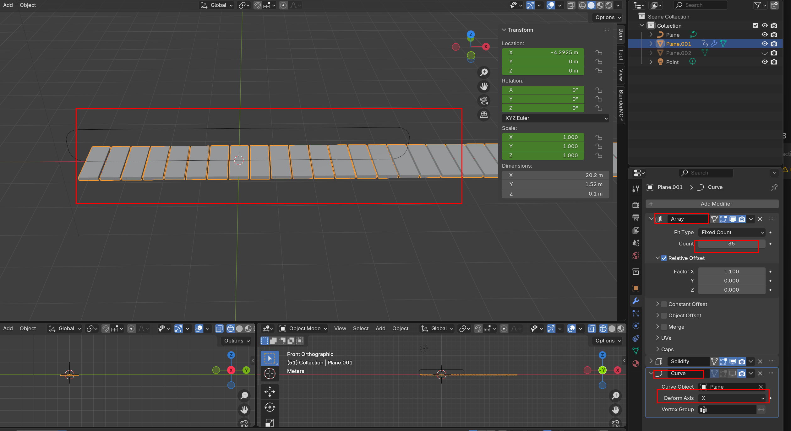
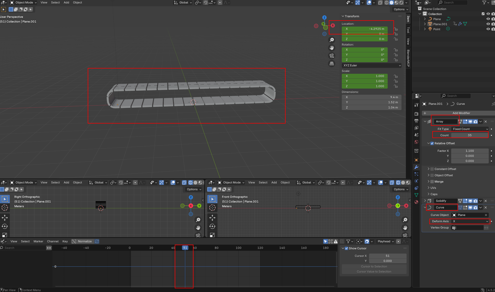

# Conveyor Belt 만드는 방법 정리 

---

> 기준: Blender Conveyor Belt 방식 요약
> 중점: Circle/Curve 경로에 Mesh Object를 붙이고 따라가게 만드는 방법
>
> [참고 영상1](https://www.youtube.com/watch?v=Gt48x_DFiQI)
>
> [참고 영상2](https://www.youtube.com/watch?v=OhzcCsR_EO0&t=562s)

## 1. Circle 경로 만들기

- **키워드:** `cube`, `Curve Path`, `NURBS/Bezier Circle`, `Track Shape`
- 컨베이어 벨트가 따라갈 기준선을 `Circle/Curve`로 만들고, 필요하면 타원형 트랙처럼 스케일 조정한다.
- 중요!!!
  - 만들 때 scale 이나 rotation 도 Edit Mode 에서 해야함!!!
  - 안하면 결과 달라지거나 제대로 타원 안만들어짐 

```
Add → cube → Edit Mode → rotation → scale 조절 → Ctrl + B , V → 모서리 둥굴게 처리 
Object Mode → Convert to Curve 로 변환 
```



## 2. Mesh Object 준비

- **키워드:** `Belt Piece`, `Mesh Segment`, `Subdivision`, `Deform 준비`
- Circle을 따라 휘어질 벨트 조각 Mesh를 만들고, 잘 휘도록 길이 방향 세그먼트를 충분히 나눈다.

```
Mesh 조각 생성
Edit Mode → Subdivide / Loop Cut으로 세그먼트 추가 → Solidify 로 두께 키우기 
```



## 3. Origin / Transform 정리

- **키워드:** `Origin 일치`, `Apply Scale`, `Rotation & Scale`, `Curve 기준`
- Mesh와 Circle의 Origin 위치가 어긋나면 이상하게 휘므로, 작업 전 `Ctrl + A → Rotation & Scale`로 정리한다.

```
Mesh Object 선택 → Ctrl + A → Rotation & Scale
Circle Curve 선택 → Ctrl + A → Rotation & Scale
```

## 4. Array로 Mesh 반복

- **키워드:** `Array Modifier`, `Fit Curve`, `Relative Offset`, `Count`
- Mesh 조각에 Array를 걸어 Circle 길이만큼 반복되게 만들고, 조각 간격은 Offset으로 맞춘다.

```
Mesh Object 선택
Modifier → Array
Fit Type: Fit Curve 또는 Count 사용
Curve: Circle 선택
Relative Offset: X 또는 Y 방향 설정
```

## 5. Curve Modifier로 Circle에 붙이기

- **키워드:** `Curve Modifier`, `Curve Object`, `Circle 선택`, `Deform Axis`
- Array 아래에 Curve Modifier를 추가하고, Curve Object에 Circle을 지정하면 Mesh가 Circle 경로를 따라 휘어진다.

```
Modifier 순서:
1. Array
2. Curve

Curve Modifier:
Curve Object = Circle
Deform Axis = Mesh가 길게 반복되는 Local 축
```

## 6. Deform Axis 선택 기준

- **키워드:** `Local Axis`, `X/Y`, `Array 방향`, `축 불일치`
- Array가 실제로 늘어나는 Object의 Local 축과 Curve Modifier의 Deform Axis가 같아야 정상적으로 붙는다.

```
Array가 Local X로 반복 → Deform Axis: X
Array가 Local Y로 반복 → Deform Axis: Y
```

## 7. Mesh가 이상하게 붙을 때

- **키워드:** `Origin 불일치`, `Scale 미적용`, `Axis 오류`, `세그먼트 부족`
- Mesh가 찌그러지거나 엉뚱한 곳으로 가면 Origin, Scale, Deform Axis, Subdivision을 순서대로 확인한다.

```
1. Ctrl + A → Rotation & Scale
2. Origin 위치 확인
3. Deform Axis X/Y 변경 테스트
4. Mesh 세그먼트 추가
```

## 8. Circle을 따라 움직이는 애니메이션

- **키워드:** `Location 이동`, `Deform Axis 방향`, `Linear`, `Loop`
- Mesh Object의 Location을 Deform Axis 방향으로 움직이면, 화면에서는 Circle을 따라 벨트가 도는 것처럼 보인다.

```
Frame 1   → Location X 또는 Y = 0    → I → Location
Frame 120 → Location X 또는 Y = 1칸 이동 → I → Location
Graph Editor → Linear → Make Cyclic
```

## 9. 핵심 구조

- **키워드:** `Circle = 경로`, `Mesh = 벨트 조각`, `Array = 반복`, `Curve = 붙이기`
- Circle이 실제 Mesh를 붙잡는 것이 아니라, Curve Modifier가 Mesh를 Circle 형태로 변형시켜 붙어 보이게 만든다.

```
Circle Curve
   ↑
Curve Modifier가 참조

Mesh Belt Piece
   ├─ Array로 반복
   └─ Curve로 Circle 따라 변형
```

