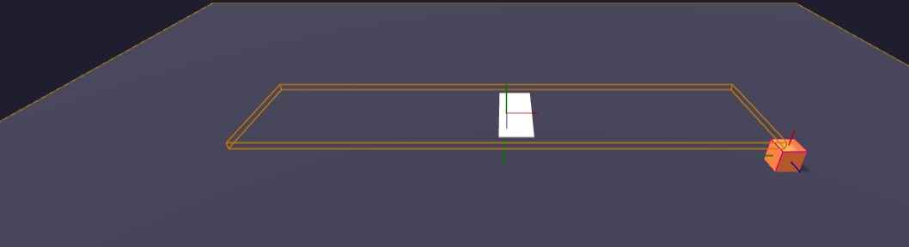
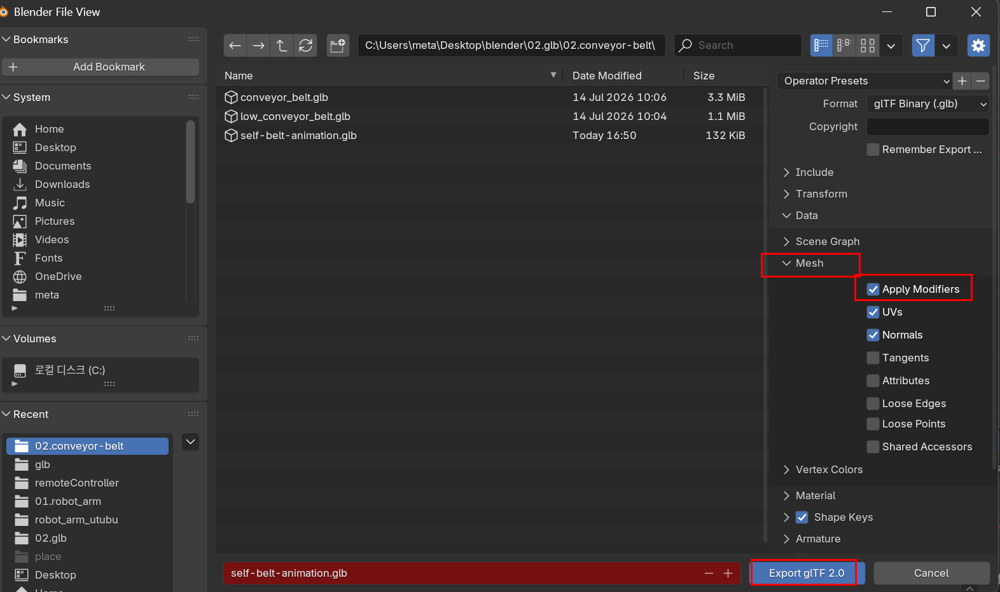
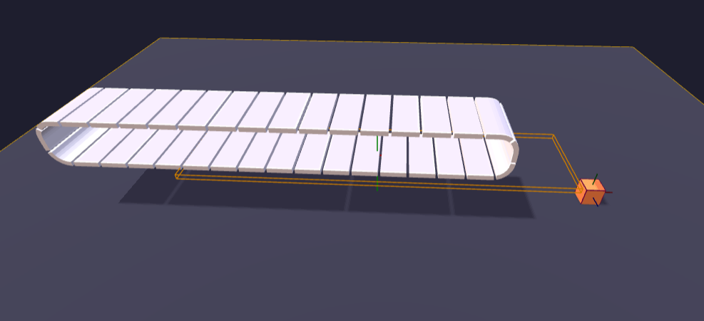

# conveyor-belt 의 modifiers 동작 안하는 문제

---

>

## 문제발생

- blender 에서 belt model 을 만들 때 Mesh 의 Modifier 속성 중 Array(하나의 물체를 복재), Curve(복사경로), Solidify(두께) 을 수정해 Model GLB 파일을 생성했다. 
- 이런 GLB 파일을 Export 후 Threejs 로 Load 하니 Modifier 가 적용되지 않는 3D Model 만이 표출되는 문제가 발생했다. 

1. Blender 에서의 속성과 Renderer 모습 

2. Threejs 로 3D Model 불러온 모습 
   - Modifier 의 속성이 적용되지 않은 원본 GLB 파일로 표출되는 것을 확인함 

## 문제 해결 

- Blender 에서는 Modifier 속성을 포함시켜서 Export 하는 옵션이 있었다. 
- 나같은 경우엔 해당 옵션이 체크되어잇지 않아서 Modifier 옵션이 빠진 상태로 GLB 파일이 추출된 상태였다. 
- 따라서 Export 시 Modifier 적용 옵션을 체크함으로써 문제가 해결되었다. 

## 적용 결과 

