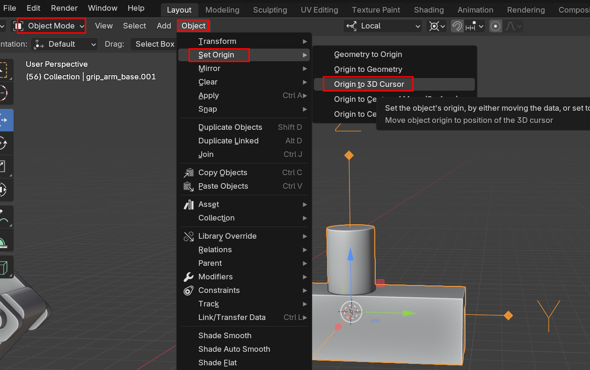
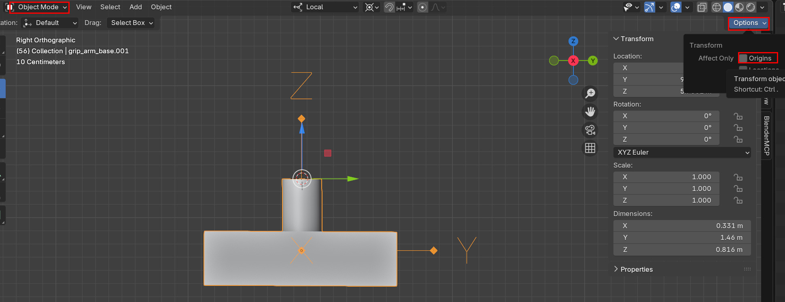

## 회전축 개념

- 로컬축과 글로벌 축이 있다. 
- 회전은 항상 “자기 자신의 **로컬 좌표계**(Local Axis - object의 로컬 X축)”기준이다

## 문제점

Three.js에서는:

```
gripBase.rotation.x
```

- 이게 의미하는 건 **gripBase의 로컬 X축 기준 회전**
- 그런데 지금
  - 로컬 X축 = 월드 X축
  - 모델 방향 ≠ 월드 방향
- 그래서 회전하면 **관절 기준이 아니라 이상한 방향으로 도는 것처럼 보임**
- origin point는 잘 잡혔는데 축만 world 기준인 상태였음 

---

## Origin Point 변경방법

##### tip. 3D Cursor 옮기는 방법

1. `shift + 마우스 오른쪽 `
2. `shift + s -> cursor to selected`

##### 1. 3D Cursor 이용

- 3D cursor 위치로 origin Point 를 옮기는 방법
- `Object 모드에서 선택 -> Object -> Set Origin -> Origin to 3D cursor`



##### 2. 면 중앙 (가장 많이 씀)

- `edit mode -> 면선택 -> cursor to selected (면의 중앙이 selected 됨)-> Object Mode -> Object -> Origin to 3D cursor`
- 면 중앙으로 origin 위치를 옮길 수 있음. 

##### 3. Option Origin 이용 

- origin 의 위치를 직접 컨트롤 하는 방법
- G키를 이용해서 축 기준으로 origin point 를 옮길 수 있다. 

