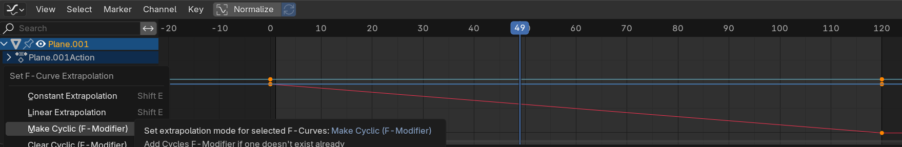

# Blender Conveyor Belt Animation 정리

---

>

## 1. 프레임 지정 방법

- **키워드:** `Frame 1`, `Frame 120`, `Timeline`, `Start / End`
- 시작 프레임과 끝 프레임을 정한 뒤, 각 프레임에서 Object 상태를 `Keyframe`으로 저장한다.
  - object 선택 후 Timeline 에서 Location 설정 후 `I` 단축키로 위치 저장 

```
Frame 1   → 시작 위치 설정 → I → Location
Frame 120 → 끝 위치 설정   → I → Location
```

## 2. Location 다루는 법

- **키워드:** `Location X`, `Object Origin`, `Transform`, `N Panel`
- `Location`은 Mesh 자체가 아니라 Object의 `Origin 위치`를 움직이는 값이다.

```
N 키 → Item → Transform → Location X/Y/Z
Location X 값 변경 → X축 방향 이동
```

## 3. 컨베이어 이동 애니메이션 방식

- **키워드:** `Location Keyframe`, `한 칸 이동`, `반복 루프`, `Conveyor Motion`
- 컨베이어는 전체 길이만큼 이동하기보다, 벨트 패턴 한 칸만 이동시키고 반복하는 방식이 자연스럽다.

```
Frame 1   → Location X = 0
Frame 120 → Location X = -1.1 또는 1.1
```

## 4. 속도 조절 방법

- **키워드:** `이동 거리`, `프레임 수`, `빠르게`, `느리게`
- 같은 거리를 더 적은 프레임에 이동하면 빠르고, 더 많은 프레임에 이동하면 느리다.

```
빠르게: Frame 1 → 60
보통:   Frame 1 → 120
느리게: Frame 1 → 240
```

## 5. Linear 속도 설정

- **키워드:** `Graph Editor`, `Interpolation Mode`, `Linear`, `Ease In/Out 제거`
- **기본 보간은 Bezier라서 중간은 빠르고 끝은 느려질 수 있으므로** `Linear`로 바꿔야 한다.

```
Graph Editor → 키프레임 선택 → T → Linear
또는 Key → Interpolation Mode → Linear
```

- 실제 이동 애니메이션을 줄 Object를 선택한 뒤, X Location에 키프레임을 다시 찍고 Linear를 적용한다.

```
Frame 1   → Location X = 0    → I → Location
Frame 120 → Location X = -1.1 → I → Location
Graph Editor → A → T → Linear
```

## 6. 반복 애니메이션

- **키워드:** `Make Cyclic`, `Shift + E`, `Loop`, `무한 반복`
- 컨베이어처럼 계속 움직여야 하는 경우 Graph Editor에서 Cyclic 반복을 적용한다.

```
Graph Editor → 키프레임 선택
Shift + E → Make Cyclic
```



## 핵심 요약

- **프레임:** 시작/끝 프레임에서 `Location` 키프레임을 찍는다.
- **속도:** `Linear`로 바꾸면 일정 속도, 프레임 수를 줄이면 빠르고 늘리면 느리다.


