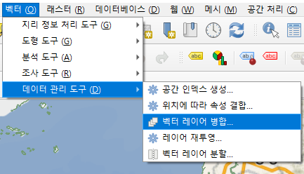
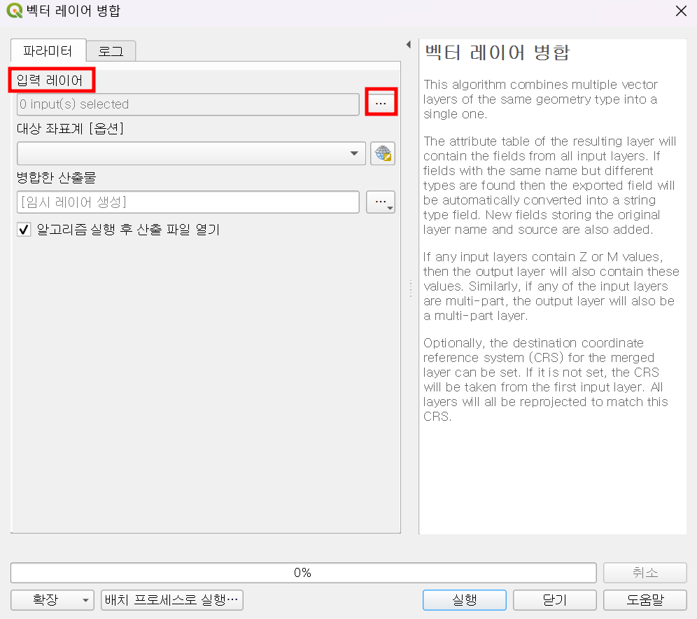
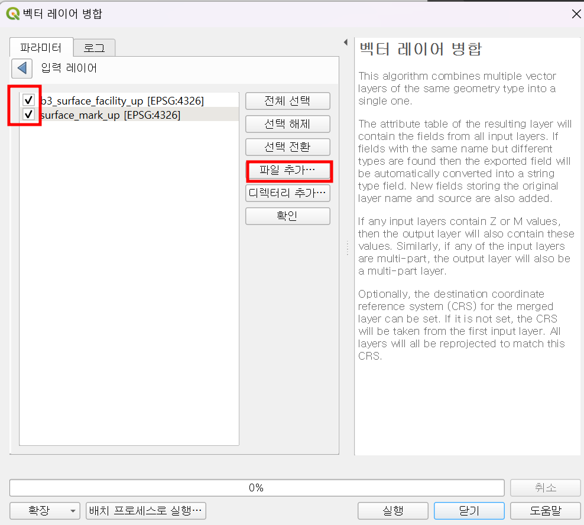
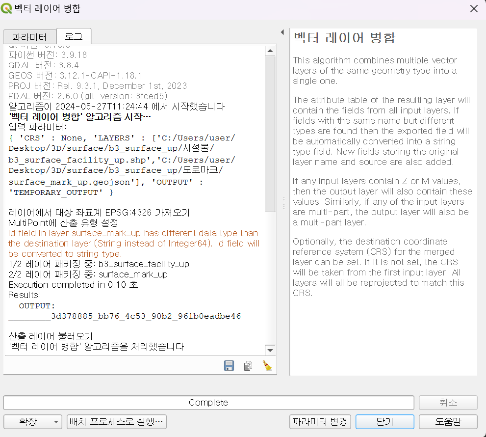
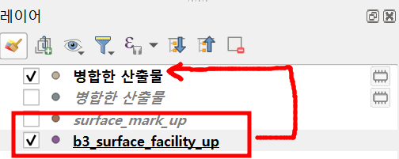
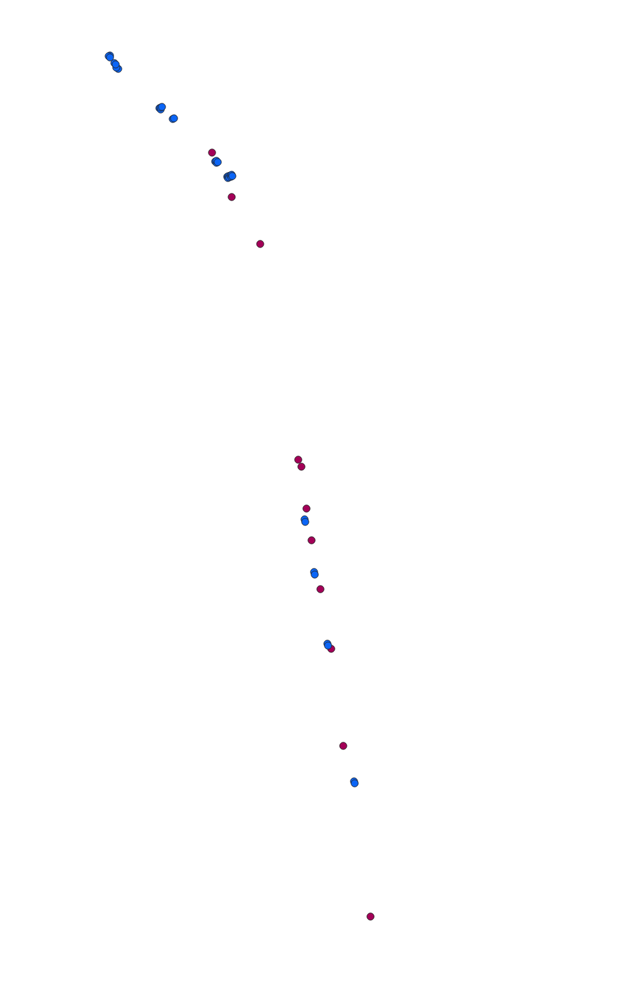
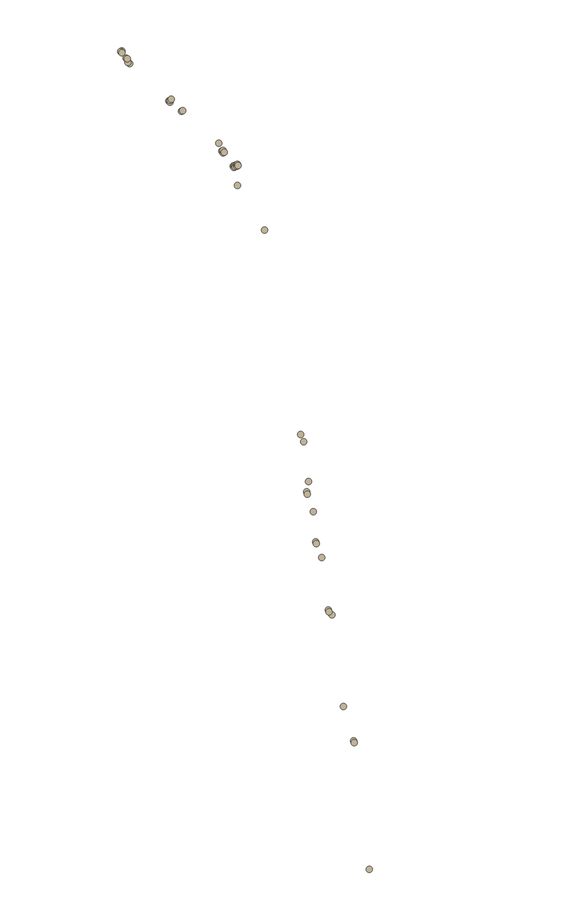

# QGIS를 이용한 shp 병합.md

---

>[참고 사이트](https://wogus789789.tistory.com/194)

## 사용 이유

1. qgis를 이용하다 보면 여러개의 shp이 생성되어 관리가 힘들어질 수 있다. 
   1. 예를들어, 도로의 surfaceMark 위치 포인트 좌표와 가로등, 이정표 같은 설치물의 위치 포인트는 다른 shp 파일로 만들어 진다. 
2. 이때 2개의 shp을 geoserver에 레이어로 올리기 보단 하나의 shp 파일로 병합해 올리게 되면 관리하기가 수월해 진다. 

## QGIS 이용 shp 파일 병합하기 

### 1. 벡터 레이어 탭 

1. 상단의 `벡터` 탭 -> `데이터 관리 도구` -> `벡터 레이어 병합` 클릭

### 2. 레이어 선택 

1. 입력 레이어의 '...' 클릭 -> 병합 원하는 shp 파일을 선택 -> 원하는 `좌표계 선택 ` -> `실행`  클릭
   1. 이때 shp을 위치에서 선택하기 보다는 QGIS의 레이어로 먼저 추가해 놓는게 편하다. 
   2. 왜냐하면 `입력 레이어` 리스트에 자동으로 나타나 체크만 하면 되기 때문이다. 
2. 이때 주의할점은 합칠 레이어가 같은 형태여야 하는것 같다. 
   1. Point 객체가 아닌 다른 형태의 레이어를 병합하려고 했는데 에러가 났기 때문이다. 
3. 또한 합칠 레이어가 같은 형태라면 파일의 확장자는 달라도 되는것 같다. 
   1. Point객체로 이루어진 shp 과 geojson을 합쳤는데 병합이 잘 이루어 졌다. 

### 3. 결과물

1. 레이어 -> `병합한 산출물`  추가된것을 확인 

2. 병합 전 shp 파일 
   1. `surface_mark_up`
   2. `b3_surface_facility_up`

3. 병합 후 shp 파일 
   1. `병합된 산출물 `

