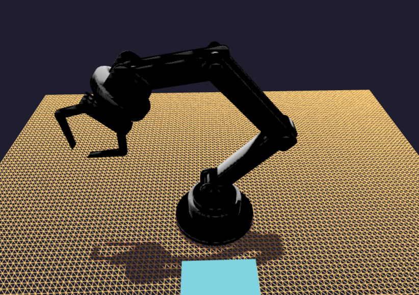
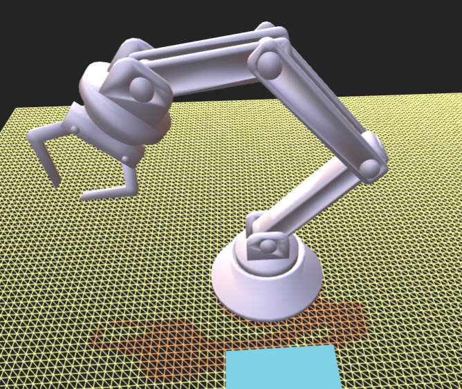

# 3D model 어둡게 표시되는 이유 정리

---

>

## 상황

- Blender 에서 Material 을 모두 흰색으로 한 다음 glb 파일로 뽑음
- Threejs 에서 불러왔는데 물체가 어둡게 표출됨 
  - `ambientLight(전역빛) + directionalLight(태양빛)` 이 있는것은 그림자와 표면의 얼룩덜룩 흰색이 표시되는걸로 알수 있음 
  - 즉, 빛이 모두 있는데 3D Model 만 빛을 못받는 상황이 발생했다. 

##### 이유 가정 

1. Blender 의 빛 없음
   - Blender 에서는 Export 할때 Model 이 빛을 포함하지 않음. 즉 빛이 있어도 Export 시 없어짐 
2. Blender material 색상 없음
   - Blender 의 material 색상 확인시 흰색인것을 확인 
3. Threejs 자연광 빛
   - 나는 이게 문제였음. 3D model 의 재질이`Matalness : 1 `여서 환경반사에 의존함 



## 정리

> **metalness = 1 + roughness = 1 + envMap = null**
>  → **빛을 거의 반사하지 않는 ‘검은 금속’**
>  → 환경광 없으면 사실상 검정

------

## 문제 핵심 3가지

##### `metalness: 1` (완전 금속)

```
metalness: 1
```

- 이 재질은 **100% 금속**
- 금속은 **Diffuse(기본 반사)** 거의 없음
- **환경 반사(Environment Map)** 에 거의 전적으로 의존

```
envMap: null
```

- **반사할 환경이 없음**
- 결과: **빛을 먹어버림 → 검정**

------

##### `roughness: 1` (완전 거침)

```
roughness: 1
```

- 반사가 **완전히 퍼짐**
- 하이라이트 거의 없음
- DirectionalLight 있어도 반짝임 안 생김
- 금속 + 거침 + 환경 없음 = **검은 철가루**

------

### `map: null` (BaseColor 텍스처 없음)

```
map: null
color: white
```

- 색은 흰색이지만
- **metalness=1이면 이 color는 거의 무시됨**
- 금속 색은 **반사 색 = 환경색**
  - 환경이 없으니 색도 없음

---

## 사용방법

##### 1. 3D model 의 material 에 직접 설정 추가 

```
material.metalness = 0.2;
material.roughness = 0.6;
material.needsUpdate = true;
```

##### 2. 환경광 추가  (나는 이 방법으로 해결했음)

- environment 에 환경광을 가진 HDR추가 
  - HDR은 ‘배경’이 아니라 ‘빛 데이터’다
  - `scene.background` → **보이는 배경**
  - `scene.environment` → **빛 계산용 환경**

```
scene.environment = envMap;   // HDR → 빛 계산용
scene.background = null;     // 배경은 안 씀
```

- 화면은 단색/투명
- 반사/금속/밝기 계산은 HDR 기준

---

## 결과 

```
현재 3D Model :
- 완전 금속이고
- 완전 거칠고
- 반사할 환경이 없고
- 빛을 스스로 내지도 않는다
```

- 즉,  거의 검정
- 해결책 
  - HDR 환경광 필요 (HDR 중 배경은 필요 x )

