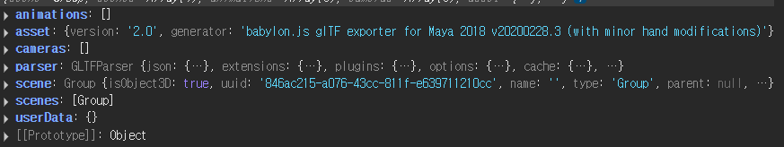

# glTF 구조

---

>



## 구조

```
gltf.scene      // THREE.Group (루트 씬)
gltf.scenes     // 씬 배열 (여러 씬 가능)
gltf.animations // 애니메이션 배열
gltf.parser     // 내부 파서
gltf.asset      // 메타데이터
```

## glTF 의 내부 Scene 

- glTF 모델은 단순히 **메시 집합**이 아니라,
  - 모델을 어떻게 배치할지 (위치/회전/스케일)
  - 어떤 부모-자식 관계로 연결할지
  - 라이트나 카메라도 포함할지
  - 여러 노드를 그룹으로 묶을지 등을 **씬(Scene)** 구조로 저장한다.
- 즉, glTF내부 `scene` 은 **“모델 전체를 대표하는 루트 컨테이너”** 역할을 하게 된다. 