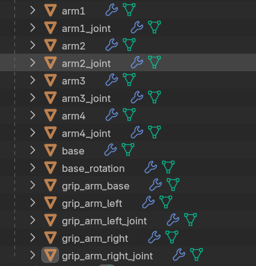

# 3D model 물리법칙 적용

---

>

## Blender 상 이름 및 역할 

##### 1. base

- base : 회전판 (고정)
- base_rotation_arm : 회전판 rotation 부분 (blender 기준 z 축 기준으로만 회전 가능)
- base_rotation_arm_joint : 회전판 joint 부분

##### 2. arm

- arm1 ~ arm4 : x축 기준으로만 이동 가능 (y, z 축 고정)
- arm[1~4]_joint : 각 arm 의 joint 부분 

##### 3. grip

- grip_arm_base : 집게 손의 base 부분 (IK Bone 과 함께 동작, bone 기준 rotation 가능)
- grip_arm_left : 집게손의 왼쪽 grip
- grip_arm_right : 집게손의 오른쪽 grip
- grip_arm_left_joint : 집게손의 왼쪽 grip_joint
- grip_arm_right_joint : 집게손의 오른쪽 grip_joint

## 구현

- Joint 를 중심으로 회전하기 때문에 Arm 들을 Joint 에 부착함
  - Joint 를 rotation 해 Mesh 움직임 
  - Rotation 의 제한 범위를 설정해 움직이도록함 
