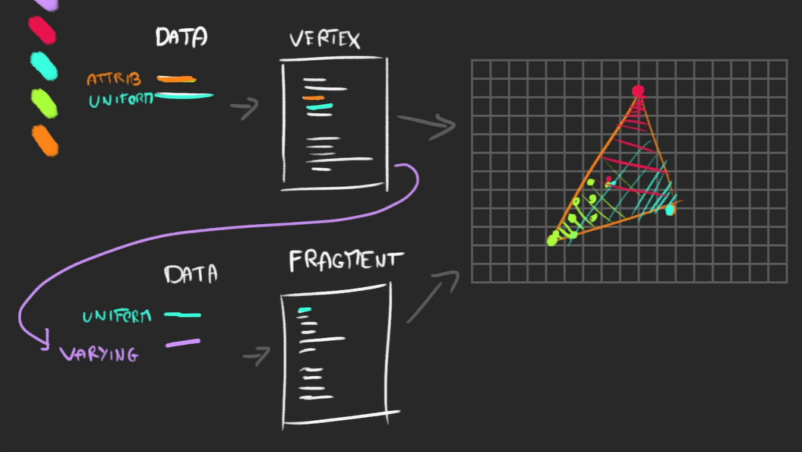

# Shader 개념정리 

---

>[shader glsl Docs1](https://thebookofshaders.com/)
>
>[shader glsl Docs2](https://shaderific.com/glsl.html)

## Shader 란? 

- WebGL의 주요 구성 요소 중 하나
- 셰이더는 GLSL로 작성되어 GPU로 전송되는 프로그램이다. 
  - 셰이더를 코딩하는 데 사용되는 언어는 GLSL이라고 하며, OpenGL Shading Language의 약자
- 셰이더는 **지오메트리의 각 정점을 배치(Vertex Shader)** 하고 **해당 지오메트리의 각 픽셀에 색상을 입히는(Fragment Shader)** 데 사용된다. 

## Shader 구조

- 셰이더에는 두 가지 유형이 있으며, 둘 다 필요하다. 
  - Vertex Shader (점들을 이용해 Geometry 표현)
  - Fragment Shader (삼각형이용해 Meterial 색상 표현)



## Shader 특징 

1. 정점 **셰이더는** 렌더에서 정점을 배치합니다.
2. 프래그먼트 **셰이더는** 해당 지오메트리의 각 보이는 프래그먼트(또는 픽셀)에 색상을 지정합니다.
3. 프래그먼트 **셰이더는** **정점 셰이더** 이후에 실행됩니다 .
4. 각 정점 사이에서 변경되는 데이터(예: 위치)를 **속성(Attribute) 이라고 하며** **정점 셰이더** 에서만 사용할 수 있습니다 .
5. 정점 간에 변경되지 않는 데이터(예: 메시 위치나 색상)를 **균일 데이터(Uniform 데이터) 라고 하며** **정점 셰이더** 와 **프래그먼트 셰이더** 에서 모두 사용할 수 있습니다 .
6. **varying을** 사용하여 **정점 셰이더 에서** **프래그먼트 셰이더** 로 데이터를 보낼 수 있습니다 .

## 정점(Vertex)이란? 

- 3D 공간에서 **하나의 점(point)** 을 의미

- 각 정점은 보통 **다음과 같은 속성(attribute)** 을 가진다

  - `position` (위치)
  - `normal` (법선)
  - `uv` (텍스처 좌표)
  - `color` (색상)

- 이 정보들이 `attribute` 로 셰이더에 전달

- 보통 3개의 정점이 모이면 하나의 면(삼각형)을 만든다.

  - 각 정점에는 자신만의 `attribute` 값이 있고, **Fragment Shader 단계에서 GPU가 삼각형 내부 픽셀마다** 이 값들을 **보간(interpolation)** 해서 부드럽게 연결한다. 

    ```
       v0
      /  \
     /____\
    v1    v2
    ```

- 즉

  - `attribute` = “정점의 데이터”
  - 정점 3개 = “삼각형(면)”
  - 삼각형 수천~수만 개 = “3D 모델”

## Vertex Shader 

- 정점 위치 계산 담당

  - 즉, **Geometry 로 부터 정점 데이터를 받아서 최종 화면 좌표로 변경하는 역할을 한다.** 

- `attribute` 로 들어온 `position` 을 가져와서 `modelMatrix`, `viewMatrix`, `projectionMatrix` 를 이용해 최종 화면 좌표(`gl_Position`)로 변환하는 역할을 한다. 

  ```glsl
  uniform mat4 modelMatrix;
  uniform mat4 viewMatrix;
  uniform mat4 projectionMatrix;
  
  attribute vec3 position;
  
  void main() {
      gl_Position = projectionMatrix * viewMatrix * modelMatrix * vec4(position, 1.0);
  }
  ```

## Vertex Shader 정리 비교표

| 구분        | uniform                      | attribute                            |
| ----------- | ---------------------------- | ------------------------------------ |
| 의미        | 모든 정점/픽셀이 공유하는 값 | 각 정점마다 다른 값                  |
| 적용 범위   | 전역(Global)                 | Vertex 개별                          |
| 데이터 갱신 | JS에서 수시로 갱신 가능      | 보통 한 번만 설정 (geometry 정의 시) |
| 예시        | 시간, 조명 색, 텍스처        | 정점 위치, UV, 색상                  |
| 사용 위치   | vertex & fragment shader     | vertex shader 전용                   |

- uniform 
  1. “하나의 조명 색상(lightColor)”
  2. “현재 시간(uTime)”
  3. “카메라 위치(cameraPosition)”
  4. 이런 값들은 장면 전체에서 동일하므로 `uniform` 으로 관리 
- attribute
  1. 이 **정점들이 모여서 면(face, triangle)** 을 구성
  2. "정점의 위치(position)"
  3. "정점의 법선(normal)"
  4. "정점의 UV 좌표(uv)"
  5. 이런 건 모두 정점마다 다르므로 `attribute` 로 전달

## Fragment Shader 

- 정점으로 면(삼각형)을 만들면 그 면 안의 **픽셀(fragment) 들을 채우는 색상 담당**

- 이 단계에서는 색상, 조명, 텍스처 등을 계산한다. 

  ```glsl
  void main() {
      gl_FragColor = vec4(1.0, 0.6, 0.3, 1.0);
  }
  ```

## 연결 과정 요약 (Three.js → GLSL)

- Three.js의 Geometry는 **정점 데이터 저장소**
- Vertex Shader는 **그 정점을 화면 좌표로 변환**
- Fragment Shader는 **그 정점으로 만들어진 면의 색을 계산**

| 단계 | 주체                           | 역할                                        |
| ---- | ------------------------------ | ------------------------------------------- |
| ①    | `BufferGeometry`               | 정점 데이터(위치, 색상, UV 등)를 GPU로 전달 |
| ②    | `attribute` (in Vertex Shader) | 각 정점의 데이터를 받아옴                   |
| ③    | `uniform`                      | 카메라, 시간, 조명 등 공통 값 전달          |
| ④    | `gl_Position` 계산             | 정점을 스크린 좌표로 변환                   |
| ⑤    | Fragment Shader                | 픽셀 색상 계산 후 화면 출력                 |

```glsl
uniform mat4 projectionMatrix;
uniform mat4 viewMatrix;
uniform mat4 modelMatrix;

attribute vec3 position;

void main()
{
    vec4 modelPosition = modelMatrix * vec4(position, 1.0);
    vec4 viewPosition = viewMatrix * modelPosition;
    vec4 projectedPosition = projectionMatrix * viewPosition;
    
    gl_Position = projectedPosition;
}
```

