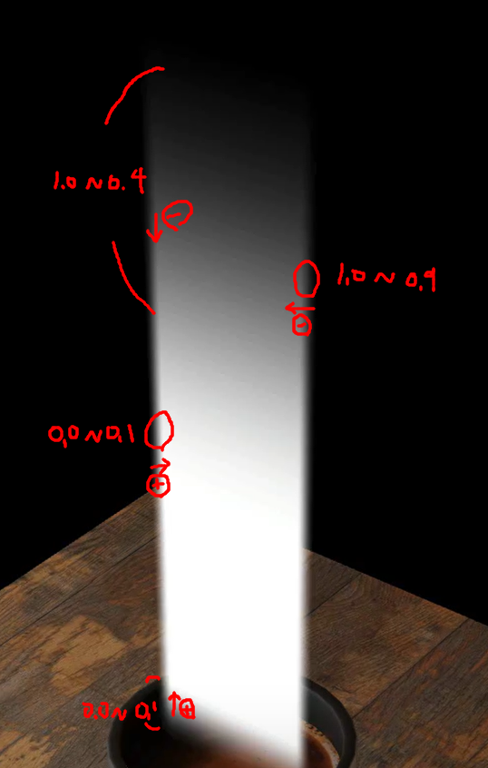

# smoothstep 메소드 

---

>

## 정의

- `smoothstep(edge0, edge1, x)` 는 **부드러운 0→1 전이**를 만드는 GLSL 함수
  - `x ≤ edge0`면 → `0`
  - `x ≥ edge1`면 → `1`
  - 그 사이는 **큐빅(hermite)** 곡선으로 스무스하게 보간
  - `edge0 > edge1` 로 주면 전이가 **뒤집혀서 1→0** 으로
- 결과는 항상 `0..1`로 **clamp**

```glsl
smoke *= smoothstep(0.0, 0.1, vUv.x); // ← x가 0.0~0.1 구간에서 0→1로 상승 (좌측 가장자리 서서히 등장)
smoke *= smoothstep(1.0, 0.9, vUv.x); // ← edge0>edge1 → 1→0로 하강 (우측 0.9~1.0에서 서서히 사라짐)
smoke *= smoothstep(0.0, 0.1, vUv.y); // ← y의 하단 0.0~0.1 구간에서 0→1 (바닥에서 부드럽게 등장)
smoke *= smoothstep(1.0, 0.4, vUv.y); // ← 위쪽 0.4~1.0에서 1→0 (천장 쪽으로 점점 사라짐, 폭 넓음)
```

