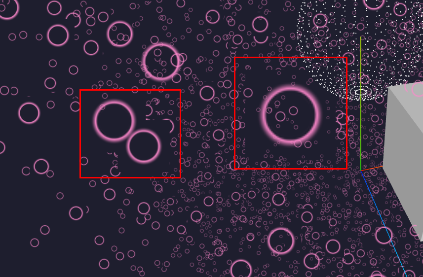
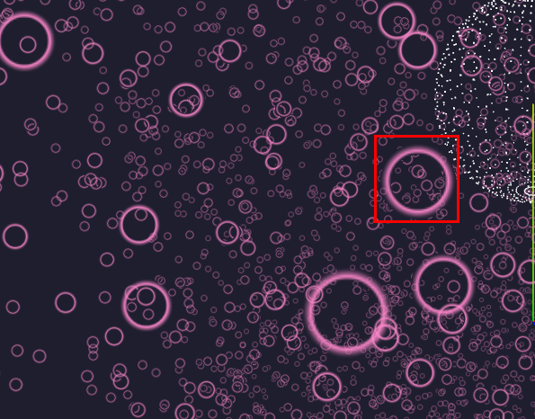
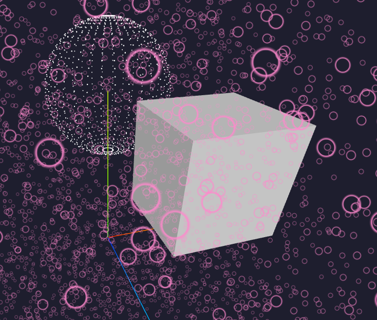
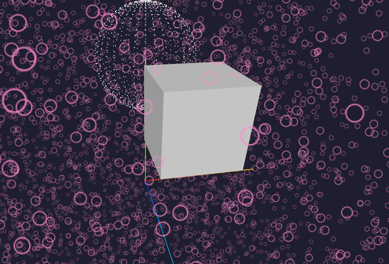

# Texture 검은 테두리 문제 해결

---

>

## 현상

- `map` + `alphaMap` 을 함께 사용했을 때
   투명 영역 경계에서 **검은색(or 원본 알파 영역 색상)** 이 보임.
- 대표적으로 **나뭇잎, 파티클, 글자 텍스처**에서 발생.

## 원인 (GPU 샘플링 이슈)

- 나의 주요 원인은 **GPU 가 검은 부분도 렌더하는 문제**였다. 
  - 즉, 불필요한 검은 부분은 렌더 하지 않도록 하는게 목적이였다. 
- 추가 원인들은 다음과 같다. 

##### 1. **텍스처 샘플링 & 보간**

- GPU 는 픽셀 단위로 텍스처를 샘플링할 때 주변 픽셀을 함께 참조(보간)함.
- 알파가 0인(투명) 영역에도 RGB 값이 남아있을 경우 → **검은색(또는 원본 색상)이 번짐**.

##### 2. `transparent: true`

- 역할:
  - 머티리얼을 “투명 렌더링” 모드로 전환 → 알파 값(0~1)에 따라 픽셀을 혼합(blending).
- 효과:
  - 부분 투명(연기, 유리, 파티클 등) 표현 가능.
- 문제점:
  - 경계선에서 **알파 0 영역의 RGB 값**이 섞이면 검은 테두리 생길 수 있음.
  - Z-buffer 정렬 문제(겹침 순서 오류)가 발생하기도 함.

##### 3. `alphaTest`

- 역할:
  - 알파 값이 특정 임계값보다 작으면 픽셀을 **아예 버림(discard)**.
  - 예: `alphaTest: 0.5` → 알파 < 0.5 인 픽셀은 그리지 않음.
- 효과:
  - 반투명 경계를 날려버리므로, **검은 테두리 현상 완화**.
  - 나뭇잎, 철망처럼 “뚜렷한 잘림”이 필요한 경우 유용.
- 문제점:
  - 부드러운 경계(anti-aliasing) 사라짐 → 가장자리 픽셀이 톱니처럼 보임.
  - 완전 반투명 효과(유리, 연기)에는 부적합.

## 해결

##### 1. `map` 으로 적용한 이미지를 `alphaMap` 으로 변경 

- `map` 과 `alphaMap` 개념

| 속성           | 설명                                                         |
| -------------- | ------------------------------------------------------------ |
| **`map`**      | 오브젝트의 표면 색상/패턴을 정의하는 텍스처.  일반적으로 RGB 값을 사용하며, diffuse texture 라고도 불림. |
| **`alphaMap`** | 오브젝트의 **투명도(알파 값)** 를 제어하는 텍스처.  RGB 색상은 무시되고, **흑백 값(밝기)** 으로 투명도가 결정됨.  흰색 = 불투명 / 검은색 = 투명 / 회색 = 반투명 |



##### 2. `alphaTest` 적용 

- **역할**
  - 알파 값이 `0.01` 미만인 픽셀은 GPU가 아예 **discard(버림)** 처리.
  - 알파=0 주변의 “검은 RGB 값”이 섞이지 않도록 막아줌.
- **효과**
  - 경계에서 번지는 검은 테두리 완화.
  - **가장자리 부분에만 경계처럼 이미지 남음** 
- **문제점**
  - 알파 값이 살짝 있는 픽셀도 잘려나가서 가장자리가 딱딱(톱니처럼) 보일 수 있음.
  - 부드러운 반투명 효과가 필요한 경우엔 부적합.

```js
const material = new THREE.MeshStandardMaterial({
  map: colorMap,
  alphaMap: alphaMap,
  transparent: true,
  alphaTest: 0.5
})
```



##### 3. `depthTest: false`

- **역할**
  - Z-buffer(깊이 테스트)를 하지 않음. → **다른 오브젝트와의 깊이 비교를 건너뜀**.
- **효과**
  - 반투명 픽셀이 뒷면에 가려져서 잘리는 문제를 피할 수 있음.
  - 파티클 같은 경우 앞뒤 순서에 상관없이 다 보이게 됨.
- **문제점**
  - 오브젝트가 겹칠 때 **시각적 깊이 정보가 무시**됨 → 비현실적인 겹침 표현 발생.
  - 투명 오브젝트가 많으면 화면이 지저분해질 수 있음.
- 결론 
  - 사용 x -> 깊이 정보가 무시됨 



##### 4. `depthWrite: false`

- **역할**
  - 현재 오브젝트를 Z-buffer에 기록하지 않음.
  - 즉, 다른 오브젝트가 이 오브젝트 뒤에 있어도 가려지지 않음.
- **효과**
  - 여러 투명 오브젝트가 겹칠 때 **앞 오브젝트가 뒷 오브젝트를 잘못 가리는 현상**을 줄임.
- **문제점**
  - 이 오브젝트가 다른 것들을 가릴 수 없게 됨.
  - 복잡한 씬에서 깊이 순서 문제가 더 눈에 띌 수 있음.
- 결론
  - **해당 옵션 이용하면 테두리 검은 문제 + 깊이문제 해결 가능** 

```js
const galaxyPoint = usePoint(
    galaxyGeo,
    new THREE.PointsMaterial({ 
        color : '#ff88cc',
        size : 0.2, 
        sizeAttenuation : true,
        transparent : true, 
        // map: textures.particleTextureObj.base // 이미지 가장자리 있음 
        alphaMap: textures.particleTextureObj.base, // 이미지 가장자리 없어짐 
        alphaTest : 0.01, // 검은 부분 GPU가 버리도록 함 
        // depthTest : false,
        depthWrite : false
    }),
    {
        position : { x: 0, y: 0, z: 0}
    }
)
```

