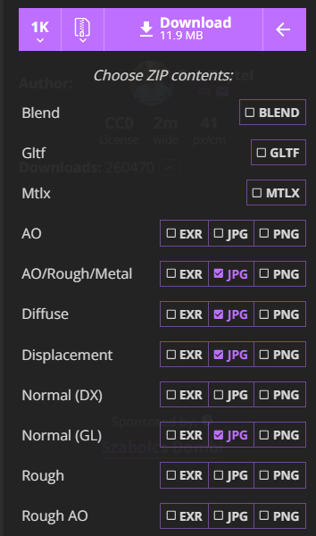

## Texture 이미지 종류 

---

>[Poly Haven 사이트(Texture 무료 이용 사이트)](https://polyhaven.com/a/forrest_ground_01)

## 텍스처 종류별 역할 정리

| 텍스처                           | 설명                                                         | 용도                                                         |
| -------------------------------- | ------------------------------------------------------------ | ------------------------------------------------------------ |
| **AO (Ambient Occlusion)**       | 주변광 차단 맵. 틈새나 접촉부에 **어두운 음영**을 줘서 입체감을 강화 | `material.aoMap`                                             |
| **Diffuse (Base Color, Albedo)** | **물체의 실제 색상(실제 표면)**. 빛 반사/광택 정보는 없음    | `material.map`                                               |
| **Displacement (Height Map)**    | 흑백 값에 따라 정점을 실제로 위아래로 움직여 **표면 높낮이**를 생성 | `material.displacementMap`                                   |
| **Normal (DX/GL)**               | 표면의 **세부 굴곡**을 흉내냄. 실제 지오메트리 변화 없이 빛 반사 방향만 바꿔서 디테일 표현 | `material.normalMap`                                         |
| **Rough (Roughness Map)**        | **표면의 거칠기**. 값이 낮으면 매끄럽고 반사, 높으면 거칠고 확산 반사 | `material.roughnessMap`                                      |
| **AO/Rough/Metal (Packed)**      | AO, Roughness, Metalness **3개를 각각 R,G,B 채널에 담은 압축 맵**. 메모리/성능 최적화용 | `material.aoMap`, `material.roughnessMap`, `material.metalnessMap` |

##### Normal (DX vs GL)

- DirectX (DX)와 OpenGL (GL)의 **Y축 방향(그린 채널)**이 반대라서, 엔진에 맞는 버전을 선택해야 함.
- Three.js는 **OpenGL 방식(GL)**과 호환되므로 보통 **Normal (GL)** 사용.

##### AO/Rough/Metal:

- 세 장을 따로 쓰면 텍스처 3개 로딩 → 성능 비용 ↑
- Packed Map은 텍스처 1장에 R=AO, G=Rough, B=Metal로 담음 → 성능 최적화

#####  요약

- **색상** → Diffuse
- **그림자 틈새 강조** → AO
- **거칠기** → Rough
- **세부 굴곡** → Normal
- **실제 높낮이** → Displacement
- **최적화용** → AO/Rough/Metal (Packed)

## 파일 형태 

| 파일 형식         | 특징                                     | 장점                                                         | 단점                                             | 활용 예시                                       |
| ----------------- | ---------------------------------------- | ------------------------------------------------------------ | ------------------------------------------------ | ----------------------------------------------- |
| **EXR** (OpenEXR) | **HDR(고해상도 부동소수점)** 이미지 포맷 | - 32bit float → 매우 정밀 - 빛/색상 정보 손실 없음 - PBR, HDRI 환경맵에 최적 | - 파일 용량 큼 - GPU 메모리 부담 ↑               | HDR 환경맵, AO/Height 정밀 텍스처               |
| **PNG**           | **무손실 압축, 8bit 또는 16bit**         | - 투명 채널(Alpha) 지원 - 색 보존 좋음 - 아트웍/아이콘 등 선명함 유지 | - JPG보다 용량 큼 - 고해상도/타일링에 부담       | 알파 채널 필요한 텍스처 (투명, 마스크 등)       |
| **JPG (JPEG)**    | **손실 압축, 8bit**                      | - 파일 용량 작음 - 웹/게임에 최적화 - 로딩 빠름              | - 압축 아티팩트 발생 - 알파 채널 없음 - HDR 불가 | Diffuse(색상), Roughness, Normal (압축 허용 시) |

- **EXR** → 고정밀, HDR용 (빛/고도/환경맵)
- **PNG** → 무손실, 알파 필요할 때 / Normal 같은 디테일 맵
- **JPG** → 가벼움, 색상 맵(Diffuse, AO 등)에 최적

## 항목 별 파일 형태 추천 

- Diffuse (Base Color): 
  - JPG (색상 정보만 필요 → 용량↓)
- AO / Rough / Metal (Packed): 
  - JPG or PNG (PNG는 디테일 보존, JPG는 가벼움)
- Normal Map: 
  - PNG 권장 (세부 디테일 보존 필요 → 손실 압축하면 아티팩트 발생)
- Displacement / Height: 
  - EXR 또는 PNG (정밀도가 중요 → 가능하면 EXR)
- HDRI 환경맵 (Sky, LightProbe): 
  - EXR (HDR 데이터 유지 필요)