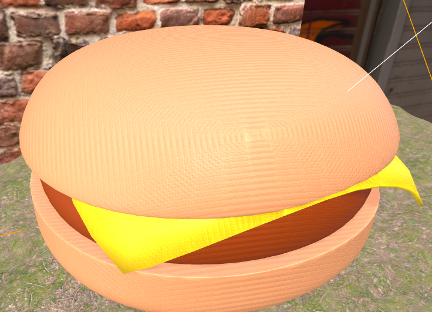
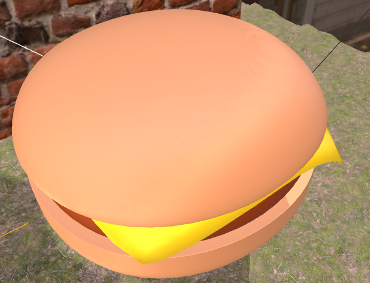

# model 표면 물결무늬 문제 해결

---

>

## 섀도우 아크네란?
- **그림자 맵핑(Shadow Mapping)** 기법을 사용할 때 발생하는 대표적인 아티팩트.
- 표면 위에 **줄무늬나 점 패턴**처럼 잘못된 그림자가 나타나는 현상.
- 매끈한 표면뿐만 아니라 평평한 표면에서도 흔히 발생.



##### 원인

- Shadow Map은 **빛의 관점에서 깊이(depth)를 텍스처에 저장**한 뒤, 렌더링 시 픽셀의 깊이와 비교하여 그림자 여부를 판정함.
- 이 과정에서 GPU의 **부동소수점 정밀도 한계** 때문에 실제로는 같은 위치인데도 "그림자 안"으로 잘못 판정되는 경우가 발생.
- 그 결과, 표면 위에 잘못된 얇은 줄무늬가 보이게 됨.

## 해결 방법

##### 대부분 `Bias, normalBias` 로 해결 

- GUI 툴로 자신의 모델에 잘 맞는 값을 찾아야함 



##### 1. Bias 조정

```js
directionalLight.shadow.bias = -0.0001;
```

- **일반적으로 평평한 표면에 도움**
- 그림자 깊이 비교에 오차를 보정하기 위해 그림자를 살짝 밀어냄.
- 값이 너무 크면 그림자가 떠 있는 것처럼 보이는 Peter Panning 현상 발생.

### 2. Normal Bias 사용

```js
directionalLight.shadow.normalBias = 0.05;
```

- **일반적으로 둥근 표면에 도움**
- 표면 노멀 방향으로 그림자를 이동시켜 아크네를 줄임.
- 주로 PBR(Material) 사용 시 효과적.

### 3. Shadow Map 해상도 증가

```js
directionalLight.shadow.mapSize.width = 2048;
directionalLight.shadow.mapSize.height = 2048;
```

- 기본값(512x512)은 정밀도가 낮아 아크네가 두드러짐.
- 해상도를 높이면 개선되지만 성능 비용이 증가.

### 4. Shadow Camera 범위 최적화

```js
directionalLight.shadow.camera.near = 1;
directionalLight.shadow.camera.far = 500;
directionalLight.shadow.camera.left = -100;
directionalLight.shadow.camera.right = 100;
directionalLight.shadow.camera.top = 100;
directionalLight.shadow.camera.bottom = -100;
```

- 그림자 카메라 범위가 너무 크면 깊이 정밀도가 떨어져 아크네 발생.
- 필요한 영역만 커버하도록 범위를 줄이는 것이 중요.

### 5. 재질/표면 트릭

- 매끈한 표면일수록 아크네가 눈에 띔.
- 미세한 노이즈 텍스처를 입혀 아티팩트가 덜 보이도록 할 수 있음.

## 정리

- **원인**: Shadow Map의 깊이 비교 정밀도 문제
- **대표 해결책**:
  1. **`bias` / `normalBias` 조정**
  2. Shadow Map 해상도 증가
  3. Shadow Camera 범위 축소
  4. 필요시 머티리얼/텍스처 트릭