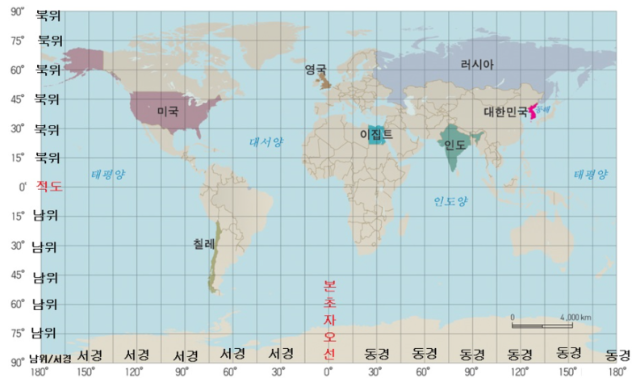

# Three.js 라이브러리 개념정리 

---

>[Three.js 문서](https://threejs.org/docs/index.html#manual/en/introduction/Creating-a-scene)
>
>[Three.js 공식홈페이지](https://threejs.org/)
>
>[Three.js 이용한 예시 페이지](https://www.pola.co.jp/special/o/wecaremore/mothersday/)
>
>[인프런 강의](https://www.inflearn.com/course/3d-%EC%9D%B8%ED%84%B0%EB%9E%99%ED%8B%B0%EB%B8%8C-%EC%9B%B9)
>
>[기초개념 정리](https://velog.io/@outclassstudio/Three.js-1-%EA%B8%B0%EC%B4%88-%EA%B0%9C%EB%85%90)
>
>[기초개념 정리2](https://kyportfolio.tistory.com/265?category=558305)
>
>[도형 만들기 예제](https://velog.io/@whdnjsdyd111/Three.js-%EA%B8%B0%EB%B3%B8-%EA%B5%AC%EC%A1%B0)
>
>[Threejs웹사이트 제작예시](https://velog.io/@cksrb63/React-Three.js-3D-%EC%9B%B9%EC%82%AC%EC%9D%B4%ED%8A%B8%EB%A5%BC-%EB%A7%8C%EB%93%A4%EC%96%B4%EB%B3%B4%EC%9E%90)
>
>[Threejs이용 토스페이스 클론코딩 ](https://velog.io/@blcklamb/%ED%86%A0%EC%8A%A4%ED%8E%98%EC%9D%B4%EC%8A%A4%EB%A5%BC-%ED%81%B4%EB%A1%A0%EC%BD%94%EB%94%A9-%ED%95%B4%EB%B3%B4%EC%9E%90)
>
>[상자 옮기기 예제](https://threejs.org/examples/?q=rota#misc_controls_transform)
>
>[차량 개인 카메라 표출 예제](https://threejs.org/examples/#webgl_geometry_extrude_splines)

# WebGL

- 웹 기반의 그래픽 라이브러리이다. 자바스크립트 프로그래밍 언어를 통해서 사용할 수 있으며 호환성이 있는 웹 브라우저에서 인터랙티브한 3D 그래픽을 사용할 수 있도록 제공된다. 
- 즉, 웹 상의 요소를 Graphic 으로 표현하기 위해 사용되는 라이브러리로, 자바스크립트를 이용해 2D,3D 를 그릴 수 있다. 
- WebGL을 더 쉽고 간편하게 사용할 수 있도록 도와주는것이 Three.js이다. 
  1. WebGL은 Low레벨이기 때문에 도형 하나 만들려면 많은 코드가 필요하다. 
  2. 이때 더 쉽게 만들 수 있도록 도와주는것이 Three.js이다. 

---

## geo-three 라이브러리 

> [geo-three 깃허브](https://github.com/tentone/geo-three?tab=readme-ov-file)

### 1. 정의 

1. three.js를 사용하여 지도를 표시하는 라이브러리이다. 
2. 타일 기반으로 지리 데이터를 전 세계 규모로 시각화할 수 있다.

### 2. provider

1. 지도 서비스 제공 업체를 객체로 가진다. 
   1. 제공 업체 : [BingMaps](https://www.microsoft.com/en-us/maps), [GoogleMaps](https://developers.google.com/maps/documentation), [HereMaps](https://developer.here.com/), [MapBox](https://docs.mapbox.com/api/), [MapTiler](https://www.maptiler.com/), [OpenMapTiles](https://openmaptiles.org/), [OpenStreetMaps](https://www.openstreetmap.org/)
   2. OpenStreetMaps, BingMaps 같은 몇몇 provider 만 제외하고 모두 계정에 따른 API 를 발급받아야 한다. 
2. 생성된 Provider 마다 요구되는 매개변수와 사용되는 형태가 달라진다.

### 3. 사용법

```js
// 1. 타일 제공업체에 대한 객체 생성 
var provider = new OpenStreetMapsProvider();
// var provider = new geoThree.BingMapsProvider();

// 2. provider 객체 이용해 타일 제공 업체에 따른 mapView 생성
var map = new MapView(MapView.PLANAR, provider); // PLANAR : 평면 지도 

// 3. threejs의 scene에 지도 표출 
scene.add(map);
```

### 4. 좌표계 

1.  [EPSG:900913](https://epsg.io/900913) 

2. threejs에서 사용되는 좌표계와 호환될 수 있도록 위경도 좌표계인 WGS84 를 X,Y,Z 좌표로 변환하는 메소드를 제공한다. 

   ```js
   var coords = Geo.UnitsUtils.datumsToSpherical(40.940119, -8.535589);
   controls.target.set(coords.x, 0, -coords.y);
   ```

### 5. Tile (타일)

1. 지도는 타일 정보로 되어있어, 프로세스 시작시 로드된다. 

   1. 확대/축소를 통해 십자가 모양의 rays를 통해 tile 정보를 가져오게 된다. 
   2. rays의 수는 는 MapView subdivisionRays 속성을 사용하여 구성 가능하다. 

2. 타일 좌표는 zoom 레벨에 따라 제공업체로 부터 타일로 나눠서 가져오게 된다. 

   1. LOD Control을 이용해 가까운 노드는 세분화되고 멀리 있는 노드는 단순화한다.

   ```js
   // openStreetMap 의 예시 
   image.src = "https://a.tile.openstreetmap.org/" + zoom + "/" + x + "/" + y + ".png";
   
   // zoom : 5, x : 27, y : 12 위치의 tile 정보를 가져와 LOD Control을 통해 표시 부분을 세분화 및 단순화 한다. 
   'https://a.tile.openstreetmap.org/5/27/12' 
   ```

### 6. 예제 

1. [Sandbox](https://tentone.github.io/geo-three/examples/providers.html)
2. [Globe](https://tentone.github.io/geo-three/examples/transition.html)


---

# Three.js

## 1. 정의

1. WebGL을 이용해서 3D 컨텐츠를 웹페이지에 구현할 수 있도록 도와주는 자바스크립트 라이브러리이다

##### 기본개념

1. 카메라, Scene 을 웹사이트에 구현해주는 것이 Renderer 이다. 
   1. 즉, Renderer 는 카메라에 담긴 장면을 웹사이트에 표출
2. Scene 
   1. 장면으로, 최상위 노드이다. 

## 2. 위도와 경도

1. 위도 ( Latitude )
   1. 남북
2. 경도 ( Longitude )
   1. 동서 
3. 우리나라
   1. 북위 37, 동경 127



## 3. 좌표체계 

1. X / X : 왼쪽 / 오른쪽

2. Y / Y : 아래 / 위

3. Z / Z : 앞 / 뒤 - 영점을 기준으로 내가 앞으로 바라보는(나를 바라보는게 아닌) 앞쪽과 내뒤쪽

4. 기본 설정상 `scene.add()`로 물체를 추가하면 `(0,0,0)`의 위치를 갖는다. 

5. 사용법

   ```js
   // 보조축 (x,y,z 축 표시) => x : red , y : green, z : blue
   var axes = new THREE.AxesHelper(5); // 매개변수 : size 
   // axes.setColor(x,y,z); // 색상 지정 가능  
   this.scene.add(axes); // 축을 장면에 추가
   ```

## 4. 카메라 

####  [PerspectiveCamera()](https://threejs.org/docs/#api/en/cameras/PerspectiveCamera) - 원근 투영

1. 정의

   1. 원근감을 시뮬레이션하기 위해 사용되며, 원격에 있는 객체가 작아지는 시점을 제공

   2. 우리가 실제 세상을 볼 때 발생하는 원근감을 시뮬레이션하기 위해 사용

   3. 즉, 멀리 있는 객체는 작게 보이고, 가까이 있는 객체는 크게 보인다.

   4. 사진찍으면 먼 산은 작게 보이고, 가까운 나무는 크게 보이는것과 같음 

2. 매개변수 

   1. `fov (Field of View)`: 
      - **시야각**을 나타내는 매개변수입니다. 시야각은 카메라가 얼마나 많은 수평 및 수직 영역을 볼 수 있는지를 결정합니다. 값은 각도로 표시되며, 일반적으로 **0에서 180도 사이의 값**을 가집니다. 값이 클수록 시야가 넓어지고, **작을수록 시야가 좁아집니**다.
      - 즉, 확대 기능으로도 사용된다. 
   2. `aspect`
      - **화면의 가로 세로 비율**을 나타내는 매개변수입니다. 보통 웹 브라우저의 창 크기나 화면의 비율을 나타내는 값으로 사용됩니다. 이 값을 조절하여 뷰포트의 가로 세로 비율을 설정할 수 있습니다. 일반적으로 `window.innerWidth / window.innerHeight` 또는 캔버스의 너비와 높이를 사용합니다.
   3. `near`: 
      - 카메라가 보는 **원근 투영에서 가까운 경계 평면**을 나타내는 매개변수입니다. **이 값보다 가까운 객체는 렌더링되지 않습**니다. 주로 0.1 또는 더 큰 양수 값으로 설정됩니다.
      - 지정한 거리보다 더 가까히 다가갈때 랜더링 안됨 
   4. `far`: 
      - 카메라가 보는 **원근 투영에서 먼 경계 평면**을 나타내는 매개변수입니다. **이 값보다 먼 객체는 렌더링되지 않습니다**. 무한대에 가까운 값으로 설정됩니다. 일반적으로 1000, 2000, 또는 더 큰 값으로 설정됩니다.
      - 지정한 거리 벗어난 객체 렌더링 안함 

3. 예시

   ```js
   const fov = 75; // 시야각
   const aspect = window.innerWidth / window.innerHeight; // 화면 비율
   const near = 0.1; // 가까운 경계 평면
   const far = 1000; // 먼 경계 평면
   
   const camera = new THREE.PerspectiveCamera(fov, aspect, near, far);
   ```

#### [OrthographicCamera()](https://threejs.org/docs/index.html?q=camera#api/en/cameras/OrthographicCamera) - 직교 투영 

1. 모든 방향에서 동일한 크기로 객체를 투영
2. 즉, 멀리 있는 객체와 가까이 있는 객체가 화면에 그려질 때 크기가 같다. 
3. 정확한 크기와 비율이 필요한 경우에 유용하다. 


## 5. 회전 방법

1. [회전 방법 참고](https://facet.tistory.com/entry/threejs-move-scale-rotation)

2. Mesh 객체를 생성 후 회전시키는 방법으로 사용할 수 있다.

   1. Mesh 객체는 Geometry 와 Material 을 결합하여 생성되는 3D 객체이다. 

3. rotation 속성

   1. X,Y,Z축 주위의 회전 각도를 이용해서 회전시킨다. 
   2. 즉 `π = 180°`를 염두에 두고 회전값을 입력해야 한다.

4. rotation적용시 geometry 와 mesh 에 차이점 

   1. geometry에 직접 회전을 적용한다면, 같은 geometry를 사용하는 여러 mesh가 모두 같은 회전을 가지게 된다. 
   2. mesh에 직접 회전을 적용하면 각각의 mesh가 독립적으로 회전할 수 있다. 

5. 예시

   ```js
   // X 축 주위의 회전 (90도)
   cube.rotation.x = Math.PI / 2; // 라디안 단위로 지정
   // Y 축 주위의 회전 (180도)
   cube.rotation.y = Math.PI; // 라디안 단위로 지정
   // Z 축 주위의 회전 (360도)
   cube.rotation.z = Math.PI * 2; // 라디안 단위로 지정
   
   // Geometry에 회전 적용 (비권장)
   geometry.rotateX(Math.PI / 2); // X 축 주위로 90도 회전
   // Mesh에 회전 적용 (권장)
   mesh.rotation.x = Math.PI / 2; // X 축 주위로 90도 회전
   ```


## 6. 건물 객체 정보 출력 

1. 서칭 정보
   1. [내가 원했던 기능 예시](https://discourse.threejs.org/t/is-it-possible-to-subdivide-a-box3helper/6720/2)
   2. [사용 예시](interactive)
2. Threejs의 [boxHelper](https://threejs.org/docs/index.html?q=boxhel#api/en/helpers/BoxHelper) 와 [box3](https://threejs.org/docs/index.html?q=box#api/en/math/Box3)를 이용하면 된다. 


## 7. 건물 표출

- bingMap 이용 

  

- StreetMap 이용 

  

### 필요 과정 

1. 건물의 위치정보 
2. 건물 돌출 정보

### 건물 위치 정보 

1. 좌표 정보를 계산식을 통해 Threejs의 x,y,z 좌표로 변환한다. 

   1. 좌표정보로 건물의 밑면을 그리게 된다.
   2. 이때 사용되는 함수는 moveTo(좌표) 와 lineTo(좌표) 이다. 
   3. 즉, (127.12 , 37.12) 와 (127.13 , 37.13) 을 가지고 하나의 선을 만들어가며 건물의 밑면을 그려나간다. 

2. 예시

   ```js
   const shape = new THREE.Shape();
   
   // 원하는 도형의 점을 지정하고 순서대로 연결
   shape.moveTo(0, 0);   // 첫 번째 점
   shape.lineTo(10, 0);  // 두 번째 점 (오른쪽으로 이동)
   shape.lineTo(10, 5);  // 세 번째 점 (위쪽으로 이동)
   shape.lineTo(0, 5);   // 네 번째 점 (왼쪽으로 이동)
   ```

### 건물 돌출 정보

1. 앞의 건물 위치 정보를 이용해 밑면의 정보를 돌출시켜 3D 입체 건물로 변환시키는 과정이다. 

2. 돌출 정보에는[ExtrudeGeometry()](https://threejs.org/docs/#api/en/geometries/ExtrudeGeometry) 객체 형태를 사용한다. 

   1. 객체 생성 후  [BufferGeometry()](https://threejs.org/docs/index.html?q=BufferGeometry#api/en/core/BufferGeometry) 형태로 변환해 사용한다. 

3. 문제

   1. 건물이 y축을 기준으로 반대로 그려진다면 depth 를 음수로 변경하면 된다. 

4. 예시

   ```js
   // ExtrudeGeometry로 돌출된 모델 생성
   const extrudeSettings = {
       steps: 2, // 돌출된 스플라인의 깊이를 따라 세그먼트를 세분화하는 데 사용
       depth: 16, // 돌출 높이( 건물 높이 )
       bevelEnabled: true, // 건물 둥굴게 처리 유무 
       bevelThickness: 1, 
       bevelSize: 1,
       bevelOffset: 0,
       bevelSegments: 1
   };
   
   // ExtrudeGeometry 객체 생성 
   const geometry = new THREE.ExtrudeGeometry(shape, extrudeSettings);
   
   // ExtrudeGeometry를 BufferGeometry로 변환
   geometry.computeBoundingBox();  // 바운딩 박스 계산 (옵션)
   that.geos_building.push(geometry); // geometry 집합 생성 
   
   // 표시 
   this.$nextTick(() => {
           let mergeGeometry = BufferGeometryUtils.mergeBufferGeometries(that.geos_building);
           let mesh = new THREE.Mesh(mergeGeometry, meterial );
   
           mesh.rotateX(Math.PI / 2);
           // mesh.scale.setY(-1);
           scene.add(mesh);
       })
   },
   ```


## 8. 조명

### 정의

1. 객체에 빛을 비추어 시각적인 효과 생성 
2. light 라고 표현되며 `AmbientLight` 와 `PointLight` , SpotLight 등을 사용한다. 

### [AmbientLight ](https://threejs.org/docs/index.html?q=AmbientLight#api/en/lights/AmbientLight)

1. 장면의 모든 객체를 전체적으로 동일하게 비추기 위해 사용 

2. 매개변수 

   1. 빛 색상 (color : Integer)
   2. 빛의 세기 (intensity : Float)

3. 예시

   ```js
   // AmbientLight
   let light0 = new THREE.AmbientLight(0xfafafa, 0.25);
   
   // 빛 추가
   this.scene.add(light0);
   ```

### [PointLight](https://threejs.org/docs/index.html?q=PointLight#api/en/lights/PointLight)

1. 한 지점에서 모든 방향으로 방출되는 빛

2. 매개변수

   1.  빛 색상 (color : Integer )
   2.  빛의 세기 (intensity : Float)
   3.  빛의 최대 범위 (distance : Number)
   4.  빛의 거리에 따른 어두워지는 정도 (decay : Float)

3. 예시

   ```js
   // PointLight1
   let light1 = new THREE.PointLight(0xfafafa, 0.4);
   light1.position.set(200, 90, 40);
   
   // PointLight2
   let light2 = new THREE.PointLight(0xfafafa, 0.4);
   light2.position.set(200, 90, -40);
   
   // 빛 추가 
   this.scene.add(light1);
   this.scene.add(light2);
   ```

### [SpotLight](https://threejs.org/docs/index.html?q=spotLight#api/en/lights/SpotLight)

1. 빛에서 멀어질수록 크기가 증가하는 원뿔을 따라 한 방향의 **단일 지점**에 방출

   1. 즉, 빛을 특정 지점에만 비출때 사용한다. 

   2. 예를들어, 극장 무대를 생각하면 쉽다. 극장에서 주인공만을 비출때 사용되는 빛이라고 생각하면 된다. 

      

2. 예시

   ```js
   // 카메라가 보는 위치로 조명 비추기 
   
   let spotLight = new THREE.SpotLight(0xffffff); // 흰색 빛 생성
   
   // 빛의 속성 설정
   Object.assign(spotLight, {
       angle: Math.PI / 14, // 빛이 비추는 각도 설정 -> 나누기 커질수록 좁은범위 
       castShadow: true, // 그림자 생성 여부
       penumbra: 0.5, // 부분 그림자 비율 설정 (0~1 사이)
       intensity: 1, // 빛의 강도
       distance: simpledDistance , // 빛의 거리
       decay: 0, // 빛 감쇄율 0으로 해서 거리 상관없이 빛의 세기 유지 
   });
   
   // 빛이 비추는 범위를 나타내는 원 생성
   let spotLightHelper = new THREE.SpotLightHelper(spotLight);
   
   // SpotLight의 타겟 생성 (light가 비추는 곳)
   let spotLightTarget = new THREE.Object3D();
   
   this.spotLight = spotLight;
   this.spotLightHelper = spotLightHelper; 
   this.spotLightTarget = spotLightTarget;
   
   this.scene.add(this.spotLight);
   this.scene.add(this.spotLightHelper);
   this.scene.add(this.spotLightTarget);
   
   // 렌더링 
   Update() {
       this.renderer.render(this.scene, this.camera);
       this.controls.update();
       // 카메라 이동, 회전 등이 발생했을 때 빛의 방향 업데이트
       this.updateLightDirection();
       
       requestAnimationFrame(this.Update); // 1초에 60번 렌더링됨 
   }
   
   updateLightDirection(){
       let spotLight = this.spotLight;
       let camera = this.camera;
       let cameraCurrPosition = camera.position.clone(); // 현재 카메라 위치 복재 
       
       // SpotLight의 위치를 카메라 위치로 설정
       spotLight.position.copy(cameraCurrPosition);  
   
       // 카메라의 방향을 가져와 SpotLight의 위치와 타겟의 위치를 설정
       const cameraDirection = new THREE.Vector3();
       camera.getWorldDirection(cameraDirection); // 카메라의 방향을 가져옴
       const lightDistance = 1; // 빛의 카메라에서 떨어진 거리
   
       // 카메라 현재 위치에서 특정 방향과 거리에 해당하는 위치를 계산
       const targetPosition = cameraCurrPosition.clone().add(cameraDirection.multiplyScalar(lightDistance));
       this.spotLightTarget.position.copy(targetPosition); // SpotLight 타겟 위치 설정
   
       // SpotLight의 타겟을 SpotLightTarget으로 설정하여 카메라의 방향으로 빛이 비추도록 함
       spotLight.target = this.spotLightTarget;
   },
   ```


## 9. DOM 의 비동기 처리 $nextTick

1. vue의 특성때문에 사용되는 것으로, Vue.js는 비동기적으로 상태가 업데이트 되며 상태가 변경된 후 DOM 이 업데이트 된다. 

2. 즉, Vue가 업데이트 된 DOM을 처리하고 나서 처리할 함수를 실행할때 `$nextTick()` 가 사용된다. 

3. 예시

   ```js
   this.$nextTick(() => { // Vue의 DOM 이 업데이트 된 후 호출된다. 
       let mergeGeometry = BufferGeometryUtils.mergeBufferGeometries(that.geos_building);
       let mesh = new THREE.Mesh(mergeGeometry,that.MAT_BUILDING );
   
       mesh.rotateX(Math.PI / 2);
       // mesh.rotateX(Math.PI / 2);
       that.iR.add(mesh);
   
   })
   ```


## 10. 건물과 도로 데이터 출력

1. overpass-turbo.kr 에서 해당 질의문 통해 정보를 얻을 수 있다. 
   1. 나같은 경우는 geojson으로 출력했다. 

```js
// overpass-turbo.kr
// 건물과 도로 정보
[out:json][timeout:30];(
  way["building"]({{bbox}});
  relation["building"]["type"="multipolygon"]({{bbox}});
  way["highway"]({{bbox}});
  );out;>;out qt;

// 도로만 표시 
[out:json][timeout:30];(
  way["highway"]({{bbox}});
);out;>;out qt;


// 지형 정보
[out:json][timeout:30];(
way["natural"="water"]({{bbox}});
relation["natural"="water"]({{bbox}});
);out body;>;out skel qt;


// 한국 tile 위치 정보 
// Tile's zoom = 4 => x = 13, y = 6
https://a.tile.openstreetmap.org/4/13/6.png 
// Tile's zoom = 5 => x = 27, y = 12
https://a.tile.openstreetmap.org/5/27/12.png
```


---

# 기타 자료 

## 1. NASA EarthData

1. [QGIS다운로드](https://qgis.org/ko/site/forusers/download.html#)
2. https://search.earthdata.nasa.gov/
3. https://github.com/orabazu/threejs-dem-visualizer
4. https://app.geotiff.io/
5. [3차원 하늘 공간 만드는 방법](https://www.youtube.com/watch?v=Gew0bBaaJ38)
6. [geo-three 라이브러리 예시](https://codesandbox.io/p/sandbox/taste-of-the-geo-three-47c4n6?file=%2Fsrc%2FApp.tsx%3A70%2C21)


## 2. 프로젝트 버전

1. "three": "^0.117.1", => geo-three 때문에 0.120.0 으로 버전 업 
2. vue 2


## 3. LOD level 이 존재

- 건물 그릴때 레벨이 존재. 
- 높아질수록 건물의 디자인이 세밀하게 변경됨 
- [참고 사이트1](https://www.researchgate.net/figure/Level-of-Detailing-LOD-as-defined-by-City-GML-Open-GIS-consortium-Source-Gerhard-et_fig1_290954779)


## QGIS x,y,z Tiles 추가 방법 

1. [참고 사이트](https://blog.naver.com/PostView.nhn?blogId=hongun7&logNo=221706999707)