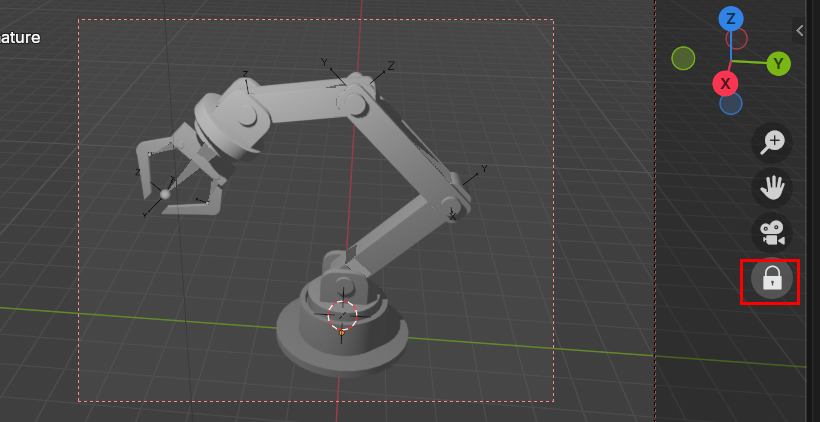

## 렌더 범위 조절

- `Ctrl + b` 를 통해 렌더 범위를 조절할 수 있다. 

## 카메라 너비 조절 

1. Output 이용 
   - `카메라 -> output -> x, y 조절` 을 통해 카메라 너비를 조절할 수 있다. 
2. 속성 이용
   - `카메라 선택 -> data -> focal Length ` 을 통해 카메라 너비 조절 가능 

## 카메라 위치 세부조절 

- 카메라 모드에서 자물쇠 잠구면 카메라 세밀 조정 가능 

