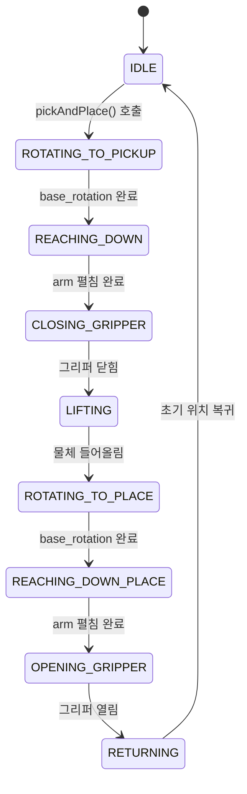

## 애니메이션 시퀀스

### 애니메이션 단계별 로직

| 단계                   | 동작                  | 관절 움직임                            |
| :--------------------- | :-------------------- | :------------------------------------- |
| 1. ROTATING_TO_PICKUP  | 픽업 위치 방향 회전   | `base_rotation.rotation.y`             |
| 2. REACHING_DOWN       | 팔 펼쳐서 물체 위치로 | `arm1-4_joint.rotation.x`              |
| 3. CLOSING_GRIPPER     | 그리퍼 닫기           | `grip_arm_left/right_joint.rotation.z` |
| 4. LIFTING             | 물체 들어올리기       | `arm1-4_joint.rotation.x` (역방향)     |
| 5. ROTATING_TO_PLACE   | 놓을 위치 방향 회전   | `base_rotation.rotation.y`             |
| 6. REACHING_DOWN_PLACE | 팔 펼쳐서 놓을 위치로 | `arm1-4_joint.rotation.x`              |
| 7. OPENING_GRIPPER     | 그리퍼 열기           | `grip_arm_left/right_joint.rotation.z` |
| 8. RETURNING           | 초기 위치로 복귀      | 모든 관절 초기화                       |