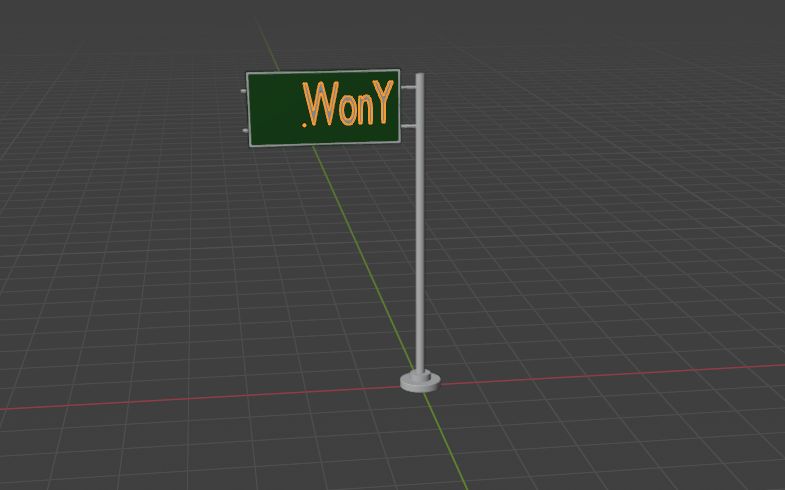

# 3D 디자인 툴  Blender

---

>[glTF 파일이란](https://docs.fileformat.com/ko/3d/gltf/)
>
>[참고 사이트1](https://blog.naver.com/js_kimmin/222320198387)
>
>[glTF파일 플러그인](https://github.com/ksons/gltf-blender-importer?tab=readme-ov-file)

## glb 파일과 glTF 파일 

1. glb 파일 
   1.  GLTF(GL Transmission Format)의 이진 버전인 파일 형식이다. 
   2. 3D 모델과 관련된 데이터를 효율적으로 저장하고 전송하기 위해 사용된다. 
   3. 모델, 텍스처, 셰이더 등의 데이터를 포함하고 있다. 
2. glTF파일 
   1. **3D 모델 정보를 JSON 형식으로 저장하는 3D 파일 형식**이다.
   2. JSON을 사용하면 3D 자산의 크기와 이러한 자산의 압축을 풀고 사용하는 데 필요한 런타임 처리가 최소화된다. 
   3. 즉, 작은 파일 크기, 빠른 로딩, 완전한 3D 장면 표현 및 확장성을 가질 수 있도록 만들어졌다. 

## Blender 

>[Blender 다운로드](https://www.blender.org/download/)
>
>[블랜더에 한글 text입력](https://blog.naver.com/js_kimmin/222324548031)

### Blender란? 

1. glb 파일을 다룰 수 있는 툴

### glTF 파일 불러오기 

1. `File -> import -> glTF ` 선택으로 glb 나 glTF같은 3D 모델을 가져올 수 있다. 

### text 입력

1. 편집모드로 변경
   1. 왼쪽 상단에 보면 Object Mode와 Edit Mode로 나뉘어 있는것을 확인할 수 있다. 
   2. 여기서 Edit Mode로 변경해야 Text를 변경할 수 있다. 
2. 한글입력을 지원하지 않기 때문에, 다른곳에다 입력 후 붙여넣기 하는 방법으로 한글을 사용할 수 있다. 

### 사용 예

