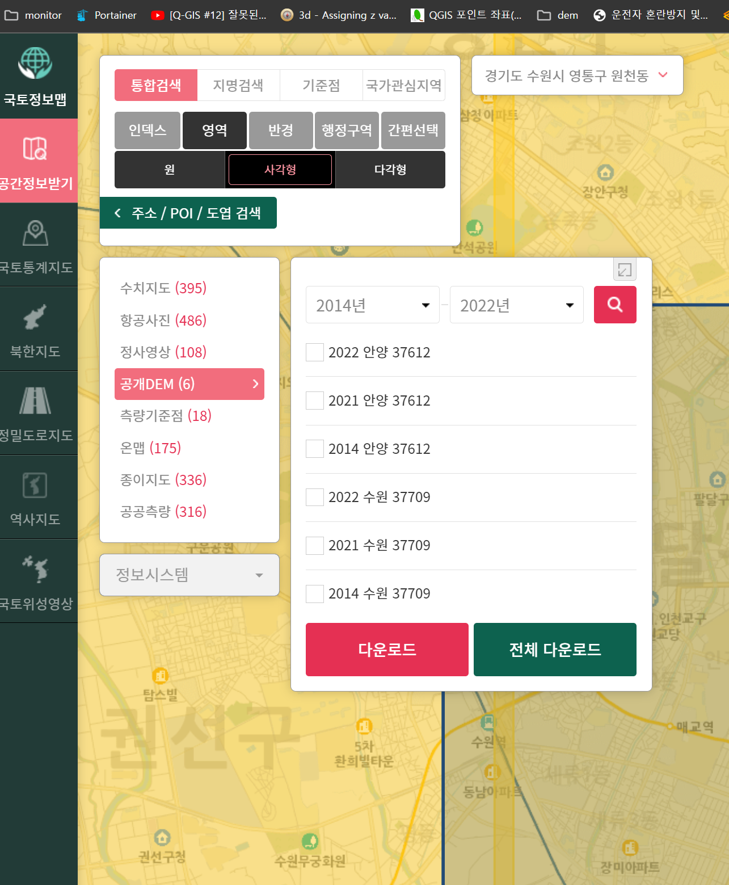
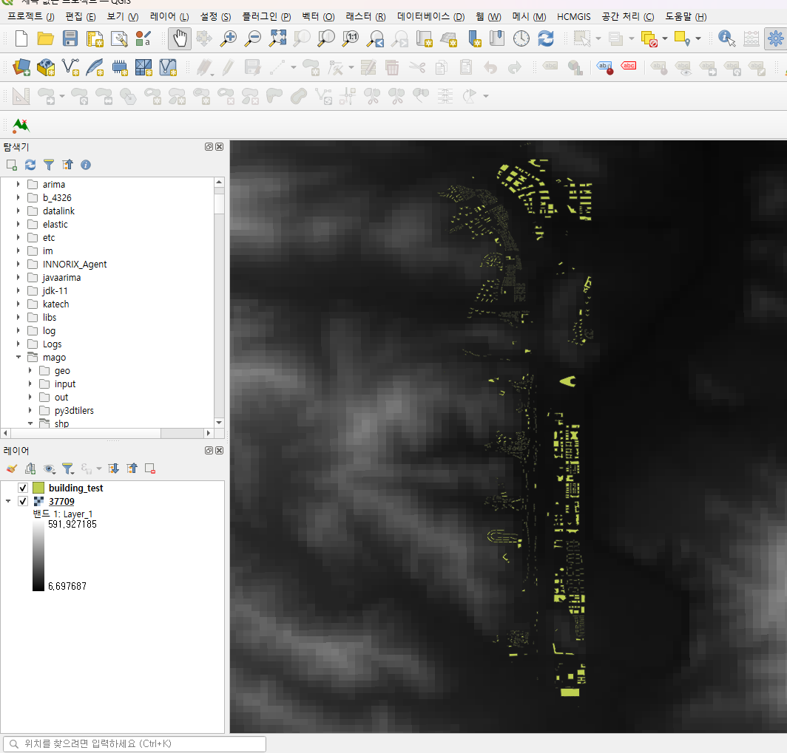
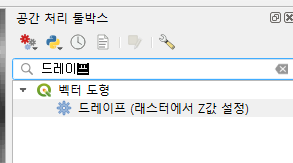
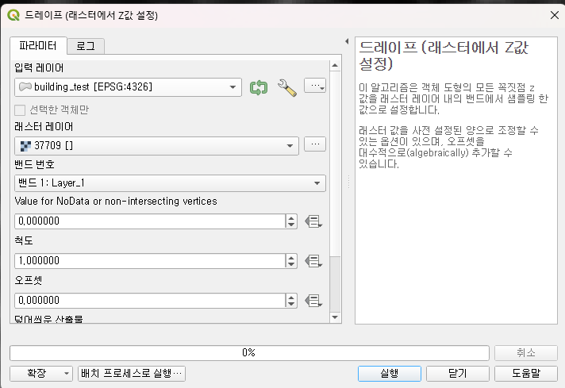
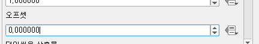

# shp파일에 고도 데이터 DEM 추가

---

>

## DEM 데이터

1. 고도를 표시하는 데이터 이다. 
   1. 데이터의 형태는 png, jpg 같은 그림파일이다. 
2. 하나의 픽셀로 이루어진 사진으로, 해당 픽셀로 인해 땅이 울퉁불퉁 할 수 있다. 

## shp에 DEM 추가 방법

### 1. Qgis에 건물 shp, DEM 데이터 추가

1. [국토정보플랫폼](https://map.ngii.go.kr/ms/map/NlipMap.do)에서 DEM 파일을 다운받는다. 

   

2. Qgis 에 DEM 데이터와 건물 에 대한 shp 파일을 추가한다. 

   

### 2.  DEM의 고도데이터를 shp 파일에 추가

1. Qgis에서 DEM 데이터를 사용하여 건물에 고도 데이터를 추가하기 위해서는 Qgis의 **드레이프 기능**을 사용하면 된다. 

   1. `입력 레이어`에 DEM 고도 데이터 추가할 shp 파일 

      

   2. `래스터 레이어`에 DEM 데이터를 추가

      

   3. `오프셋` 은 shp 파일의 고도에 추가로 고도를 더 주고 싶은 경우 사용

      1. DEM 데이터의 픽셀보다 건물이 커 고도에 건물이 침식당하는 경우가 생김 
      2. 이때 강제로 건물을 조금 올려주기 위해 `오프셋`을 이용함

      

   

### 3.  고도 데이터가 추가된 shp 파일 export 

1. shp 파일을  3D Tiles로 생성하기 위해 geojson으로 export 
   1. geojson-tiler 개념을 이용해 shp 파일을 3DTile로 변환한다. 
2. [geojson-tiler 사용법 정리 페이지](https://github.com/wonyoung0207/TIL/blob/master/3D/%EC%A7%80%EB%A6%AC%EC%A0%95%EB%B3%B4%20%EC%9D%B4%EC%9A%A9%203DTiles%20%EC%83%9D%EC%84%B1%EB%B0%A9%EB%B2%95%20%EC%A0%95%EB%A6%AC.md)

