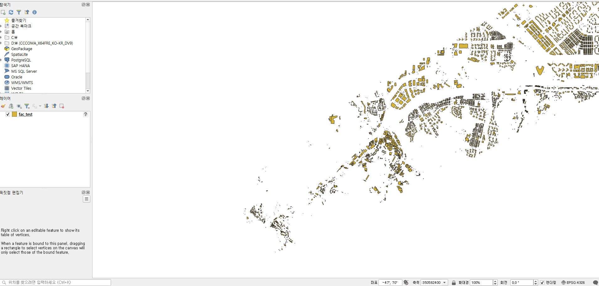
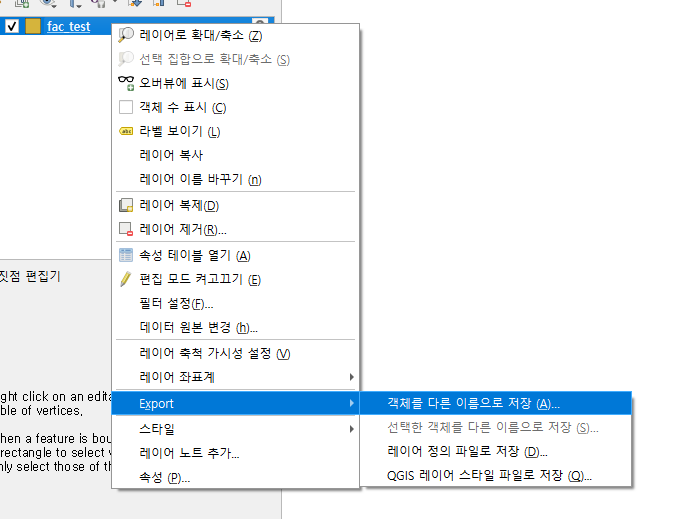
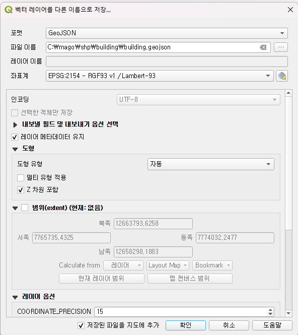
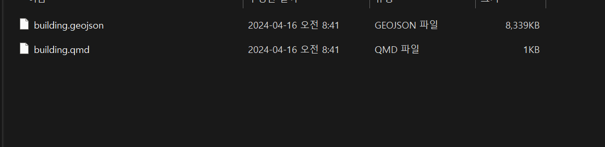
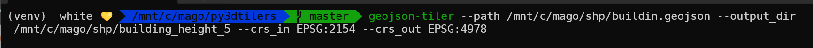
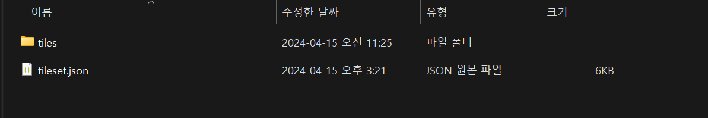
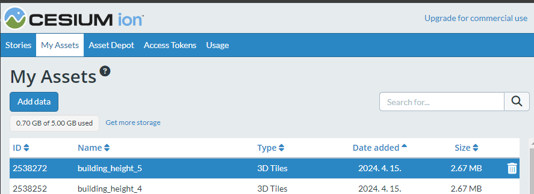
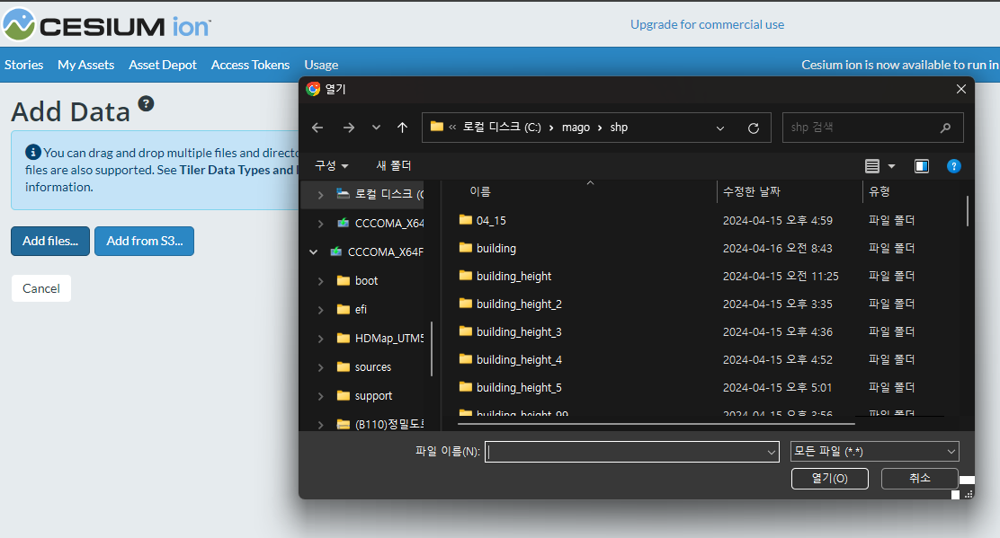
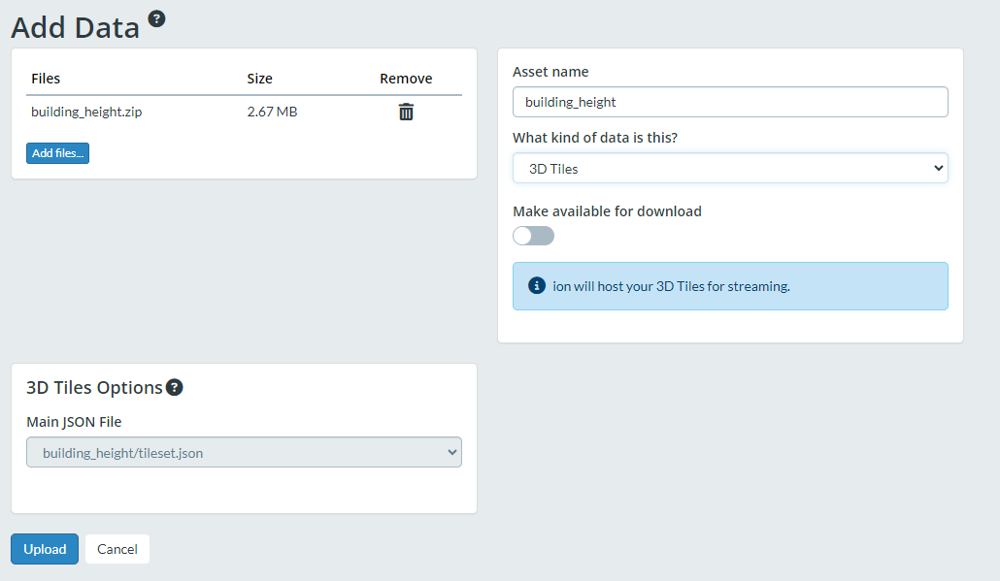
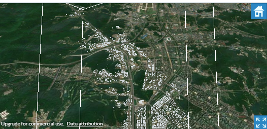

# GeoJSON을 사용하여 3DTiles 생성

---

>

## 1. 실제 도로 데이터인 shp 파일 다운로드

1. 실제 도로 데이터와 공간 데이터는 **국토정보플랫폼**에서 다운로드 받을 수 있다. 
   1. https://map.ngii.go.kr/mn/mainPage.do
2. 수치지도 받기 => 간편지도 선택 => 공간 정보 받기 => 통합검색 => 다각형 영역을 선택하고 원하는 데이터 타입을 다운로드 받는다.
   1. 여기서는 shp 파일로 다운받는 과정으로 소개한다. 


## 2. geojsonto3dtiles 프로그램을 사용하기 위해 shp 파일을 geojson으로 변경

1. shp 파일을 geojson으로 변경하기 위해서는 qgis 툴이 필요하다. 

   1. https://www.qgis.org/ko/site/forusers/download.html

2. 다운받은 shp 파일을 qgis에 임포트 한다. 

   

   

3. 좌표계 맞추기 

   1. 사용할 좌표계에 맞게 형식 변환이 필요 
   2. geojsonto3dtiles는 input으로 **EPSG:2154** 형식을 사용하여 해당 형식으로 변경필요. 
      1. qgis 에서 2154 검색해서 선택하면 됨 

   

   


## 3. geojson을 3D tiles로 변환

1. geojsonto3dtiles 프로그램을 install 한다. 

   1. https://github.com/VCityTeam/py3dtilers

   2. install후 실행하기 위해선 리눅스 환경에 virtualevn 이 설치되어있어야 한다. 

      1. apt-get은 리눅스 명령어이다. 

      ```js
      apt-get install virtualenv git // apt-get을 이용해 virtualenv와 git 을 설치 
      git clone https://github.com/VCityTeam/py3dtilers
      cd py3dtilers
      virtualenv -p python3 venv
      . venv/bin/activate
      (venv)$ pip install -e .
      ```

2. 설치가 완료되면 아래 명령어를 사용하여 생성한다. 

   

   ```cmd
   geojson-tiler --path /Users/user/Desktop/3D/tiles/geojson/building.geojson --output_dir /Users/user/Desktop/3D/tiles/geojson/geojson/shp --crs_in EPSG:2154 --crs_out EPSG:4978
   
   geojson-tiler --path [input file path] --output_dir [output path] --crs_in EPSG:2154 --crs_out EPSG:4978
   ```

   1. 외의 다른 속성값은 아래 경로를 참조해주세요.
   2. https://github.com/VCityTeam/py3dtilers/tree/master/py3dtilers/GeojsonTiler
   3. 결과 값을 확인하면 tileset.json 과 tiles 폴더가 생성된 것을 확인한다. 




## 4. 변환된 3Dtiles를 cesium ion에 import

1. 생성된 output 폴더를 압축한다. 

   1. tiles와 tilset.json이 같이 들어있어야 한다. 

2. cesium ion에 접속하여 MyAssets에 들어간다. 

   

3. Add data 를 누른 후 add files 버튼을 누른다. 

   

4. 압축한 zip 파일을 올린다. 

   1. 아래 사진 형식으로 upload 해준다. 

   

5. 결과가 오른쪽 페이지에 나오는 것을 확인한다. 

   


---

## geoJson 파일을 3D Tileset 으로 만들때 설정값 옵션 

```cmd
options:
  -h, --help            show this help message and exit
  --obj [OBJ]           When defined, also create an .obj model of the features. The flag must be followed by the name
                        of the obj that will be created.
  --loa [LOA]           Creates a LOA when defined. The LOA is a 3D extrusion of polygons. Objects in the same polygon
                        are merged together. Must be followed by the path to directory containing the polygons
                        .geojson
  --lod1                Creates a LOD1 when defined. The LOD1 is a 3D extrusion of the footprint of each object.
  --offset [OFFSET ...]
                        Add an offset to all the vertices.
  --scale [SCALE]       Scale features by the input factor.
  --height_mult [HEIGHT_MULT]
                        Multipler can be used if height values are in different units. For example, if height is in
                        survey feet, you will need to use 0.3048006096 as multipler.
  --crs_in [CRS_IN]     Input projection.
  --crs_out [CRS_OUT]   Output projection.
  --with_texture        Adds texture to 3DTiles when defined
  --no_normals          If specified, no normals will be written to glTf, useful for Photogrammetry meshes
  --quality [QUALITY]   Set the quality of the atlas images. The minimum value is 1 and the maximum 100. Quality can
                        only be used with the JPEG format.
  --compress_level [COMPRESS_LEVEL]
                        Set the compression level of the atlas images. The minimum value is 0 and the maximum 9.
                        Compress level can only be used with the PNG format.
  --format [{jpg,JPG,jpeg,JPEG,png,PNG}]
                        Set the image file format (PNG or JPEG).
  --output_dir [OUTPUT_DIR], --out [OUTPUT_DIR], -o [OUTPUT_DIR]
                        Output directory of the tileset.
  --paths [PATHS ...], --path [PATHS ...], --db_config_path [PATHS ...], --file_path [PATHS ...], -i [PATHS ...]
                        Paths to input files or directories.
  --geometric_error [GEOMETRIC_ERROR ...]
                        The geometric errors of the nodes. Used (from left ro right) for basic nodes, LOD1 nodes and
                        LOA nodes.
  --kd_tree_max [KD_TREE_MAX]
                        Set the maximum number of features in each tile when the features are distributed by a kd-
                        tree. The value must be an integer.
  --texture_lods [TEXTURE_LODS], --tl [TEXTURE_LODS]
                        Set the number of levels of detail that will be created for each textured tile. Each level of
                        detail will be a tile with a less detailled image but the same geometry.
  --keep_ids [KEEP_IDS ...]
                        If present, keep only the features which have their ID in the list.
  --exclude_ids [EXCLUDE_IDS ...]
                        If present, exlude the features which have their ID in the list.
  --as_lods             When used, the inputs are used as LODs.
  --height [HEIGHT]     Change the name of the propertie to look for in the feature for height. The value can also be
                        a float or an int, this will set the default height. Default property name is HAUTEUR
  --width [WIDTH]       Change the name of the propertie to look for in the feature for width. The value can also be a
                        float or an int, this will set the default width. Default property name is LARGEUR
  --z [Z]               Change the name of the propertie to look for in the feature for Z. The value can also be a
                        float or an int, this will set the default Z. By default, the Z will be taken from the
                        geometry coordinates.
  --prec [PREC]         Change the name of the propertie to look for in the feature for altitude precision. Default
                        property name is PREC_ALTI
  --is_roof             When defined, the features from geojsons will be considered as rooftops. We will thus


substract the height from the coordinates to reach the floor.
  --keep_properties, -k
                        When defined, keep the properties of the GeoJSON features into the batch table.
  --add_color [ADD_COLOR ...]
                        When defined, add colors to the features depending on the selected attribute.
```

