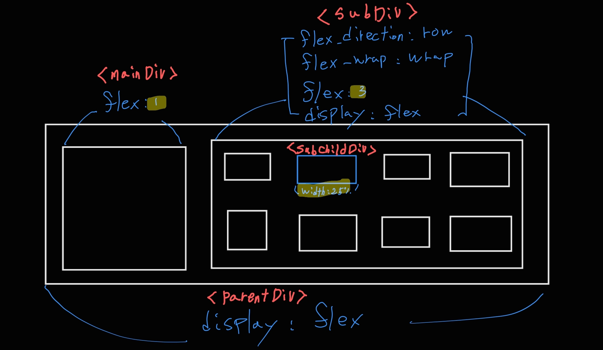

# flex 개념정리

---

>[flex 속성 예제 사이트](https://flexngrid.com/cheatsheet-flex/)

## flex 

1. Flex 항목에 적용하는 단축 속성으로, `flex-grow`, `flex-shrink`, `flex-basis` 속성을 한 번에 정의할 수 있다. 
2. 즉, 원래는 `flex-grow`, `flex-shrink`, `flex-basis` 속성 각각을 옵션값으로 적용해야하지만, `flex` 속성을 사용하면 한번에 세가지 속성을 적용시킬 수 있다. 
3. `flex-grow`
   1. 남는 공간을 얼마나 차지할지 결정 (기본값 `0`)
4. `flex-shrink`
   1. 공간이 부족할 때 얼마나 줄어들지 결정 (기본값 `1`)
5. `flex-basis`
   1. 기본 크기를 설정 (기본값 `auto`)

## display : flex 

1. `display: flex;`는 컨테이너 요소에 적용하는 속성. 
2. 이 속성을 사용하면 해당 컨테이너가 Flex 컨테이너로 변환되고, 그 안의 모든 자식 요소들이 Flex 항목이 된다. 

## flex 와 display:flex 차이점 

1. `display: flex;`
   1. 부모 요소에 적용하여 자식 요소들을 Flexbox 레이아웃으로 배치.

2. `flex`
   1. 자식 요소에 적용하여 Flexbox 레이아웃 내에서의 크기 조정과 배치를 제어.
   2. **즉, 가장 상위 컨테이너에 `display : flex` 를 적용하고, 하위에서 flex 속성으로 공간 비율을 설정한다.** 

3. 예시
   1. `flex : 1` 과 `flex : 3` 을 하위설정하면 1:3 비율로 공간을 나눌 수 있다. 
   2. 또한 `flex : 3` 한 태그안에서 또 비율을 나누고 싶다면 `display : flex`  를 설정해 하위 요소의 너비 비율에 따라 나눠진다. 
      1. 추가로, `flex-wrap` 이나 `flex-direction` 을 하면 줄바꿈으로 요소들을 표시할 수 있다. 



```css
.parentDiv{
    display : flex;
    width: 100%;
    height: 100%;
}
.mainDiv {
    width: 100%; /* flex:1 기준으로 나뉜 총 너비로 설정됨 */
    height: 100%;
    padding : 0.3rem;
    flex : 1;
}
.subDiv {
    flex : 3; 
    width: 100%; /* flex:3 기준으로 나뉜 총 너비로 설정됨 */
    height: 100%;
    display: flex; /* 하위 요소를 비율로 나누기 위해 선언 */
    flex-wrap: wrap; /* wrap 을 씌워야 여러개 요소가 한줄이 아닌 여러줄로 표출된다. flex-wrap 예제 보면됨 */ 
    flex-direction: row;  /* 한줄이 아닌 여러 row로 표출할 때 사용 */
}

.subChildDiv {
    width: calc(25% - 0.2em); /* 요소 1개의 너비로, subDiv 너비의 25% 너비로 설정됨 */
    /*  요소 여러개인 경우 개별 요소 너비가 모여 부모너비 만큼 다 차면 줄바꿈 일어남  */
    height: calc(50% - 0.2em);
    padding : 0.3rem;
    position: relative;
}
```


## 그 외 flex 관련 속성 

1. flex-wrap 
   1. 나열 된 (정렬 된) **요소들의 총 넓이가 부모 넓이 보다 클 때**, 이 요소들을 **다음 줄**에 이어서 나열(정렬) 해주는 기능이다. 
   2. flex-wrap 속성을 사용하지 않으면 기본값  즉, flex-wrap:nowrap; 이 적용되므로,이 정렬된 (나열된) 요소들의 넓이는 **부모 넓이에 맞게 모두 자동 축소 또는 확장 된다..**
