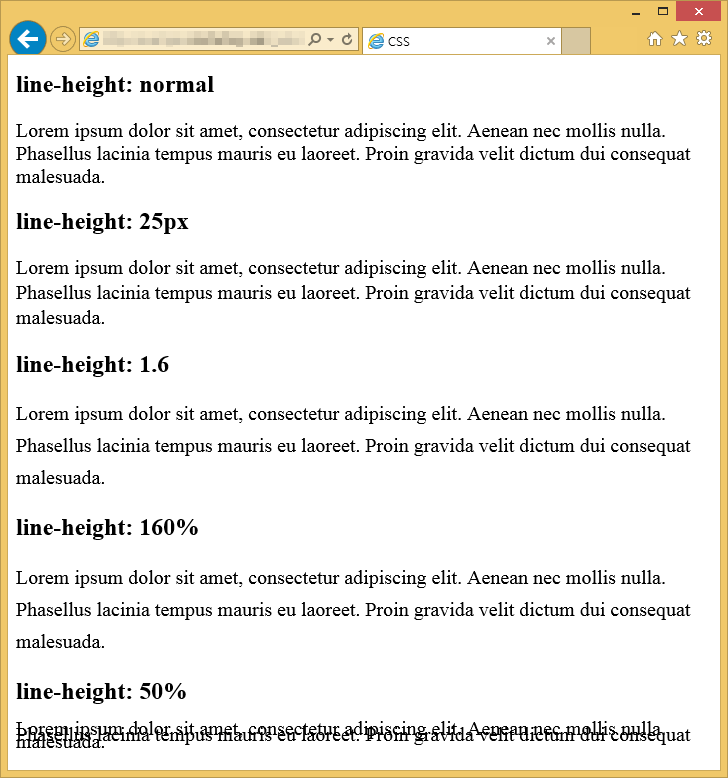

## line-height

### 정의

- 줄 높이를 정하는 속성

### 옵션

- normal : 웹브라우저에서 정한 기본값입니다. 보통 1.2입니다.
- length : 길이로 줄 높이를 정합니다.
- number : 글자 크기의 몇 배인지로 줄 높이를 정합니다. 
- percentage : 글자 크기의 몇 %로 줄 높이로 정합니다.
- initial : 기본값으로 설정합니다.
- inherit : 부모 요소의 속성값을 상속받습니다..

### 사용법

- 예를 들어 글자크기가 40px일 때 line-height의 값을 1.5로 하면, 줄 높이는 40의 1.5배인 60px가 된다 .
- 줄 높이는 60px인데 글자 크기는 40px이므로, 글자 위와 아래에 각각 10px의 여백이 생긴다. 

