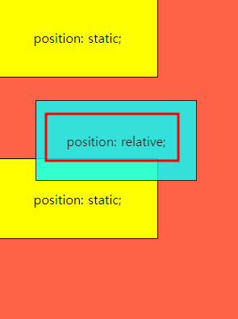
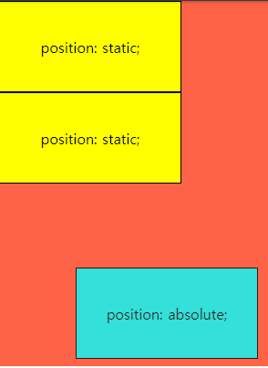
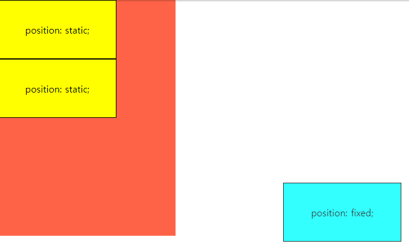

# Position 개념정리 

---

>[참고 사이트1](https://www.daleseo.com/css-position/)
>
>

## position : relative

1. 속성을 `relative`로 설정하게 되면, 요소를 원래 위치에서 벗어나게 배치할 수 있게 된다. 
2. 요소를 **원래 위치**를 기준으로 **상대적(relative)으로 배치** 한다. 
3.  요소의 위치 지정은 `top`, `bottom`, `left`, `right` 속성을 이용해서, 요소가 원래 위치에 있을 때의 상하좌우로 부터 얼마나 떨어지게 할지를 지정할 수 있다. 

### 예시

1. 요소 위치 이동

   ```css
   div:nth-of-type(2) {
     position: relative; /* 상대적 배치 */
     top: 28px; /* 원래 위치로부터 위로 28 이동 */
     left: 48px; /* 원래 위치로부터 위로 48 이동 */
     background: cyan;
     opacity: 0.8;
   }
   ```

   


## position : absolute 

1. 배치 기준을 자신이 아닌 상위 요소에서 찾는다.  
   1. DOM 트리를 따라 올라가다가 `position` 속성이 `static`이 아닌 첫 번째 상위 요소가 해당 요소의 배치 기준으로 설정된다. 
   2. 만약에 해당 **요소 상위**에 `position` 속성이 `static`이 아닌 **요소가 없다면**, **DOM 트리에 최상위에 있는 `<body>` 요소가 배치 기준**이 된다. 
2. 즉, 이러한 매커니즘 때문에 대부분 absolute 의 부모요소에 position을 적용하여 컨트롤 할 수 있게 한다. 
   1. 대부분의 경우, 부모 요소(가장 가까운 상위 요소)를 기준으로 `top`, `left`, `bottom`, `right` 속성을 적용해야하기 때문
   2. 따라서 어떤 요소의 `position` 속성을 `absolute`로 설정하면, **부모 요소의 `position` 속성을 `relative`로 지정해주는 것이 관례**이다. 
3. 주의할점은 `absolute` 는 HTML 문서 상에서 독립되어 앞뒤에 나온 요소와 더 이상 상호작용을 하지 않게 된다는 것이다. 

### 예시

1. 부모에 `position` 지정 후 밑에 `absolute` 를 지정한다. 

   ```css
   main {
     position: relative;
     width: 300px;
     height: 400px;
     background: tomato;
   }
   div:nth-of-type(2) {
     position: absolute;
     bottom: 8px;
     right: 16px;
     background: cyan;
     opacity: 0.8;
   }
   ```

   


## Position : fixed

1. 요소를 항상 고정된(fixed) 위치에 배치한다. 
2. `fixed` 속성값의 **배치 기준**이 자신이나 부모 요소가 아닌 뷰포트(viewport), 즉 **브라우저 전체화면**이다. 

### 예시 

1. 전체 브라우저 기준으로 배치가 설정된다. 

   ```css
   div:nth-of-type(2) {
     position: fixed;
     bottom: 8px;
     right: 16px;
     background: cyan;
     opacity: 0.8;
   }
   ```

   

## position: sticky

1. 브라우저 화면을 스크롤링할 때 효과가 나타난다. 
2. 스크롤링할때 원하는 위치에 붙어 움직인다. 

### 예시

```css
div:nth-of-type(2) {
  position: sticky;
  top: 0;
  background: cyan;
  opacity: 0.8;
}
```

