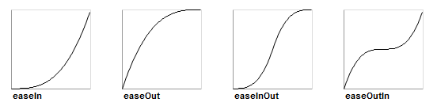

# Css 애니매이션 효과

---

>[참고 사이트1](https://velog.io/@pcg0527/CSS-ease-in-ease-out)

## 1. @keyframes 문법

- CSS 애니메이션에서 **구간**을 정하고 각 **구간별로 어떤 스타일을 적용**시킬지 정하는 문법이다. 

### 구성요소

1. **animation-name**
   - @keyframes 가 적용될 애니메이션의 이름
   - 즉, 사용자가 직접 지정한 이름으로 @keyframes 를 적용시킬 때 사용할 이름이다. 
2. **스테이지 (구간)**
   - from - to 로 0~100% 의 구간
   - 구간이 0%와 100% 인 경우에 from , to 로 사용한다. 
   - `퍼센티지(%)` 는 사용자 마음대로 할 수 있다.
     - 즉, 0~100 사이의 퍼센티지를 사용할 수 있다.
3. **CSS 스타일** 
   - 각 스테이지(구간)에 적용시킬 스타일
     - 퍼센티지별로 적용시킬 스타일을 지정한다. 
   - 주로 애니매이션 효과인 `transform : translateX(0) scale(1);` 처럼 사용된다. 

### 사용법

```css
<style>
.animationEx {
    animation : ex1 0.6s ease-out forwards
    /* 
        0.6s : 0.6초만큼 애니매이션 효과 적용 
        ease-out : 보통~느리게 순서로 애니매이션 부드럽게 만들어줌 
        forwards : @keyframes 적용이 끝나면 처음 위치로 돌아가는 것을 막아줌. ( 즉, 애니매이션 적용 후 마지막 위치에 머무르게 함 )
        + reverse : ex1 의 실행순서를 역순으로 실행함. modal 창 닫을 때 많이 사용 
    */
}

@keyframes ex1{
    0% {
        transform : translateX(0) scale(1); /* 왼쪽으로 0 만큼 이동하고, 크기는 기본크기를 유지한다. */
        /* translateY(0) 도 가능하다.  */
    }
    20% {
        transform : translateX(-100) scale(1.1); /* 왼쪽으로 100 만큼 이동하고, 크기는 +10% 를 키운다*/
    }
    100% {
        transform : translateX(-150) scale(1.5); /* 왼쪽으로 150 만큼 이동하고, 크기는 +50% 를 키운다 */
    }
}

@keyframes ex2{
    from {
        transform : translateX(0) scale(1); 
    }
    to {
        transform : translateX(-150) scale(1.5); 
    }
}
</style>
```


## 2. ease 속성

- 애니매이션을 부드럽게 움직이게 해주는 속성

### 종류

1. ease: 천천-빠름-천천
2. ease-in: 보통-빠르게
3. ease-out: 보통-느리게
4. ease-in-out: 천천-보통-천천(ease와 그래프 모양이 같은데, 기울기 변화 속도는 다르다)

### '시간 - 결과값' 그래프 예시



### 사용법

```css
.Modal {
    transition: all 0.3s ease-in-out;
}
.Modal {
	animation: openModal 0.3s ease-in-out forward;
}
```


