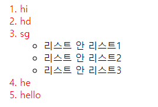

# 자식과 자손 선택자 차이점 

---

>[참고 사이트1](https://sectumsempra.tistory.com/57)

## 자식 선택자 ( \> 기호 사용 )

### 정의

- 직계만 선택할 때 사용한다. 
- s1 \> s2 일때 
  - s1과 s2 만 선택된다. 그 하위는 선택 안됨 

### 사용방법

```html
<!DOCTYPE html>
<html lang="en">
	<style>
        ol>li{
            color:red;
        }
    </style>
</head>
<body>
    <ol>
        <li>hi</li>
        <li>hd</li>
        <li>sg</li>
            <ul>
                <li>리스트 안 리스트1</li>
                <li>리스트 안 리스트2</li>
                <li>리스트 안 리스트3</li>
            </ul>

        <li>he</li>
        <li>hello</li>
    </ol>
</body>
```

- 자식 선택자(s1>s2)는 바로 아래 있는것만 선택하는 것으로 s1의 s2까지의 태그만 선택된다.



---

## 자손 선택자 or 후손 선택자  ( ' ' 띄어쓰기로 표시 ) 

### 정의

- 직계와 그 밑에있는 자손들도 모두 선택된다. 

### 사용방법

```html
<!DOCTYPE html>
<html lang="en">
	<style>
        ol li{
            color:red;
        }
    </style>
</head>
<body>
    <ol>
        <li>hi</li>
        <li>hd</li>
        <li>sg</li>
            <ul>
                <li>리스트 안 리스트1</li>
                <li>리스트 안 리스트2</li>
                <li>리스트 안 리스트3</li>
            </ul>

        <li>he</li>
        <li>hello</li>
    </ol>
</body>
```

- 후손 선택자(s1 s2)는 아래 있는 해당 태그에 속한 모두를 선택하기 때문에 s1과 s2, s2 밑에 있는 태그 모두( ol, li , li밑에있는 ul, ul밑에있는 li ) 를 선택한다. 

