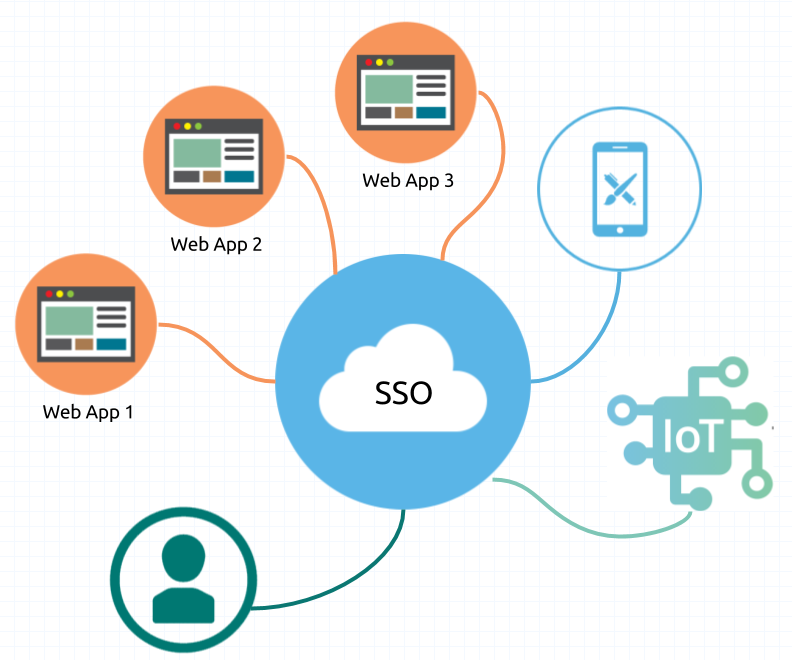

# SSO(Single Sign On) 개념정리 

---

>[참고 사이트1](https://aws.amazon.com/ko/what-is/sso/)
>
>[참고 사이트2](https://toma0912.tistory.com/75)
>
>[참고 사이트3](https://www.cloudflare.com/ko-kr/learning/access-management/what-is-saml/)

## SSO

### 정의

- 사용자가 여러 애플리케이션 및 서비스에 대해 한 번에 인증을 받는 방법
  - 즉, **사용자가 하나의 자격 증명으로 여러 서비스에 접속할 수 있도록 하는 인증 및 권한 부여 기술로, 사용자는 한 번의 로그인 과정만 거치면 된다. **
- SSO를 **중개자**라고 생각하면 된다. 
  - 데이터베이스를 통하지 않고 사용자의 자격 증명을 이용해 데이터베이스의 ID와 일치하는지 여부를 확인할 수 있게 해주는 중개자

### 사용되는 곳

- 내부 IT 팀에서 사용자 애플리케이션을 할당하고 관리하는 비즈니스 컨텍스트에서 자주 사용된다. 
- 예시 
  - 바에 입장한 고객이 추가로 술을 구매하려고 할 때마다 나이를 증명하기 위해 신분증을 제시해야 한다면 불만이 생기게 된다. 
  - 그러나 대부분의 식당에서는 고객의 신원을 한 번만 확인한 다음 저녁 시간 내내 고객에게 술을 제공한다. 
  - 이는 SSO 시스템과 다소 비슷한 것으로, 사용자는 ID를 계속해서 확인받는 대신 **ID를 한 번 확인받은 다음 여러 서비스에 액세스**할 수 있게 된다. 
- 즉,  여러 비밀번호를 사용하여 여러 번 로그인하는것을 **하나의 비밀번호로 한 번 로그인할 수 있도록** 도와주는 서비스가 SSO 이다. 

### SAML 이란

-  외부 애플리케이션 및 서비스에 사용자가 자신이 누구인지 알려주는 표준화된 방법
-  **사용자를 한 번 인증한 다음 해당 인증을 여러 애플리케이션에 전달하는 방법을 제공**하여 SSO(Single Sign-On) 기술을 가능하게 한다. 
-  SAML은 사용자 인증이 아니라 사용자 인증을 위한 기술

### 동작 방법

1. 사용자가 애플리케이션에게 요청을 한다.
2. 그런 다음 애플리케이션이 플랫폼에게 인증을 요청을 한다. 
3. 플랫폼은 SAML 어설션을 애플리케이션에게 보내고 
4. 애플리케이션는 사용자 에게 응답을 보낼 수 있습니다.
5. 사용자가 아직 로그인하지 않은 경우 플랫폼은 SAML 어설션을 보내기 전에 로그인하라는 메시지를 표시할 수 있습니다.
   - SAML 어설션은 **사용자가 로그인되었**음을 애플리케이션에게 알리는 메시지
   - 어설션의 소스, 발급된 시간, 어설션을 유효하게 만드는 조건 등 애플리케이션이 사용자 ID를 확인하는 데 필요한 모든 정보가 포함됨 

## SSO 유형

1. SAML
   - 애플리케이션이 SSO 서비스와 인증 정보를 교환하는 데 사용하는 프로토콜
   - SAML은 브라우저 친화적인 마크업 언어인 XML을 사용하여 사용자 식별 데이터를 교환
   - SAML 기반 SSO 서비스는 사용자 보안 인증 정보를 시스템에 저장할 필요가 없으므로 더 나은 보안과 유연성을 제공
2. OAuth
   - 애플리케이션이 암호를 제공하지 않고도 다른 웹 사이트의 사용자 정보에 안전하게 액세스할 수 있도록 하는 개방형 표준
   - 애플리케이션은 사용자 암호를 요청하는 대신 OAuth를 사용하여 암호로 보호된 데이터에 액세스할 수 있는 사용자 권한을 얻는다. 
   - 권한을 통해 사용자 정보를 사용한다. 
3. OIDC
4. Kerberos

### `SSO`  와  `Spring Security OAuth2.0 ` 차이점 

- SSO 
  - SSO 서비스는 사용자가 한 번의 로그인으로 다른 서비스에 액세스할 수 있도록 하며 대표적인 **프로토콜로**는 **SAML(Security Assertion Markup Language)**이 있다. 
- OAuth 2.0 
  - Spring Security 는 자바 기반의 보안 프레임워크로, 인증 및 **권한 부여**를 구현할 수 있도록 돕는다. 
  - 그중 **OAuth2.0**은 **인터넷 사용자의 리소스에 대한 안전한 접근을 위한 표준 프로토콜** 이다. 
- 정리
  - SSO 
    - 서비스간 동일 로그인을 보장하여 하나의 ID로 **여러 서비스에** 접속할 수 있도록 도와주는 서비스이고, 
    - 즉, 플랫폼 로그인하면 SSO가 해당 로그인을 기억해 SSO 사용중인 시스템에서 로그인 하지 않고 바로 사용할 수 있게 함.
  - OAuth 2.0 
    - 플랫폼 로그인시 사용되는 프로토콜로써 플랫폼 **로그인의 과정**을 통해 애플리케이션에게 **권한을 부여**한다. 
  - SSO는 여러 **서비스 간의 단일 인증을 중심**으로 하고, Spring Security의 OAuth 2.0은 **서비스 간 권한 부여 및 인증 관리**를 위해 사용됨 
  - OAuth 2.0은 사용자의 **리소스 접근 권한을 관리**하는 데 중점을 두는 반면, SSO는 사용자의 **로그인 관리를 중심**으로 한다. 

