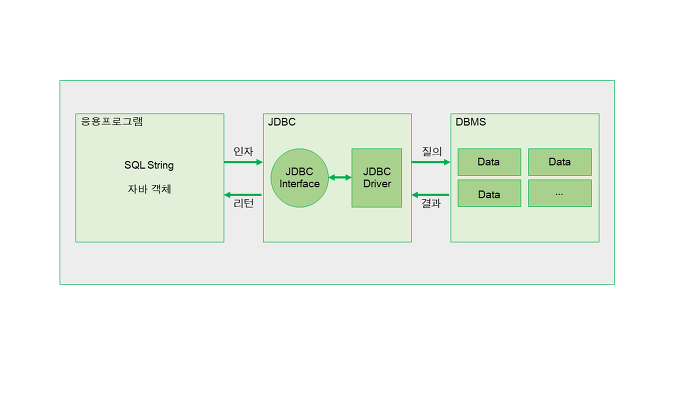

# DBMS와 JDBC 차이점 

---

>DBMS와 JDBC 개념의 차이점을 파악한다. 

## JDBC ( Java DataBase Connected)

- 자바 프로그램이 데이터베이스와 연결되어 데이터를 주고 받을 수 있게 해주는 프로그래밍 인터페이스이다. 
- 응용프로그램과 DBMS사이에서 동작하는 것으로, 중간에서 번역해주는 역할을 한다. 

## DBMS ( Database Management System )

- 데이터베이스를 운영하고 관리하는 소프트웨어.
- 데이터베이스가 데이터의 집합이라면 해당 데이터를 이용할 수 있도록 도와주는 것이 DBMS 이다. 
-  데이터베이스를 사용하기 위해서 소프트웨어, 즉 DBMS를 설치해야 하는데 **대표적으로 MySQL, 오라클(Oracle), SQL 서버, MariaDB** 등이 있다.

## 차이점

- **응용프로그램과 DBMS 사이에 동작하는 것이 JDBC이다.** 
- DBMS는 데이터베이스를 운영하기 위해 필요한 소프트웨어(MySql 같은거 ) 이고, JDBC는 자바 프로그램이 데이터베이스와 연결되어 데이터를 주고 받을 수 있게 해주는 API이다. 