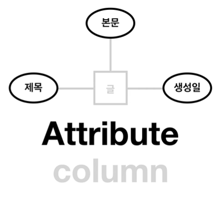

# ERD 그리기

---

>[생활코딩 - 관계형 데이터 모델링](https://www.youtube.com/watch?v=1d38YZKCM88&list=PLuHgQVnccGMDF6rHsY9qMuJMd295Yk4sa&index=1&pp=iAQB)

## ERD 

### ERD ( Entity Relationship Diagram )

1. 정보 (Entity)
2. 그룹 (Group)
3. 관계 (Relationship)

- 위의 3가지로 구성된다. 

### 용어

1. Entity ( 개체 )

   - 하나의 중심이 되는 개체

     - 예시 ) 폴더

   - DB의 **Table** 이 된다. 

     

2. Attribute ( 속성 )

   - 개체안에 존재하는 값 

     - 예시 ) 파일

   - DB의 **column**이 된다. 

     

3. Relation ( 관계 )

   - Entity들 간의 관계

   - DB의 **PK, FK , JOIN 에 사용**된다. 

     

4. Tuple ( 행 )

   - DB의 **Row** 가 된다. 

## 테이블간의  속성

### 테이블간 관계(Relationship)에 사용되는 개념

1. 기수 (Cardinality)
   - 일 대 일
   - 일 대 다
   - 다 대 다
2. 옵션 (Optionality)
   - 옵션 (Optional)
   - 필수 (Mandatory)

### Cardinality

1. **일 대 일 ( 1 : 1)**

   - 하나의 테이블은 다른쪽 테이블과 한개로만 매핑 되야 한다. 

   - ex ) **담임과 반의 관계**

     1. 각 선생님은 한 반만 담당한다. 
     2. 각 반의 단임은 한명이다. 

     

2. **일 대 다 ( 1 : N )**

   - '1' 에 해당하는 테이블은 'N' 에 해당하는 테이블에 여러 형태로 존재할 수 있다. 

   - 'N' 에 해당하는 테이블은 '1' 에 해당하는 테이블에 하나만 존재한다. 

   - ex ) **저자와 댓글의 관계**

     1. 각 저자는 여러 글을 작성
     2. 각 댓글은 하나의 저자만 존재 

     

3. **다 대 다 ( N : M )**

   - **가장 복잡한 형태로, 표현시 2개의 테이블 사이에 1개의 테이블을 별도로 만들어 표시해야한다.** 

   - 'M' 에 해당하는 테이블은 'N' 에 해당하는 테이블에 여러개 존재할 수 있다. 

   - 'N' 에 해당하는 테이블은 'M' 에 해당하는 테이블에 여러개 존재할 수 있다. 

   - ex ) **저자와 글의 관계** 

     1. 각 저자는 여러 글을 작성한다. 
     2. 각 글은 여러 저자가 존재한다. 

     

### Optionality

- Optionality는 Cardinality 또한 포함하고 있어야 한다. 
  - 즉, 두 속성 모두 ERD 를 그릴 때 동시에 표시되야 한다. 

1. **옵션 (Option)**

   - 해당 테이블은 다른 테이블을 **포함할 수 도 있고, 포함하지 않을 수 도 있다. ** 

   - ex ) 저자와 댓글

     - 저자는 댓글을 작성하지 않을 수도 있다. 
     - 따라서 저자에게 댓글은 **옵션**이다. 

     

2. **필수 (Mandatory)**

   - 해당 테이블은 다른 테이블을 **무조건 포함**해야한다.

   - ex ) 저자와 댓글

     - 각 댓글은 반드시 저자가 있다. 

     

