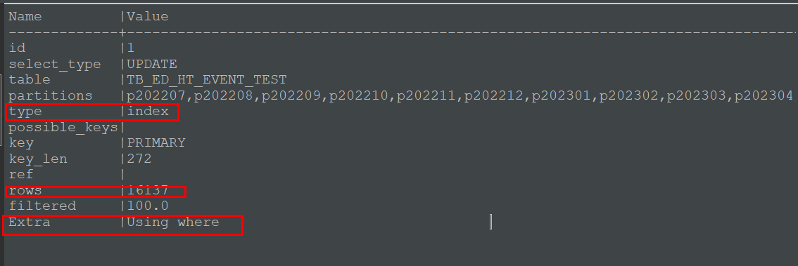
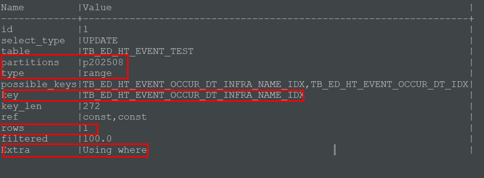

# MySQL `EXPLAIN` / `EXPLAIN ANALYZE` 치트시트

> 목적: 쿼리가 **인덱스를 타는지**, **파티션 프루닝이 되는지**, **얼마나 많이 읽는지**를 빠르게 파악하고, 개선 포인트를 찾는다.

---

## 1) 기본 사용법

```sql
-- SELECT
EXPLAIN SELECT ...;

-- UPDATE / DELETE 도 동일
EXPLAIN
UPDATE your_table
  SET col = ...
WHERE ...;

-- 실행시간/실제 스캔행까지 (MySQL 8.0+)
EXPLAIN ANALYZE
SELECT ...;
EXPLAIN ANALYZE
UPDATE ...;
```

> 프레임워크(예: MyBatis) 쓰는 경우 **바인드 변수 대신 실제 값**을 넣고 `EXPLAIN` 하세요. 옵티마이저 추정이 달라진다. 

---

## 2) 출력 컬럼 읽는 법 (핵심 4개)

- **key**: 실제 사용된 인덱스. `NULL`이면 인덱스 미사용(테이블 스캔).
- **type**: 접근 방식. 좋음 ← `const` > `eq_ref` > `ref` > `range` > `index` > `ALL` → 나쁨
- **rows**: 읽는(추정) 행 수. 작을수록 좋음.
- **Extra**: 추가 힌트.
  - `Using index condition`(ICP): 인덱스에서 일부 where 조건 처리 → 좋음
  - `Using where`: 인덱스 범위로 가져온 뒤 테이블에서 추가 필터
  - `Using temporary` / `Using filesort`: 보통 안 좋음(정렬/임시테이블 발생)

보조로 자주 보는 값들:

- **possible_keys**: 이론상 사용 가능 인덱스 후보.
- **key_len**: 사용된 인덱스 길이(= 몇 컬럼까지 썼는지 가늠).
- **partitions**: 읽은 파티션 목록 → 적을수록 좋음(= 파티션 프루닝 성공).

##### 파티셔닝적용안됨



##### 파티셔닝 적용 후 



## 3) 파티션 프루닝 체크

- `partitions` 컬럼에 **딱 필요한 파티션만** 나열되면 프루닝 성공.
- 예: `p202508`만 보이면 `WHERE OCCUR_DT=...` 같은 파티션 키 조건이 먹힌 것.

```sql
-- 파티션 키가 OCCUR_DT일 때
EXPLAIN SELECT ... WHERE OCCUR_DT='20250821150726000';
```

---

## 4) 함수가 인덱스를 못 타게 하는 경우 (비 SARGABLE)

다음 조건들은 보통 **인덱스를 못 탄다**:

```sql
WHERE SUBSTRING_INDEX(EVENT_ID,'-',1) = '6180'    -- 컬럼에 함수
WHERE DATE(created_at) = '2025-08-21'            -- 컬럼에 함수
```

> UPDATE/DELETE라 해도 **조건을 줄이는 인덱스**는 매우 중요 (커버링 인덱스 자체는 SELECT에 더 의미가 큼)

---

## 5) 예시 해석 

### A) `OCCUR_DT`로 필터 (파티셔닝 및 인덱싱 적용)

```
type: range
partitions: p202508
key: TB_ED_HT_EVENT_OCCUR_DT_INFRA_NAME_IDX
rows: 1
Extra: Using where
```

- **파티션 프루닝 O** (`p202508`만)
- **(OCCUR_DT, INFRA_NAME)** 인덱스를 범위/동등으로 잘 사용
- 잔여 조건(`PROC_STATUS`, `SUBSTRING_INDEX(EVENT_ID, ...)`)은 테이블에서 필터

### B) `EVENT_DT`로 필터 (파티셔닝 및 인덱싱 안함)

```
type: index
partitions: p202207 ~ pmax (여러 개)
possible_keys: (비어있음)
key: PRIMARY
rows: 8752
Extra: Using where
```

- **파티션 프루닝 실패**(파티션 키가 `OCCUR_DT`이므로)
- 보조 인덱스가 없어 **클러스터드 인덱스 전체 스캔**
- 개선: `EVENT_DT` 중심 조회가 많다면 **전용 인덱스** 또는 **파티션 키 재설계**

---

## 6) `EXPLAIN ANALYZE`로 체감 확인 (8.0+)

```sql
EXPLAIN ANALYZE
UPDATE TB_ED_HT_EVENT
   SET PROC_STATUS='end',
       END_DT=SUBSTRING(DATE_FORMAT(NOW(3), '%Y%m%d%H%i%S%f'),1,17)
 WHERE INFRA_NAME = '레이더 IDS'
   AND PROC_STATUS = 'ing'
   AND SUBSTRING_INDEX(EVENT_ID,'-',1) = '6180'
   AND OCCUR_DT = '20250821134056283';
```

- 실제 실행 시간, `rows examined`, `rows matched`, `rows updated`가 출력된다. 
