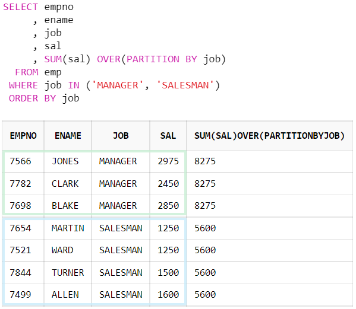

### **GROUP BY와 PARTITION BY의 차이**

|        | GROUP BY                                              | PARTITION BY                               |
| ------ | ----------------------------------------------------- | ------------------------------------------ |
| 사용   | 그룹 외부에서 묶어 순위 및 그룹별 집계를 구할 떄 사용 | 그룹 내 순위 및 그룹별 집계를 구할 때 사용 |
| 결과값 | 특정 원하는 컬럼에 대해서 추출해 결과값 보여줌        | 전체 데이터에서 원하는 결과값 보여줌       |

- 즉, 데이터 다 보고 싶으면 PARTITION BY, 요약해서 하나씩 한줄씩만 보려면 GROUP BY

### partition by 

- 집계함수와 함께 사용되어 그룹별 집계를 구할 수 있다. 

- Group By 와 비슷하게 사용되지만, 차이가 있다. 

  - 그룹 바이는 하나의 결과로써 그룹화를 하지만, 파티션은 select한 값에서 그룹화를 진행한다. 

- 즉, **`GROUP BY`는 결과를 집계된 그룹으로 표시하고, `PARTITION BY`는 데이터를 분할하고 그룹 내에서 작업을 수행하는 데 사용된다.**

  ``` sql
  SELECT empno
       , ename
       , job
       , sal
       , SUM(sal) OVER(PARTITION BY job)
    FROM emp
   WHERE job IN ('MANAGER', 'SALESMAN')
   ORDER BY job
  ```

  