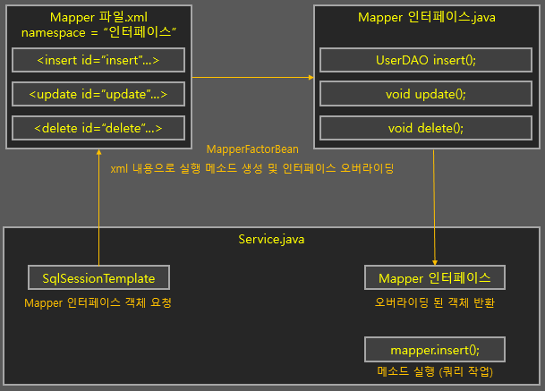

# MyBatis 개념정리

---

>MyBatis에 대해 정리해본다. 
>
>[참고 사이트1](https://codevang.tistory.com/263)

## MyBatis

### 정의

- 자바 오브젝트와 SQL사이의 **자동 매핑 기능**을 지원하는 **ORM(Object relational Mapping)프레임워크**이다.

### 장점

1. jdbc의 모든기능을 Mybattis가 제공해 JDBC코드를 걷어내 깔끔한 코드 유지가능 
2. sql에 변경이 있을 때마다 자바 코드를 수정하거나 컴파일할 필요가 없다
3. 프로그램에 있는 SQL 쿼리들을 한 구성파일에 구성하여 프로그램 코드와 SQL을 분리
   - SQL를 직접작성하므로 최적화된 쿼리 구현가능

### 단점

1. 테이블이 변경되고 DTO가 변경될 때마다 매핑에 대한 부분을 다시 수정해야하는 번거로움이 존재
2. 어플리케이션과 데이터베이스간의 설계에 대한 부분을 수정해야하는 경우 많은 설정이 바뀌어야 한다.
3. 런타임을 해야 오류를 확인할 수 있다.
4. 데이터베이스 변경시 로직도 함께 수정해야한다.

### 동작

- 데이터베이스의 접속 주소 정보나 Mapping 파일의 경로 등의 고정된 환경정보를 설정하여 동작한다. 
- Controller에서 Service를 호출하고 Service가 DAO계층에 있는 메소드를 호출하면 DAO에서 Mybatis를 호출한다.

### Mapper 인터페이스 

- Mapper 설정 파일(xml)에 있는 SQL 쿼리문을 호출하기 위한 인터페이스
  - Mybatis3.0 이후부터 지원하는 방식
- 인터페이스와 **Mapper 설정 파일을 연동**해두고 쿼리문의 ID와 동일한 메소드를 만들어둠으로써 해당 **메소드를 호출**하면 **자동으로 쿼리문이 실행**되도록 해주는 방식이다. 
  - Mapper xml **파일 하나 당 하나의 인터페이스**를 만들어주면 되는데, 이 인터페이스 자체가 **DAO의 역할**을 한다. 

### 사용법



1. SqlSessionTemplate 객체에 매퍼를 요청하면, xml 설정을 참조해 Mapper 인터페이스를 오버라이딩한 객체를 반환해준다. 
   - **mybatis**가 **SqlSessionTemplate 객체와 xml 설정을 연결**시켜줌
2. 이 객체의 메소드( 쿼리 등록시 사용한 insert, select, update, delete ) 를 실행하면 쿼리가 실행된다. 

- **Mapper xml 파일**

  ```xml
  <?xml version="1.0" encoding="UTF-8"?>
  <!DOCTYPE mapper PUBLIC "-//mybatis.org//DTD Mapper 
  3.0//EN" "http://mybatis.org/dtd/mybatis-3-mapper.dtd">
  
  <mapper namespace="hs.spring.hsweb.user.db.UserInfoMapper">
      <!-- id로 등록한 이름을 sqlSession의 메소드로 사용해 호출한다. -->
  	<select id="selectOne" parameterType="String" resultType="UserInfoVO">
  		select * from user_info where user_id = #{value}
  	</select>
  </mapper>
  ```

- **Mapper 인터페이스** 

  ```java
  package hs.spring.hsweb.user.db;
  
  public interface UserInfoMapper {
  	public UserInfoVO selectOne(String userId); 
  }
  ```

- **이용**

  ```java
  public class UserInfoService {
      
      @Resource(name="sqlSessoinTemplate")
      private SqlSession session; // SqlSessionTemplate 객체를 사용해서 mybatis의 기능을 사용할 수 있다. 
  
      public UserInfoVO selectOne(String userId) {
          // Mapper 인터페이스 객체 반환
          UserInfoMapper mapper = session.getMapper(UserInfoMapper.class);
  
          // xml 내용대로 오버라이딩된 인터페이스의 메소드 실행 
          UserInfoVO vo = mapper.selectOne(userId);
  
          return vo;
      }
  }
  ```

### WHERE 1=1

- 보통 동적 쿼리에서 사용되는 조건으로, 조건문에서 AND나 OR을 사용할 때, 첫 번째 조건을 쉽게 작성하기 위해 추가되는 코드이다. (실제로는 항상 참이므로 영향을 미치지 않는다. )

- 이렇게 하면 나중에 추가되는 조건들은 모두 AND나 OR로 시작하면 되므로 쉽게 추가할 수 있다. 

  ```sql
  SELECT userid, phone, address
  FROM user
  WHERE 1=1
  AND address = 'ssd0908.tistory.com'
  AND phone = '010-1234-5678'
  -- WHERE 1=1 로 인해 주석을 좀 더 쉽게 처리하면서 디버깅을 수월하게 할 수 있다. 
  ```

- 주의할 점 

  - SELECT문 이외에 데이터를 수정 및 삭제하는 쿼리에는 사용을 지양하는 것이 좋다.

    - UPDATE, DELETE문에 WHERE 1=1을 사용했을 경우 조건이 없기 때문에 데이터가 변경 또는 삭제될 우려가 있기 때문이다. 
