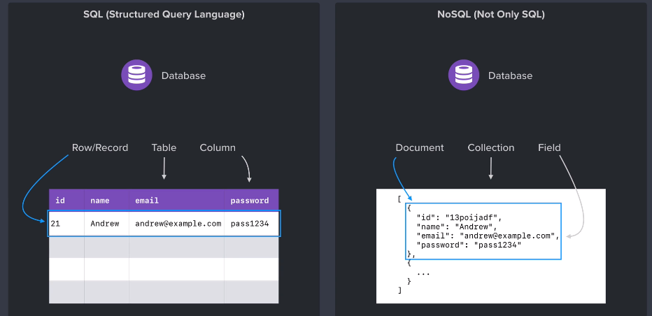
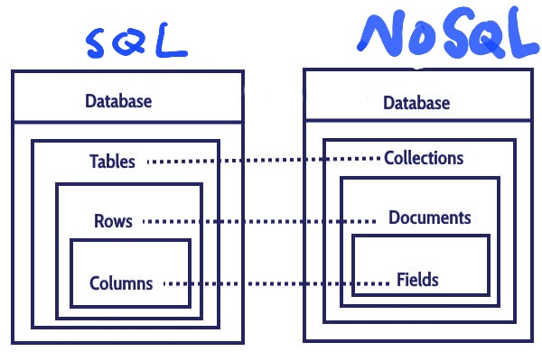

# NoSQL과 MongoDB 개념정리 

---

>[참고 사이트1](https://hoing.io/archives/1379)
>
>[참고 사이트2](https://www.ibm.com/kr-ko/cloud/learn/mongodb)
>
>[참고 사이트3](https://velog.io/@ckstn0777/MongoDB%EB%9E%80)
>
>[참고 사이트4](https://inpa.tistory.com/entry/DB-%F0%9F%93%9A-NoSQL-%EA%B0%9C%EB%85%90-%EC%A0%95%EB%A6%AC)

## NoSQL 

### 정의

- **비관계형 데이터베이스 유형**을 가리키며 이 데이터베이스는 관계형 테이블과는 다른 형식으로 데이터를 저장
  - Document 형식으로 데이터를 저장하고 관리한다. 
  - SQL 유형에서 사용되는 RDBMS 의 형식과는 다른방법이다. 
- 대표적인 NoSQL로는 MongoDB가 있다. 
  - RDBMS의 대표적인 예는 MySQL 이다. 


### SQL 과 NoSQL 



1. SQL
   - SQL(Structured Query Language)은 관계형 데이터베이스 관리 시스템(RDBMS)의 데이터를 관리하기 위해 설계된 특수 목적의 프로그래밍 언어이다. 
   - 많은 수의 데이터베이스 관련 프로그램들이 SQL을 표준으로 채택하고 있다.
   - Oracle과  MySQL 이 해당 표준을 채택하고 있다. 
2. NoSQL
   - NoSQL(원래 의미: non SQL 또는 non relational) 데이터베이스는 전통적인 관계형 데이터베이스 보다 덜 제한적인 일관성 모델을 이용하는 데이터의 저장 및 검색을 위한 매커니즘을 제공한다.
   - NoSQL 데이터베이스는 빅데이터와 실시간 웹 애플리케이션의 상업적 이용에 널리 쓰인다. 
   - SQL 계열 쿼리 언어를 사용할 수 있다는 사실을 강조한다는 면에서 "Not only SQL"로 불리기도 한다.
3. 정리
   - 성능면과 확장성 면에서는 NoSQL이 SQL보다 우수하다. 또한 유연하며 복잡성이 낮은것이 특징이다. 
   - 하지만 마냥 좋은점만 있는건 아니다. **ACID 트랜잭션**(원자성/일관성/고립성/영구성)을 보장받기 위해서는 RDBMS를 쓰는 편이 좋다. 
     - 가령 은행업무나 회사업무같은 중요한 DB는 RDBMS를 쓰는 것을 권장한다.

### SQL vs NoSQL 구조 



| SQL ( mysql ) | NoSQL ( MongoDB )                              |
| ------------- | ---------------------------------------------- |
| Database      | Database                                       |
| Table         | Collection                                     |
| Tuple / Row   | Document                                       |
| Column        | Key / Field                                    |
| Table Join    | Embedded Documents ( join 사용 안함 )          |
| Primary Key   | Primary Key (_id) **Database Server & Client** |
| mysqld        | mongod                                         |
| mysql         | mongo                                          |

### 특징 

1. 분산형 구조이다
   - NoSQL은 기존 RDBMS와는 다르게 하나의 고성능 머신에 데이터를 저장하는 것이 아니라 **일반적인 서버 수십 대를 연결해 데이터를 저장 및 처리하는 구조**를 갖는다.
   - 즉 분산형 구조를 통해 데이터를 여러 대의 서버에 분산해 저장하고 분산 시에 데이터를 상호 복제해 특정 서버에 장애가 발생했을 때에도 데이터 유실이나 서비스 중지가 없는 구조의 형태를 가진다.
2. **NoSQL은 RDBMS와는 달리 데이터 간의 관계를 정의하지 않는다**.
   - 가장 큰 특징 중 하나는 관계형 데이터 베이스인 RDBMS가 데이터의 관계를 Foreign Key 등으로 정의하고 이를 이용해 Join 등의 관계형 연산을 한다고 하면
   - NoSQL은 데이터 간의 관계를 정의하지 않는다. 데이터 테이블은 그냥 하나의 테이블이며 각 테이블 간의 관계를 정의하지 않고 일반적으로 테이블 간의 Join도 불가능하다.
3. 고정되지 않은 테이블 스키마를 갖는다. 
   - RDBMS와는 다르게 테이블의 스키마가 유동적이다. 데이터를 저장하는 컬럼은 각기 다른 이름과 다른 데이터 타입을 갖는 것이 허용된다.
   - 스키마란? 데이터베이스의 구조와 제약 조건에 관한 전반적인 명세를 기술한 메타데이터의 집합이다.
4. RDBMS에 비해 훨씬 더 대용량의 데이터를 저장할 수 있다
   - RDBMS의 복잡도와 용량의 한계를 극복하기 위한 목적으로 등장한 만큼 페타바이트급의 대용량 데이터를 저장할 수 있다.

### 구조

- **Database > Collection > Document > Field 계층**으로 이루어져 있다.

1. Document

   -  RDBMS에서의 Row(혹은 튜플)과 동일한 개념. 예를 들어 아래와 같은 JSON 형태의 key-value 쌍으로 이루어진 데이터 구조를 하나의 Document라고 보면 된다.

   - 필드

   - Document 구조 예시

     ```json
     {
         "_id": "5f2ad6b54866e5109dd2367b"
         "username": "홍길동",
         "hashedPassword": "비밀번호",
     }
     ```

2. Field

   - 데이터 포인트를 위한 고유한 식별자로, RDBMS의 Column과 비슷한 개념 
   - 위의 구조에서 "_id" 가 필드이다. 

3. Value

   - 주어진 식별자와 연결된 데이터로, 필드에 속한 값을 뜻한다. 

4. Collection

   - Document의 그룹이다.
   - RDBMS로 따지자면 **Table과 비슷한 개념**. 다만 위에서 말했듯이 스키마를 가지고 있지 않다.

5. DataBase

   - Database는 Collection들의 물리적인 컨테이너이자 **가장 상위 개념**이다. RDBMS에서의 Database와 동일