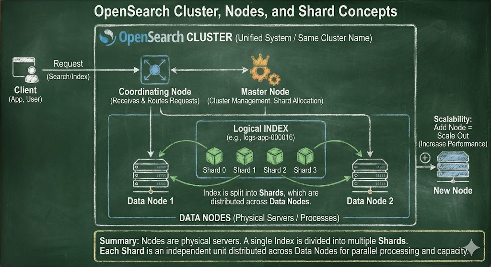

# Opensearch 의 Node 개념정리 

---

>



## 클러스터(Cluster) 

- 전체 노드(Node)들의 집합이며 하나의 거대한 검색·저장 시스템 단위 여러 노드를 묶어서 하나의 서비스처럼 동작하게 만든 구조 
- 클러스터 내부에서는 데이터 자동 분산 저장 
- 클러스터 이름이 동일해야 같은 클러스터로 인식됨 
- 실무에서는 일반적으로 핫/웜/울트라웜 구조로 구성해 비용을 최적화한다.

## 노드란? 

1. OpenSearch 클러스터 내에서 독립적으로 데이터를 **저장하고 처리하는 서버**를 의미한다. 
2. OpenSearch 클러스터는 여러 노드들로 구성되며, 각 노드는 클러스터 내에서 중요한 역할을 담당한다. 

## 역할

1. 노드는 **크게 세 가지 역할**을 가질 수 있으며, 이 역할에 따라 **데이터 처리 방식이 달라진다.** 
   1. 노드를 추가하면 클러스터의 처리 능력이 증가하여 성능을 유지하거나 향상시킬 수 있다. 
   2. 즉, 데이터가 증가하거나 쿼리 요청이 많아질 경우, **노드를 추가하여 성능을 확장할 수 있다**
2. 종류
   1. 코디네이팅 노드(Coordinating Node): **클라이언트 요청**을 받아서 처리하는 노드
   2. 마스터 노드(Master Node): 클러스터의 **관리 및 조정** 역할을 담당
   3. 데이터 노드(Data Node): 실제로 **데이터를 저장**하고, **검색 요청**이나 **인덱싱 작업**을 처리하는 노드

## Node 종류

1. Coordinating node
   - 외부 REST 요청 전용
   - 쿼리 파싱
   - shard 라우팅
   - 결과 병합
2. Cluster manager node
   - 인덱스 메타데이터
   - 클러스터 상태 관리
3. Data Node 
   - 데이터 저장 및 검색 처리 

## Shard(샤드)

1. **“Index를 쪼갠 논리적·물리적 단위가 shard이고, 그 shard가 노드에 분산 저장된다”**.
   1. Index 생성 시 미리 shard 개수를 정함
   2. shard 1개는 항상 1개 노드에만 존재
2. 샤드는 인덱스의 부분 집합으로, 클러스터 내에서 여러 노드에 걸쳐 분산 저장되며, 이를 통해 대량의 데이터를 처리할 수 있다.
3. 즉, 하나의 인덱스를 여러 개의 샤드로 나누어 각 노드에 할당하게 되면, 더 많은 데이터를 처리하면서도 성능을 유지할 수 있게 된다.

```json
logs-app-000016 # index
 ├─ shard 0 # shard
 ├─ shard 1
 ├─ shard 2
 └─ shard 3
```

## 정리 

1. OpenSearch에서 노드는 물리적 서버(또는 프로세스)에 해당하며, 하나의 인덱스는 여러 개의 **샤드(shard)**로 나뉜다.
2. 각 샤드는 인덱스 데이터의 일부를 담는 **독립적인 저장 및 처리 단위**이며, 이 샤드들이 클러스터 내 여러 노드에 분산 배치됨으로써 대량 데이터 처리와 병렬 검색이 가능해진다.