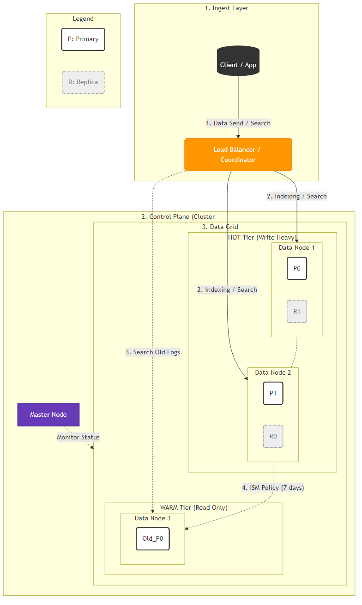

# OpenSearch Architecture & Concepts Guide

안녕하세요. OpenSearch 전문가로서, 요청하신 **클러스터(Cluster), 노드(Node), 샤드(Shard), 레플리카(Replica), Warm**의 개념과 이들이 어떻게 유기적으로 동작하는지 설명해 드립니다.

## 1. 핵심 개념 정리

| 개념                   | 비유                 | 기술적 정의                                                  |
| :--------------------- | :------------------- | :----------------------------------------------------------- |
| **Cluster** (클러스터) | 프랜차이즈 회사 전체 | 하나 이상의 노드(서버)가 모여 데이터를 저장하고 처리하는 **전체 시스템의 집합**입니다. 고유한 이름을 가진다. |
| **Node** (노드)        | 지점(매장) 하나      | 클러스터를 구성하는 **개별 서버 인스턴스**입니다. 데이터를 저장하고 실제 인덱싱 및 검색 작업을 수행한다. |
| **Shard** (샤드)       | 장부 1권             | 인덱스(데이터)를 여러 조각으로 나눈 것입니다. 데이터를 분산 저장하여 대용량 처리를 가능하게 합니다. (Primary Shard) |
| **Replica** (레플리카) | 장부 사본            | 샤드의 복제본. 원본(Primary)이 유실되었을 때를 대비하고, 검색 요청(Read)을 분산 처리하여 속도를 높인다. |
| **Warm** (웜)          | 보관용 창고          | 버릴 수 없는 데이터를 저장하는 노드 타입. 고성능(Hot) 노드보다 사양이 낮고 디스크 용량이 큰 서버를 사용하여 비용을 절감한다. |

------

## 2. 동작 구조 및 아키텍처 다이어그램

##### OpenSearch 클러스터 구조도 (Architecture Slide)

- 아래 다이어그램은 데이터가 들어오는 순간부터 저장, 관리되는 전체 흐름을 표시했다. 

### 1. 인입 계층 (Coordinator)

- 일종의 **'안내 데스크'**이다. 
- Client가 데이터를 보내면, 어느 노드의 어느 샤드에 저장해야 할지 길을 안내한다. 

### 2. 마스터 노드 (Control Tower)

- **'지휘관'**으로 데이터 자체는 저장하지 않는다. 
- 샤드들이 노드에 골고루 분배되었는지 감시하고, 노드가 죽으면 복구 명령을 내린다. 

### 3. HOT  Tier (작업실)

- **'가장 바쁜 작업 공간'**
- **특징**: 최신 CPU, 빠른 SSD 사용.
- **동작**:
  - **P (Primary Shard)**: 데이터가 처음 도착하는 원본
  - **R (Replica Shard)**: P의 복사본으로 P가 있는 노드가 죽으면 R이 P가 된다. 

### 4. WARM Tier (문서 보관소)

- **'장기 보관용 창고'**
- **특징**: 저렴하고 용량 큰 HDD 사용. CPU 사양은 낮음.
- **동작**:
  - 시간이 지나 검색 빈도가 낮아진 데이터는 HOT에서 WARM으로 이사(Migration)함 
  - 이 작업은 **ISM(Index State Management)** 정책이 자동으로 수행

------

## 동작 과정 시나리오

##### 1: 데이터 쓰기 (Indexing)

1. **클라이언트 요청**: 사용자가 로그 데이터를 보낸다. 
2. **라우팅**: 요청을 받은 노드(Coordinating Node)는 문서 ID를 해싱여 어느 샤드(`P0` 또는 `P1`)에 저장할지 계산한다.
3. **저장**: 해당 Primary Shard가 있는 **Hot Node**에 데이터가 써진다. 
4. **복제**: 저장이 완료되면 즉시 Replica Shard로 데이터가 복사되어 일관성을 맞춘다. 

##### 2: 데이터 검색 (Search)

1. **클라이언트 요청**: "지난달 매출 데이터 보여줘".
2. **분산 검색**: 요청을 받은 노드는 모든 관련 샤드(Primary 또는 Replica 중 부하가 적은 쪽)에 검색 명령을 보낸다. 
   - 최신 데이터는 **Hot Node**에서, 지난달 데이터라면 **Warm Node**에서 검색될 수 있다. 
3. **취합 (Aggregation)**: 각 샤드에서 찾은 부분적인 결과들을 하나로 모아서 정렬한 뒤 사용자에게 반환한다.

##### 3: 장애 발생 (High Availability)

1. 만약 **Node 1(Hot)** 이 갑자기 다운된다면 클러스터는 즉시 **Node 2**에 있는 `R0`(Replica)를 `P0`(Primary)로 승격시킨다. 
2. 사용자는 잠깐의 지연 외에는 서비스 중단을 느끼지 못하고 데이터를 계속 사용할 수 있다. 

## 핵심 요약

1. **Cluster**: 이 전체 그림(회사) 자체.
2. **Node**: 그림 속의 박스 하나하나(직원/서버).
3. **Shard**: 노드 안에 들어 있는 `P0`, `R0` 같은 작은 상자(업무 노트).
4. **Replica**: 점선으로 된 상자(복사본 노트). 안전장치.