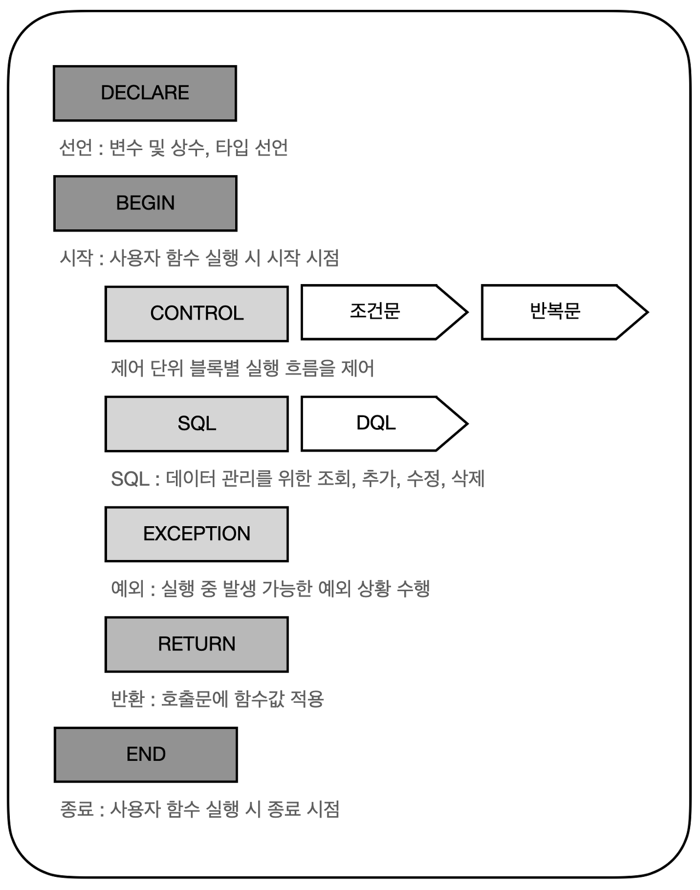

# DB 사용자 정의 함수 

---

>[참고 사이트1](https://benggri.tistory.com/77)
>
>[참고 사이트2 - 프로시저와 사용자정의함수 차이점 ](https://greatepig.tistory.com/19)
>
>[참고 사이트3 - 사용자 정의함수 구조 ](https://lihano.tistory.com/46)

## 사용자 정의 함수 ( Usre - Defined Function )

### 1. 정의

- 절차형 SQL을 활용하여 일련의 SQL 처리를 수행하고, 수행결과를 단일 값으로 반환할 수 있는 절차형 SQL 
- DBMS에서 제공되는 공통적 함수 이외에 사용자가 직접 정의하고 작성하는 함수이다. 

### 2. 트리거 / 프로시저 / 사용자 정의 함수 

#### 프로시저

1. 일련의 쿼리를 하나의 함수로 실행할 수 있는 쿼리의 집합
   1. 즉, 특정 작업을 위한 쿼리들의 블록
2. 하나의 요청으로 여러 SQL문을 실행

### 트리거 

1. 테이블에 대한 이벤트에 반응해 자동으로 실행 되는 작업을 의미

### Function

1. 각 프로세스를 수행하기 위해 필요한 기능
2. 클라이언트에서 실행되기 때문에 프로시저보다는 느리다

#### 공통점

1. 둘 다 미리 정의 해놓은 기능을 수행하는 프로그램이다. 
2. 데이터베이스의 객체로 저장
3. DBMS 내부에 저장
4. SQL문으로 작성

#### 차이점

1. 프로시저
   1. 리턴값 없어도 됨 , 리턴값 여러개 가능 (  즉, 반환값 제공이 선택 옵션 )
   2. CALL문으로 직접 호출하여 실행
2. 사용자 정의 함수 
   1. 리턴값 있어야함 ,리턴값이 오로지 1개여하 한다.  ( 즉, 반환값 필수 )
   2. SQL문 안에 포함되어 실행
3. 트리거 
   1. 리턴값이 없음
   2. 이벤트 실행시 자동 호출 실행

#### 정리표 

| **프로시저**                                             | **사용자 정의 함수**                                         |
| -------------------------------------------------------- | ------------------------------------------------------------ |
| 업무를 맡기는 목적                                       | 로직을 도와주는 목적                                         |
| SP 안에 트랜잭션을 사용할 수 있음                        | 사용자 정의 함수 안에 트랜잭션을 사용할 수 없음              |
| 파라미터 형식이 입,출력임                                | 입력 파라미터만 가능                                         |
| 프로시저 안에서 다른 프로시저를 호출할 수 있음           | 사용자 정의 함수 안에서 프로시저를 호출할 수는 없음          |
| **SELECT, WHERE, HAVING 절에 프로시저를 사용할 수 없음** | **SELECT, WHERE, HAVING 절에 사용자 정의 함수를 사용할 수 있음** |
| try-catch 블럭을 사용할 수 있음                          | try-catch 블럭을 사용할 수 없음                              |

### 3. 사용자 정의 함수 구조



|           구성요소            | 설명                                                         |
| :---------------------------: | :----------------------------------------------------------- |
|      선언부 ( Declare )       | 사용자 정의함수의 명칭, 변수와 인수(파라미터) 그리고 그에 대한 데이터 타입을 정의하는 부분 |
| 시작 / 종료부 ( BEGIN / END ) | 사용자 정의함수의 시작과 종료를 표현하는데 필수적이며 BEGIN/END가 쌍을 이루어 추가된다. 블록으로 구성되어 밑의 4가지 구성요소들이 사용된다. |
|      제어부 ( CONTROL )       | 단위 블록별 실행흐름을 제어하는 부분으로 크게 IF문과 CASE문으로 나뉜다. |
|              SQL              | 조회 용도로 SELECT 문을 사용. 데이터를 조작하는 INSERT, UPDATE, DELETE 는 사용할 수 없음 |
|     예외부 ( EXCEPTION )      | BEGIN~END 절에서 실행되는 SQL문이 실행될 때 예외 발생 시 예외 처리 방법을 정의하는 처리부 |
|       반환부 ( RETURN )       | 호출문에 대한 함수 값을 반환                                 |

#### 선언부 

```sql
CREATE FUNCTION 함수명
(
파라미터_명 MODE 데이터_타입 -- 전달받을 인자값
)
IS
RETURN 데이터_타입 -- 반환 데이터 타입 
변수 선언 -- 사용자 정의함수 내에서 사용할 변수와 변수에 대한 초깃값을 설정

-- MODE 값 
-- 1. IN(사용자 정의함수로 값 전달)
-- 2. OUT(사용자 정의함수에서 처리된 결과)
-- 3. INOUT(IN과 OUT의 두 가지 기능을 모두 수행)

-- 선언부 예시 
CREATE FUNCTION `GET_NAME`(
    NAME VARCHAR(20)
    , AGE INTEGER -- 파라미터 선언
) RETURNS varchar(20) -- 반환할 데이터타입
```

### 4. 예시

```sql
-- 선언부
CREATE FUNCTION TEST_FUNC
(
V_DATE IN CHAR(8) -- 파라미터로 받을 변수 값 
)
IS

-- 시작/종료부
BEGIN
  -- 안에서 사용할 변수와 데이터 타입 
  V_CURR_YEAR CHAR(4); 
  V_BIRTH_YEAR CHAR(4);
  V_AGE NUMBER;

-- 제어부
IF V_DATE > "21210216" THEN
SET
  V_DATE = "20191231";
END IF;

-- SQL
SELECT TO_CHAR(SYSDATE, 'YYYY'), SUBSTR(V_DATE, 1, 4)
INTO V_CURR_YEAR, V_BIRTH_YEAR
FROM DUAL;

SET V_AGE = TO_NUMBER(V_CURR_YEAR) - TO_NUMBER(V_BIRTH_YEAR) + 1;

-- 반환부
RETURN V_AGE;

-- 시작/종료부
END;
```

### 5. 호출 방법

```sql
SELECT TEST_FUNC('19900101') FROM DUAL;

UPDATE TABLE_NAME 
SET COL_1 = TEST_FUNC(COL_2)
WHERE COL_2 = '20201031';
```


