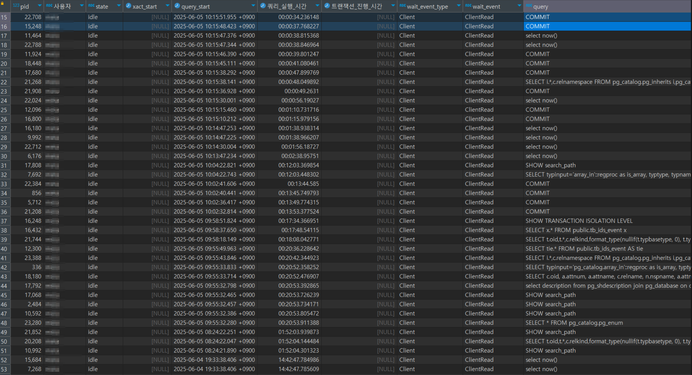

# 트랜잭션 리스트 

---

>

```sql
-- 현재 사용중인 트랜잭션 리스트 
SELECT
    pid,
    usename AS 사용자,
    state,
    xact_start,
    query_start,
    now() - query_start AS 쿼리_실행_시간,
    now() - xact_start AS 트랜잭션_진행_시간,
    wait_event_type,
    wait_event,
    query
FROM pg_stat_activity
WHERE -- 자신이 접속한 세션은 제외하고 싶으면 아래 필터를 추가하세요.
      pid <> pg_backend_pid()
ORDER BY
    xact_start NULLS LAST,      -- 트랜잭션이 시작된 순으로 (NULL은 뒤로)
    query_start DESC;           -- 이어서 쿼리 시작 시간이 오래된 순으로 정렬
```



- “트랜잭션이 밀려 있다”기 보다는 “많은 세션이 놀고 있다” 를 나타내는 사진임 

## 컬럼별 의미

**pid**

- PostgreSQL 서버 프로세스 ID입니다. 각 세션(클라이언트 연결)은 고유한 `pid`를 가진다

**사용자(usename)**

- 해당 세션을 열고 있는 데이터베이스 사용자 계정

**state**

- 현재 세션의 상태를 나타내며 주로 네 가지 상태가 있다. 
  1. `active` : 지금 SQL 문이 실행 중임
  2. `idle in transaction` : 트랜잭션이 열려 있는 상태에서(커밋/롤백 전) 대기 중
  3. `idle` : 커넥션은 유지 중이지만, 현재 트랜잭션도 쿼리도 진행 중이지 않음
  4. `disabled` 등 그 외 (백그라운드 프로세스용)
- 사진은 한 번 쿼리를 날렸거나(예: `select now()`, `COMMIT`, `SHOW search_path` 등), 혹은 트랜잭션 없이 메타테이블을 조회하고 난 뒤 현재 “아무 작업도 안 하고 Idle” 상태이다. 

**xact_start**

- 해당 세션에서 트랜잭션이 시작된 시점(timestamp)
- `xact_start`가 `NULL`이라는 것은, 현재 해당 세션 안에 열려 있는 트랜잭션이 없다는 의미
- 즉, 사진은 단순 조회만 한 뒤 대기 중인 세션들이다.

**query_start**

- 마지막으로 실행되었거나(또는 현재 실행 중인) 쿼리의 시작 시점 나타낸다. 
- `NULL`이 아니면, “마지막으로 쿼리가 시작된 시간”을 가리키고, 그 뒤로 아무 작업도 하지 않고 있다면 ‘그때 이후로 Idle’ 상태라고 볼 수 있습니다.

**쿼리_실행_시간(now() - query_start)**

- 화면에서 보이는 값(예: `00:00:34.236148`)은 “지금 시점에서 해당 세션이 마지막 쿼리(`query_start`)를 실행한 뒤부터 경과한 시간”
- 즉, 10시 15분 51초에 시작된 쿼리를 수행한 뒤로(혹은 수행 없이) 34초가 지났다는 의미

**트랜잭션_진행_시간(now() - xact_start)**

- 이 칸은 `xact_start`가 `NULL`이 아니면 “트랜잭션이 열린 지 얼마나 지났는지”를 보여준다. 
- 화면에 모두 `NULL`로 표시된 이유는, `xact_start` 자체가 `NULL`이기 때문에 “열려 있는 트랜잭션”이 없음을 뜻한다. 

**wait_event_type**

- 프로세스가 현재 무엇을 기다리고 있는지를 분류해서 보여주는 필드
- 크게 다음 네 가지가 자주 나온다. 
  1. `Client` : 클라이언트(애플리케이션)와의 네트워크(I/O) 통신을 기다리는 중
  2. `Lock` : DB 내부 락(lock)을 획득하려고 기다리는 중
  3. `IO` : 파일시스템이나 디스크 I/O를 기다리는 중
  4. `Activity` : (“백그라운드 프로세스”가 내부 작업을 기다리고 있는) 대기 상태
- “서버 프로세스가 클라이언트(애플리케이션)로부터 다음 요청을 기다리고 있는 상태”를 의미한다.
- 클라이언트가 아무런 추가 작업을 요청하지 않으면 서버 프로세스가 계속 `ClientRead` 상태로 머무르게 된다. 

**wait_event**

- `wait_event_type`이 무엇을 기다리는지 구체적으로 보여준다.
- 여기서는 모두 `ClientRead`로 나와 있는데, 이는 “클라이언트가 서버로부터 추가 요청을 보내주거나, 혹은 서버가 응답을 보낼 때까지 대기 중”이라는 의미

**query**

- 해당 세션이 가장 마지막으로 실행했던 SQL 문 텍스트를 보여준다. 
- 화면에 보이는 예시:
  - `COMMIT`
  - `select now()`
  - `SHOW search_path`
  - `SELECT … FROM pg_catalog.pg_enum` 등
- 즉, 대부분이 메타데이터 조회 구문이나 단순 시간 조회, 혹은 직전에 커밋만 수행한 뒤 대기 중인 상태이다.