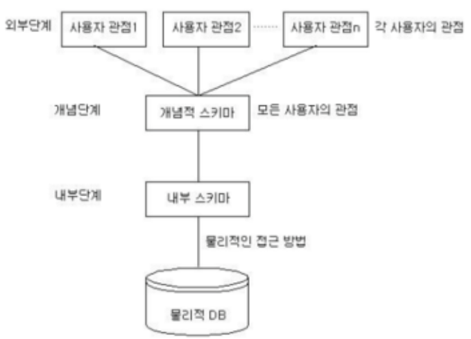

# 스키마 개념정리 

---

>[참고 사이트1](https://jwprogramming.tistory.com/47)
>
>[참고 사이트2](https://coding-factory.tistory.com/216)
>
>[참고 사이트3](https://www.hedleyonline.com/ko/blog/%EC%8A%A4%ED%82%A4%EB%A7%88%EC%97%90-%EB%8C%80%ED%95%9C-%EB%AA%A8%EB%93%A0%EA%B2%83-2022/)

## 스키마 ( Schema )

### 정의

- DB내에 어떤 구조로 데이터가 저장되는가를 나타내는 **데이터베이스 구조**
  - 데이터베이스의 구조와 제약조건에 관한 전반적인 명세를 기술한 **메타데이터의 집합**
  - 개체의 특성을 나타내는 **속성(Attribute)**과 속성들의 집합으로 이루어진 **개체(Entity)**, 개체 사이에 존재하는 **관계(Relation)**에 대한 정의와 이들이 유지해야 할 **제약조건들**을 **기술한 것**

### 스키마 구분

- **사용자의 관점**에 따라 **외부스키마, 개념스키마, 내부스키마** 로 나뉜다. 

1. **개념 스키마**
   - 데이터베이스의 전체적인 논리구조 
   - 개체간의 **관계와 제약 조건**을 나타내고 데이터베이스의 **접근 권한, 보안 및 무결성 규칙에 관한 명세**를 정의한다.
   - **데이터의 형태**를 나타내는 것으로, 단순한 스키마라고 하면 개념스키마를 의마한다. 
   - 데이터베이스당 하나만 존재하며 , 데이터베이스 관리자 (DBA)에 의해 구성된다. 
2. **내부 스키마** 
   - 물리적 저장장치의 입장에서 본 데이터베이스 구조 
   - 실제로 데이터베이스에 **저장될 레코드의 물리적인 구조**를 정의 
   - 시스템 프로그래머나 시스템 설계자가 보는 관점의 스키마이다.
3. **외부 스키마** 
   - 실세계에 존재하는 데이터들을 어떤 **형식, 구조, 배치 화면**을 통해 사용자에게 보여줄 것인가
     - 사용자가 **개인의 입장**에서 필요로 하는 데이터베이스의 **논리적 구조를 정의**한 것 
   - 서브 스키마 라고도 하며 
   - 일반 사용자는 질의어(SQL)을 이용하여 DB를 쉽게 사용할 수 있다.
4. 정리
   1. 개념 스키마 : 관계와 제약조건같은 데이터의 형태를 나타내는 것
   2. 내부 스키마 : 물리적 저장장치관점에서 사용하는 레코드의 구조를 정의한 것 
   3. 외부 스키마 : 개인의 입장에서 필요로하는 데이터의 형식, 구조 , 배치를 정의한 것 