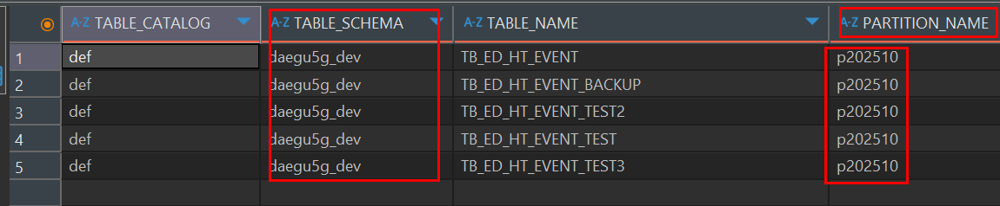

# 파티셔닝 프로시저 변수 문제 해결

---

>

## 학습개요 

- 파티셔닝 프로시저의 조건문 동작이 이상했다. 

  - 분명 p202511 파티션이 없는데 있다고 log 를 출력하고 있었다. 

  - 문제 조건의 쿼리는 다음과 같다. 

    ```sql
    -- 변수
    DECLARE schema_name VARCHAR(64) DEFAULT 'Wony';
    DECLARE table_name  VARCHAR(64) DEFAULT 'TB_ED_HT_TEST';
    
    -- 조건 
    SELECT COUNT(*) INTO @part_exists
    FROM information_schema.PARTITIONS
    WHERE TABLE_SCHEMA   = schema_name
      AND TABLE_NAME     = table_name
      AND PARTITION_NAME = CONCAT('p', next_part_name);
      
    -- 조건문
    IF @part_exists = 1 THEN 
      ... -- 1인경우 다음달 파티션 존재로 인해 Skip 
    ```

- 프로시저 내용 

  1. 매일 새벽 3시 실행
  2. 다음달 파티셔닝 있는지 확인 **(문제의 구간)**
     1. 파티셔닝 존재 : Skip 
     2. 파티셔닝 없음 : 생성 
  3. 로그 데이터 저장 

## 문제점

- 분명 파티션이 없는데 프로시저에서만 있다고 판단. 

  - SQL 편집기를 켜서 동일한 쿼리 실행시 0 나오는것을 확인 

    ```sql
    SELECT COUNT(*) INTO @part_exists
    FROM information_schema.PARTITIONS
    WHERE TABLE_SCHEMA   = 'Wony'
      AND TABLE_NAME     = 'TB_ED_HT_TEST'
      AND PARTITION_NAME = CONCAT('p', next_part_name);
      
    select @part_exists as 실제_변수값
    ```

##### 확인 내용 1

- 프로시저의 캐싱 및 메타 데이터 

  - 프로시저의 세션안에서 이전 실행 데이터에 대해 캐싱 이나 메타 데이터가 남아있을 수 있다고 판단. 

  - 파티셔닝 업데이트 쿼리 실행 

    ```sql
    ANALYZE TABLE daegu5g_dev.TB_ED_HT_EVENT_TEST;
    OPTIMIZE TABLE TB_ED_HT_EVENT_TEST;
    ```

- 결과 

  - 실패. 
  - 파티셔닝 재배치 통계 내용은 업데이트 되지만 달라지지 않았음 

##### 확인 내용 2

- 사용된 쿼리의 다른 버전 사용 

  - 쿼리 실행문 조건을 변경해 임시테이블 및 `PREPARE - EXECUTE` 로 쿼리 실행 

  ```sql
  -- 1번 방법 ( 쿼리 실행문 이용 캐시 제거 )
  SET @ddl := '';
  SET @sql := CONCAT('SHOW CREATE TABLE ', schema_name, '.', table_name);
  PREPARE stmt FROM @sql;
  EXECUTE stmt;  
  DEALLOCATE PREPARE stmt;
  
  SET part_exists := IF(LOCATE(CONCAT('PARTITION p', next_part_name), @ddl) > 0, 1, 0);
  
  
  -- 2번 방법 ( 임시 테이블 이용 캐시 문제 제거 )
  CREATE TEMPORARY TABLE tmp_parts AS
  SELECT TABLE_SCHEMA, TABLE_NAME, PARTITION_NAME
  FROM information_schema.PARTITIONS
  WHERE TABLE_SCHEMA = schema_name
    AND TABLE_NAME   = table_name;
  
  SELECT COUNT(*) INTO part_exists
  FROM tmp_parts
  WHERE PARTITION_NAME = CONCAT('p', next_part_name);
  
  DROP TEMPORARY TABLE tmp_parts;
  ```

- 결과 

  - 실패
  - 결과 똑같음 

##### 확인 내용 3 

- `information_schema` 사용으로 인해 캐싱 되는 문제 

  - `performance_schema` 로 변경 

  ```sql
  -- 버전 : mysql 8.0.16 이상이여야 함 (만족)
  SELECT VERSION();
  
  -- 설정 활성화 : ON 이여야 함 (만족)
  SHOW VARIABLES LIKE 'performance_schema';
  
  -- 설정 제한 : 값이 나와야함 (빈값) 
  SHOW TABLES FROM performance_schema LIKE '%partitions%';
  ```

- `performance_schema` 의 `partitions` 기능이 없어서 불가능 

##### 확인 내용 4 ( 정답 )

- `information_schema.PARTITIONS` 의 속성 

  - 스키마 Partitions 테이블이 어떤것인지 궁금했다. 

  - 그래서 테이블 컬럼을 봤는데, 다음과 같았다. 

    ```sql
    SHOW COLUMNS FROM information_schema.PARTITIONS;
    ```

    

  - 가장 주목할건 `table_name`

    - DB가 대소문자 구분을 안한다면 해당 변수를 예약어로 인식하여 조건이 틀어질 수 있다고 생각이 들었음
    - 그래서 실제로 테스트 해봤는데 **대소문자 구분이 안되 `TABLE_NAME   = table_name` 의 값이 true (즉, 없는 조건) 으로 판단되어 표출되고 있는것을 확인** 
    - 즉, 밑에 쿼리의 조건이 
      - 스키마 비교 + 파티션 이름(p202510) 만 걸림 
      - **Table_name 이 안걸리니 다른 테스트 테이블(TB_ED_HT_EVENT_BACKUP 등...)에 `p202510` 이 있으면 참으로 빠지는거였음** 

    ```sql
    SELECT * 
    FROM information_schema.PARTITIONS
    WHERE TABLE_SCHEMA = 'Wony'
    AND TABLE_NAME   = table_name
    AND PARTITION_NAME = CONCAT('p', '202510');
    ```

    

## 해결 

- **예약어로 설정된 `table_name` 을 변수로 인식할 수 있도록 변경** 

```sql
-- 변수
DECLARE schema_name VARCHAR(64) DEFAULT 'Wony';
DECLARE var_table_name  VARCHAR(64) DEFAULT 'TB_ED_HT_TEST';

-- 조건 
SELECT COUNT(*) INTO @part_exists
FROM information_schema.PARTITIONS
WHERE TABLE_SCHEMA   = schema_name
  AND TABLE_NAME     = var_table_name
  AND PARTITION_NAME = CONCAT('p', next_part_name);
  
-- 조건문
IF @part_exists = 1 THEN 
  ... -- 1인경우 다음달 파티션 존재로 인해 Skip 
```

