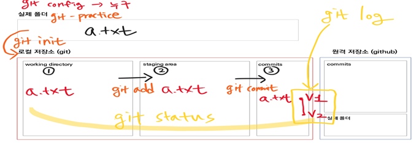

# 깃허브 특강 Day01

> [특강 질문 주소](https://hphk.notion.site/hphk/Git-22-04-07-22-04-08-AI-14-83024d717d9b41a7b76636858f95a21b)
>
> [강사님 이메일](kyle@hphk.kr)
>
> 

1.  1일차 : CLI, Vscode, Markdown, GIt, GitHub

    1. git init 으로 git을 사용할 수 있는 로컬저장소를 만든다.
    2. WorKing Directory -> Staging Area -> Commit

2.  Git = 분산 버전 관리 프로그램

    - **사용 이유 : 1. 백업, 2. 복구, 3. 협업**
      - 백업 : git add, git commit, git push
      - 복구 : git reset
      - 협업 : git clone, git pull, git branch, git merge
    - Git을 이용해서 분산 버전을 관리한다.
    - 자료를 공유하면서 포트폴리오로도 사용할 수 있다.
    - git은 내 컴퓨터 안에서 실행되는 버전 관리 프로그램이다.

3.  **git 과 Gighub 차이점**

    - git : 내 컴퓨터 안에서 버전을 관리하는 로컬 프로그램

    - github : 외부 사람들과 공유하기 위한 일종의 클라우드 서버이다.

4.  CLI 와 GUI 차이점

    - CLI : 터미널 또는 쉘이라고 함. 커맨드 라인 인터페이스라고 하며 사람이 명령어로 소통한다. -> cmd 같은거

    - GUI : 사용자가 조작하기 쉽도록 만든 그래픽 유저 인터페이스이다.

5.  마크다운

    - 마크업의 경량형 버전으로 깃허브에서 사용하는 문법이다.

      - text에 역할을 부여해 좀더 보기 쉽게 볼 수 있도록 하는 것

    - 마크업

      - 글자에 역할을 부여해 주는 것

        Ex) <본문> 가나다라 <본문> <인용> 아자차카 <인용>

        - 본문과 인용같은 것이 마크업이다.

      - html의 m이 마크업을 뜻한다.

      - 마크다운의 본질은 문서를 디자인(색 변경) 하는 것이 아니라 역할을 부여하는 것이다.

        - **글씨를 키우고 싶어서 제목으로 쓰면 안됨 -> 역할에 어긋나면 안된다. **

      - .md 파일형식을 통해 깃허브에 올린다.

6.  깃 이용해 버전 생성하기 전 설정할 일

    1. git으로 관리하고자 하는 폴더를 **git init**으로 만들어준다.

       - git이 해당 폴더를 관리하게 만드는 과정이다.
       - git을 사용하기 위해서는 먼저 git 저장소를 만들어야 한다. 이때 저장소를 초기화 하고 사용해야 하는데 그때 사용하는 명령어가 git init이다.
       - 폴더가 "일반폴더" => "git이 버전관리하는 폴더 " 로 변경된다.
       - git의 관리 대상이 된 폴더는 repository( 저장소 ) 라고 부르게 된다.

    2. git init을 사용한 폴더의 하위에서 git init을 재사용하지 않는다.

       - 다중 init은 버그를 불러온다.

    3. init 의 반대는 remote 이다.

       1. init은 **로컬디스크(git)**라면, remote는 **원격 저장소 (github)**를 뜻한다.

7.  **사용자 설정 **

    + 이걸 설정해야 github에 6하원칙의  (누가) 부분을 git이 자동으로 작성해 줄 수 있다. 

    1.  git config --global user.name "github userName"
    2.  git config --global user.email "github email"
    3.  push 할때 로그인으로 권한을 얻는다. 

8.  깃의 간단한 명령어

    1. **git log** : git의 저장 로그를 불러온다. -> 고유한 commit ID를 볼수 있고, 이것으로 버전을 관리한다.
       1. git log --online : 간단하게 log(버전정보, 고유한 ID)를 볼 수 있다.
       
    2. **git status** : 현재 git이 관리하는 폴더의 상태를 나타낸다. ( 가장 많이 사용함 )

       1. 명령어 add와 commit 둘 중 어떤것을 해야할 지 알려준다.

    3. **Ctrl + L** : 터미널 정리

9.  git을 사용하는 이유

    1. 버전을 관리할때 6하원칙에 의거해 파일을 관리해야 한다.

       1. 누가, 언제 , 어디서, 무엇을, 왜(수정내용) 을 했는지 확인이 필요하다.

    2. git은 **_누가, 왜_** 의 내용만 입력하면 "**_언저, 어디서, 무엇을_**" 을 자동으로 입력하고 관리해준다.

10.  깃 작동 원리

     - Working Directory => Staging Area => commit 3가지의 단계를 거친다.

       

     - git config를 사용해 누가 git을 사용하는지 사용자를 설정한다. => 처음 한번만 설정하면 된다.

     - **Working Directory**

       - 내 컴퓨터에 저장된 파일을 뜻한다.
       - git status로 파일을 확인하면 add하라고 뜬다.
         - git status쳤을때 글씨가 
           - 빨간색일 경우 
             - 현재 컴퓨터 디렉토리에는 있지만 Staging Area에는 올라가지 않음 
           - 초록색일 경우 
             - Staging Area에 있는 경우로, 아직 commit 전 단계임을 알 수 있다.  
       - **git add a.txt** 를 통해 Staging Area에 파일을 올린다.

     - **Staging Area (준비)**

       - Working Directory 로부터 add된 파일을 받아 저장한다.
       - **git commit -m "수정한 내용을 입력" **
         - 해당 명령어를 통해 commit (버전) 을 만든다.
         - commit 에 -m을 하지 않으면 vim이 나온다. 
           - vim은 리눅스와 비슷하다. 

     - **commit(버전 생성 )**

       - 버전을 최종적 생성한다.
       - git log 명령어를 통해 볼 수 있다.

     

11.  Staging Area를 사용하는 이유

     - commit을 입력하면 working Directory의 모든 내용을 버전으로 저장한다.

     - 이때 Staging Area 가 없으면 버전관리를 하고싶지 않은 파일도 commit되어버린다.

     - 따라서 **내가 원하는 파일, 변경사항 만 commit 하기 위해** Staging Area를 사용한다.

       ex) 버전은 하나의 의미만 가져야 한다. login 기능과 회원가입 기능이 있을 떄, 두가지의 의미가 섞여 하나의 버전이 되면 관리가 어려워진다.

       - 따라서 버전은 하나의 기능을 수정하고 업데이트 하는 것이 원칙이다.

12.  GitHub

     - 원격 저장소로 Repository 라고 한다.

     - 원격 저장소에 자료 올리는 방법

       1.  로컬과 원격으로 연결하기

           - **git remote add origin (https://github.com/wonyoung0207/TIL.git)**
             - origin 은 변수로, 다른 이름으로 변경해도 된다.
             
           - **git remote -v**
             - origin으로 등록된 것을 확인한다.
             
           - git remote remove origin
             - 설정된 origin을 삭제할 수 있다.

       2.  로컬의 버전을 원격에 보낸다.

           - **git push origin master**
             - origin이라는 master 에다가 넣는다는 의미이다.
             - 이때 master는 깃허브에서 설정할 수 있다.

       3.  따라서

           1. add
           2. commit
           3. push
              - 의 순서로 원격 저장소에 올릴 수 있다.
     - 

13.  Git 사용시 주의사항

     1.  git init 을 중첩해서 사용하면 안된다.
         - 하위 폴더 안에 폴더를 만들어 git init 하면 안됨
     2.  상위 폴더 git init 하면 안됨
         - 바탕화면이나 C드라이브 init 해 버리면 모든 파일을 git이 관리하는 것이 되어 관리가 어렵다.
     3.  github에서 수동으로 글을 수정하면 안됨
         - 깃허브에서 변경시 깃허브에만 version이 새로 하나 생성됨
         - 이렇게 되면 local 에서 version을 추가할 때 충돌이 일어난다.
     4.  commit해서 만든 버전은 되도록이면 삭제하지 않는 것이 좋다.
         - 버전의 정보들이 꼬일 수 있기 때문에.
         - 따라서 외부 저장소(github) 에 올린 경우라면 더더욱 삭제하지 않는것이 좋다.
