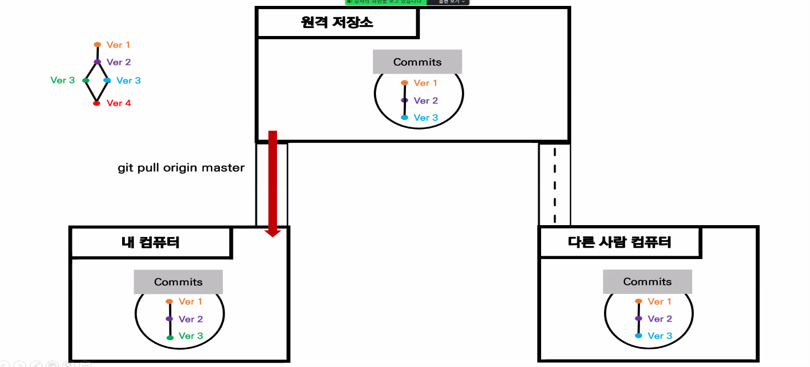
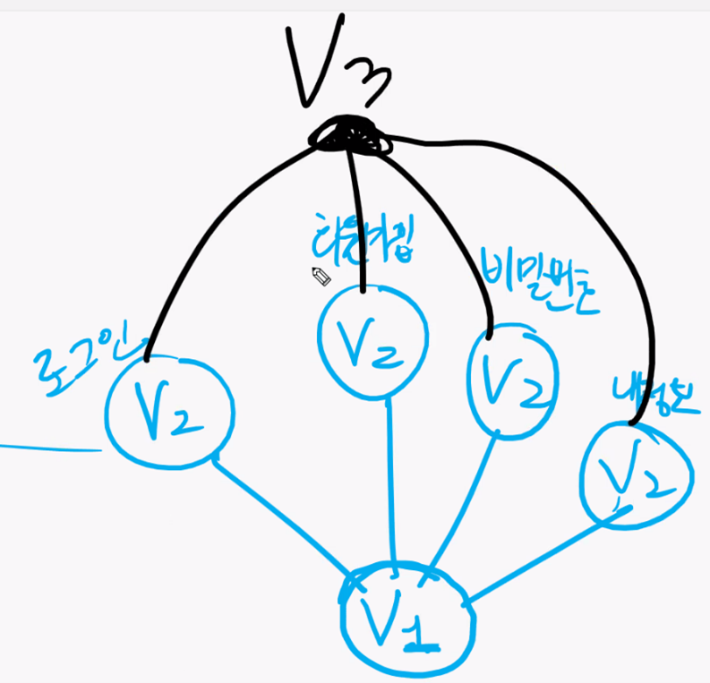
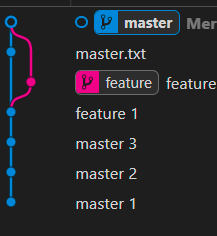
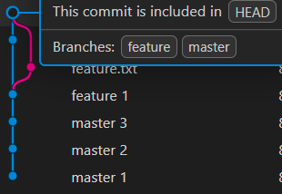
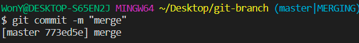

# 깃허브 특강 Day02

> 깃허브와 깃을 연결시키고 버전을 관리한다.
>
> pull, push, branch, merge의 개념을 학습한다.

1. vscode 파일 옆에 뜨는 U와 M 의 차이

   - U ( Untracked ) : 추적할 수 없는 파일을 뜻한다.
   - M ( Modifier ) : 버전 관리를 하고 있는 파일로 git이 modifier(수정) 으로 인식한다.

2. git remote add origin [원격 저장소 주소]

   - 해당 명령어는 원격 저장소와 로컬 저장소를 이어주는 통로 역할을 한다.

   - 이때 원격 저장소와 remote 하려면 권한이 필요하다.

     - 권한은 해당 저장소에서 관리자가 부여할 수 있다.

       - 저장소 -> Setting -> collaborators -> Manage Access -> add people -> 이름 추가 -> 가입 이메일로 승인 발송

3. git push origin master

   - 원격 저장소로 파일을 올린다.

   - 파일을 올리기 전 원격저장소의 버전과 로컬 버전이 동일해야 한다.
     - 따라서 오류가 나지 않기 위해서는 pull과 clone을 사용해야 한다.

4. README.md

   - 꼭 이름을 대문자로 작성해야 한다.

5. .git 폴더

   - 해당 폴더 안의 object 파일에 들어가보면 버전이 관리되고 있다.
   - git init 으로 해당폴더를 git이 관리하게 되면 생성되는 숨겨진 파일이다.
   - .git폴더를 삭제하면 버전도 따라서 삭제된다.
   - index 파일이 Staging Area 이다.

6. .gitignore 파일

   - 특수한 파일로, 버전관리를 하지 않고 github에 올리고싶지 않을 때 사용하는 폴더이다.
   - 해당 파일 안에 버전관리 하고싶지 않은 파일의 이름을 넣으면 버전관리에서 git이 무시한다.
   - 하지만, **이전에 버전관리로 등록해 놓은 파일은 이후에 .gitignore 에 등록해도 git에서 계속해서 버전관리를 한다. **
   - 프로젝트 진행시 README.md 파일과 .gitignore 파일을 맨 처음 만드는것이 좋다.
     - 버전관리되고 있는 파일이 있으면 .gitignore 로 관리가 안되기 때문에
   - [gitignore 자동 추가 사이트](https://www.toptal.com/developers/gitignore)

7. Staging Area 에 올린 파일 삭제하는 방법

   - git **reset** HEAD c.txt
     - add한 파일을 다시 리셋하고 싶은경우 사용

8. github 로부터 버전을 가져오는 방법

   - 분산 버전 관리 프로그램의 장점이다.

   - 이때 가져오는 것은 버전을 가져오는 것이다.

   1. **git clone [원격 저장소 주소]**
      - 처음 버전이 아예 없을 때 저장소를 통째로 복사하는 방법이다.
      - 폴더에서 마우스 오른쪽 -> git bash -> 명령어 입력 -> 파일생성
      - 이때 **조심해야 할 것이 파일 위치**이다. 해당 파일 안에서 vscode를 켜야한다.
        1. 버전에 저장된 이름으로 폴더 생성
        2. git init 자동 진행
        3. commit 진행
        4. git remote add origin url 로 연결된다.
           - **깃허브가 버전을 받을 때 자동으로 origin으로 변수를 설정한다. **
   2. **git pull origin master**

      - 저장된 버전이 있는경우 버전을 업데이트해서 가져오는 방법
      - 이미 한번 clone으로 Local에 버전을 복사했을 경우 사용된다.
      - 따라서 다른 사람이 github의 commit버전을 수정했을 경우 pull로 받아오면 된다.
      - 만약 다른 사람이 수정한 버전과 겹칠경우, 두 버전을 합쳐야 한다.
        - 이때 사용하는 명령어가 merge와 branch 이다.
      - 여기서 master는 branch를 뜻한다.
      - git pull 명령 사용하면 git fetch 가 일어나고, git merge가 일어난다.

      

9. **branch**

   - **평행우주** 라고도 하며 서로가 서로에게 영향을 주지 않는 공간이다.

   - 하나의 버전을 pull해서 각기다른 기능을 만들고 push하는 방법이다.

     ex) v1버전에서 서로다른 기능의 v2를 만든다.

     1. v2 - 로그린

     2. v2 - 회원가입

     3. v2 - 비밀번호

     4. v2 - 내정보

        4가지의 v2를 하나의 v3로 merge 할 수 있다.

        **이때 4가지의 v2는 각각 하나의 branch 라고 할 수 있다. **

   

10. master

    - 상용 이라고 하며, 고객에게 최종적으로 공개되는 버전이다.
    - master를 고치면 고객들이 실시간으로 영향을 받을 수 있다. 따라서 master를 branch로 복사하여 평행우주에서 작업을 진행한다.
    - branch를 완성하고 다시 master 와 merge 해서 master(버전) 을 만든다.

11. **branch**

    1. git branch feature
       - feature 라는 브렌치를 만들어 평행 우주로 만든다.
    2. git branch
       - 브랜치 목록을 조회한다.
    3. git switch feature
       - 브랜치를 feature로 변경한다.
    4. git branch -D feature
       - 브랜치를 삭제한다.

12. **merge**

    - 병합을 뜻하며 ,하나의 v1 버전으로 부터 파생된 v2 버전들을 하나의 새로운 버전 v3로 합친다.

    - 종류

      1. Fast-forward
         - git merge feature
           - 단계가 높은 버전(feature) 을 버전이 느린 master와 병합한다.
           - 주의할점은 단계가 높은 버전에서 merge하면 안된다.
             - 왜냐하면 feature은 이미 master를 지나왔기 때문에 최신버전으로 인식한다
      2. Auto-merging
         - 서로 다른 버전으로 나뉘어진 것이 자동으로 합쳐지는 것
         - 버전의 단계가 다른 버전을 합치는 것을 말한다.

       

      1. conflict
         - 서로 다른 버전이 부자연스럽게 합쳐지는 것을 말한다.
         - 내가 수동으로 합치는 것을 conflict이라고 한다.
         - 하나의 파일을 공유하는 두개의 branch가 있는 경우, 해당 파일에 내용을 변경하면 수동으로 merge하라고 conflict가 나온다.

      

13. pull Request

    - 회사에서 업무를 하는 순서

      1. 먼저 회사가 관리하면 github 원격 저장소가 존재
    1. 초보 개발자가 권한을 얻을 수 없어 내 github로 Fork 해서 저장
      1. Fork한 버전을 clone을 이용해 로컬에 저장
    1. 로컬에서 나만의 branch 를 만들어 기능 제작
      1. github로 psuh
    1. 원격 저장소의 추가된 branch 확인 후 pull request
    
14. fetch

    + pull 과 차이점 
      + pull은 merge를 해서 가져오고, fetch는 단지 소스를 그대로 가져온다. 
