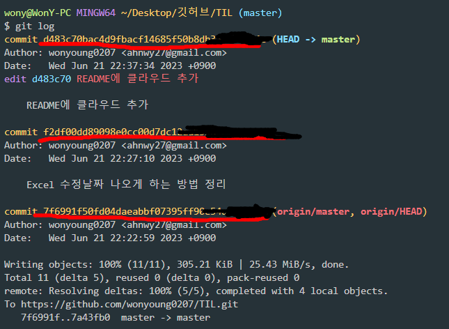
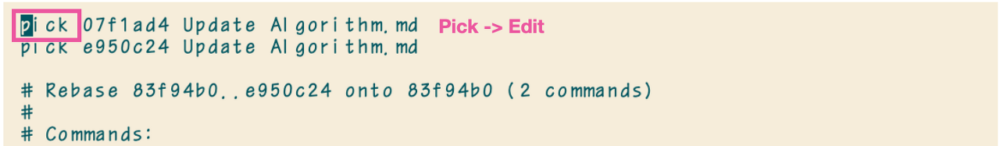
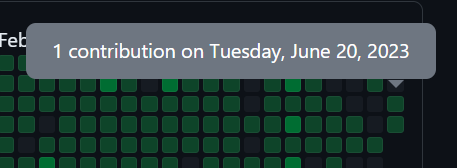

# GitHub 잔디조작 방법(commit 날짜 조작)

---

>[참고 사이트1](https://velog.io/@gnwjd309/GitHub-commit-history)
>
>[참고 사이트2](https://cindycho.tistory.com/71)
>
>[git commit --amend 참고 사이트](https://www.atlassian.com/ko/git/tutorials/rewriting-history)

##  깃허브 커밋 날짜 조작

### 이용이유 

- 커밋의 날짜를 조작해 github 메인페이지의 '잔디' 색상을 원하는 날짜에 칠할 수 있다 .
  - 커밋 후 push를 깜빡해서 하지 못한날이 있었다. 이런날을 위해 방법을 학습한다. 

### 사용방법

- 크게보자면 , commit 의 Hash값을 이용해 새 branch를 만들고 commit의 날짜를 수정하여 master 브랜치로 병합(rebase)한다. 

  1. 이때 `rebase -i `명령어를 통해 commit **히스토리를 수정**하고

     ```bash
     git rebase -i ${수정할 커밋의 직전 커밋}
     ```

  2. 히스토리 수정 후 `git commit --amend` 명령어를 사용해 git의 기록(커밋날짜)을 변경한다. 

  3. 날짜 변경 후 rebase 를 사용해 master 브랜치와 병합한다. 


### 사용 순서

#### 단계 1.  **git log**

   - 깃 로그를 확인한다. 

   - 깃 레포지토리의 commit 기록을 확인

     ```bash
     git log 
     ```

   

#### 단계 2.  git rebase -i {Hash Value}

   1. **수정하고 싶은 날짜 이전의 커밋**을 하나 골라준다.

      - rebase라는 개념 자체가 **병합**인데, merge와는 다르게 브랜치를 나누는것이 아닌 기준 브랜치에 다른 브랜치를 연결시킨다. 

      - 따라서 **내가 수정하고 싶은 commit을 rebase를 이용해 해당 날짜에 끼워넣는 방식**인거같다. ( 내 생각... )

   2. 고른 커밋의  Hash Value를 이용하여 다음과 같은 명령어를 입력한다. 

      ```bash
      git rebase -i {hash value}
      # 실제 입력 : git rebase -i 7f6991f50fd04daeabbf07395ff90e54ad4*****
      ```

#### 단계 3.  rebase 터미널 수정 

   1. 위의 명령어를 입력하면 터미널에 다음사진처럼 **vm** 이 뜬다. 

      

   2. 그러면 키보드에서 **i** 를 입력하면 *insert* 모드로 바뀌게 되고, 키보드를 움직여 해당 위치로 간 후 **제일 첫 번째 깃로그**의 **pick을 edit으로 바꿔 준다.** 

   3. 변경한 후에 **esc -> wq!** 순서대로 키보드에서 입력하여 vm **수정을 종료**한다. 

#### 단계 4.  Git commit --amend

- rebase한 커밋의 **날짜를 수정**한다. 

- 나는 `2023년 6월 20일 오후 10시` 로 커밋의 시간을 변경했다. 

    ```bash
    git commit --amend --no-edit --date="{원하는 날짜}"
    # 실제 입력 : git commit --amend --no-edit --date="JUN 21 22:00:00 2023 +0000"
    ```

#### 단계 5.  Git rebase --continue

- 해당 날짜로 수정 완료 후, 다음 명령어를 통해 rebase를 계속 진행한다. 

- 그러면 이제 터미널에서 rebase 가 완료됐다는 내용을 확인할 수 있다. 

    ```bash
    git rebase --continue
    ```

#### 단계 6.  git push -f origin main

- 수정한 리베이스 내용을 main에 강제로 push 해주는 과정이 필요하다. 

  ```bash
  git push -f origin main
  ```

#### 단계 7.  github의 잔디확인

- 변경한 날짜로 깃허브의 잔디가 칠해졌는지 확인한다. 
- 이때 , 변경한 날짜의 잔디는 칠해졌지만, commit한 시간은 push 한 시간으로 기록된다는것을 알아야 한다. 
  - 따라서 잔디는 칠했지만, 실제 commit 기록에는 push 한 시간으로 기록된다. 




