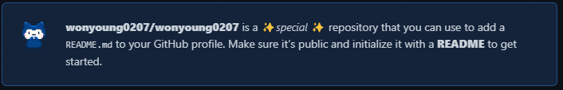
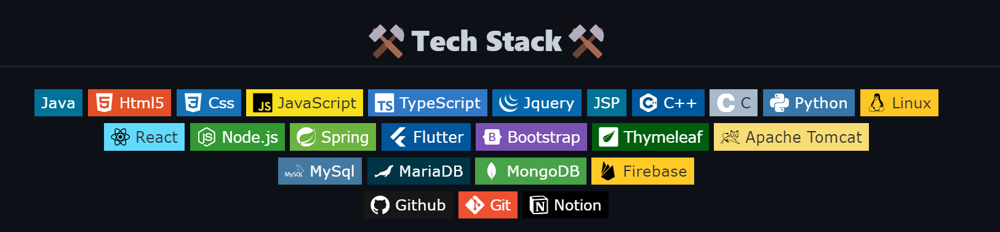
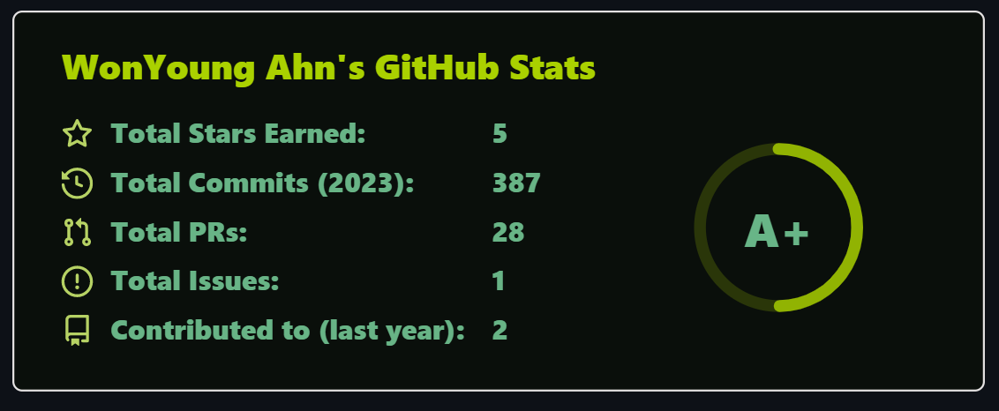
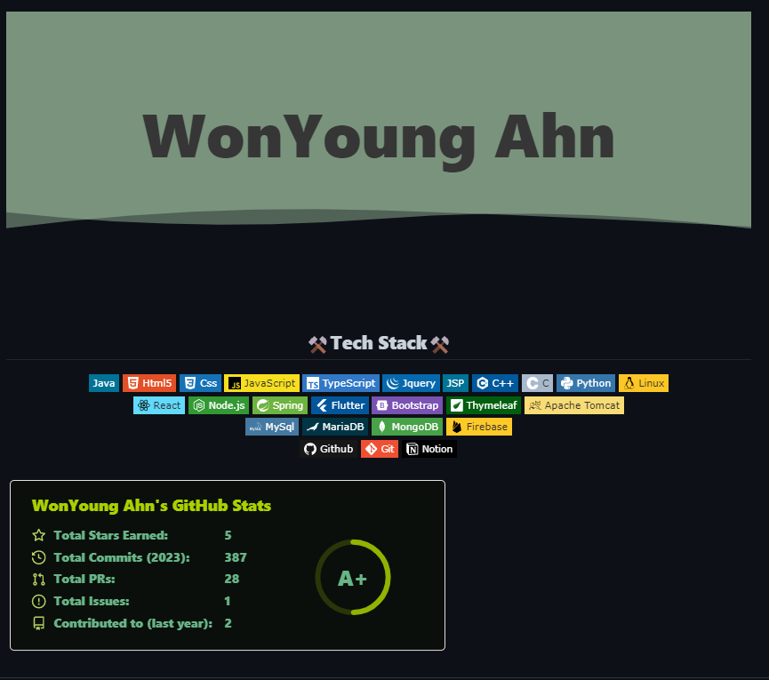

# GitHub 프로필 꾸미기

---

> [참고사이트](https://pgmjun.tistory.com/21)

## 1. 레포지토리 생성 

- 메인 프로필을 만들기 위해서는 자기 자신의 ID로 된 레포지토리를 생성해야 한다.
  - 나의 ID로 레포지토리를 생성하면 특수 레포지토리로 설정되어 README.md 파일을 꼭 같이 생성해야한다는 주의 문구가 뜬다. 
  - 나의 경우엔 " wonyoung0207 " 로 진행했다. 
- 레포지토리 생성 후 clone을 받아 README.md 파일을 통해 프로필을 꾸밀 수 있다. 



---

## 2. 헤더 꾸미기 

- README.md 파일의 가장 처음 오는 헤더를 오픈 API를 사용해 꾸밀 수 있다. 

  - [capsule-render API 정의 사이트](https://github.com/kyechan99/capsule-render)

- 이곳에 가면 헤더 사용법을 알 수 있다. 

  - 나의 경우엔 다음과 같은 코드를 사용했다. 

    ```
    
    ```

- 주요 속성 

  - type
    - 디자인을 나타냄. wave가 default 로 설정되어 있고, 다양한 type들이 있다. 
  - color
    - 헤더의 색상. 대부분 계속해서 바뀌는 auto 색상을 적용. 
  - text
    - 헤더에 출력할 내용 


---

## 3. 뱃지 꾸미기 

- 뱃지들은 자신이 습득한 기술들을 보기좋게 나열할 떄 사용한다. 

  - 뱃지들의 형태와 사용방법은 밑의 링크에서 알 수 있다.
  - [뱃지 제공 사이트 ](https://shields.io/)

- 사용 형태는 다음과 같다. 

  ```html
  // 형태 
  
  
  // 예
   
  ```

  - Java-007396 : 기술 이름과 색상 코드이다. 
    - 뱃지들 각각의 색상 코드는 밑의 링크에서 찾을 수 있다. 
    - [뱃지 색상 코드 ](https://simpleicons.org/)
  - style : 뱃지의 디자인으로, 여러 종류가 존재한다. 
  - logo : 뱃지의 로고를 정하는 부분으로, 모두 소문자로 작성한다. 
  - logoColor : 뱃지의 색상을 정하는 부분이다. 대부분 white로 설정하지만, 뱃지 배경 색상이 밝은경우 black을 사용한다. 

### 내 뱃지 

```html
<div align=center> 
     
     
     
     
     
    
    
    
    
     
     
    <br>
     
    
     
    
    
    
    
	<br>
     
     
    
    
    <br>
    
    
    
</div>
```



---

## 4. Stats 꾸미기 

- 오픈 api를 통해 내 github의 전체 상태를 등급으로 알 수 있다. 

- 해당 api는 밑의 깃허브에 정의되어 있다. 

  - [git Stats 사이트](https://github.com/anuraghazra/github-readme-stats)

- 형태 

  ```
  
  ```

  - username부분만 자신의 github ID 로 번경해주면 된다. 
  - 색상을 변경하고 싶다면 theme 부분을 변경하면 된다. 

- Error ( 2023-01-13 ) 수정

  - Cannot read properties of undefined (reading 'user') => 파일을 찾지 못해 stats가 안나오는 에러 발생 

  - 해결방법 

    ```
    // 해결방법 => https://github-readme-stats-git-masterrstaa-rickstaa.vercel.app/api? 로 주소변경 
    
    
    ```




---

## 5. 완성 화면 


