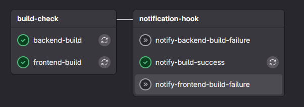
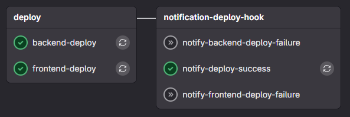

## gitlab-ci.yml

```yml
# 파이프라인 단계 정의
stages:
  - build-check
  - notification-hook
  - deploy
  - notification-deploy-hook

# 프론트 빌드 작업 (node.js, npm, nvm 필요)
frontend-build:
  stage: build-check
  image: node:14.17-alpine
  script:
    - echo "📦 node install & build frontend"
    - cd frontend
     # 캐시가 있으면 그대로 사용, 없으면 npm ci 실행
    - if [ -d node_modules ] && [ "$(ls -A node_modules)" ]; then
        echo "✅ Using cached node_modules";
      else
        echo "📂 No cache found, running npm ci";
        npm ci || npm install --legacy-peer-deps;
      fi  
    - npm run build
    - echo "✅ frontend Build Success"
    # - echo "📂 캐시 파일 전체 경로 탐색"
    # - find /cache -type f
    # - echo "📂 /cache 디렉토리 구조 전체 보기"
    # - tree /cache || echo "tree 명령어 없음"
    # - echo "📂 캐시 파일 디버깅 - /cache 경로 확인"
    # - ls -al /cache || echo "/cache 디렉토리 없음"
    # - echo "📂 캐시 파일 디버깅 - 현재 작업 디렉토리 확인"
    - pwd
    - ls -al
  cache:
    # key: frontend-node-modules
    key:
      files:
        - package-lock.json
    paths:
      - frontend/node_modules/
    policy: pull-push
  rules:
    - if: $CI_PIPELINE_SOURCE == "merge_request_event"
  tags:
    - klever-twin-runner


# 백엔드 빌드 작업 (java, gradle 필요) 
backend-build:
  stage: build-check
  image: gradle:7.6.1-jdk17
  script:
    - echo "📦 Clean & build backend"
    - cd backend/dt
    - ./gradlew --no-daemon clean build
    - echo "✅ Backend Build Success"
  rules:
    - if: $CI_PIPELINE_SOURCE == "merge_request_event"
  tags:
    - klever-twin-runner


# 프론트엔드 배포 작업 (node.js, npm, nvm 필요)
frontend-deploy:
  stage: deploy
  image: node:14.17-alpine
  script:
    - echo "📦 Install & build frontend"
    - cd frontend
     # 캐시가 있으면 그대로 사용, 없으면 npm ci 실행
    - if [ -d node_modules ] && [ "$(ls -A node_modules)" ]; then
        echo "✅ Using cached node_modules";
      else
        echo "📂 No cache found, running npm ci";
        npm ci || npm install --legacy-peer-deps;
      fi
    - npm run build
    - mkdir -p /output/frontend
    - cp -r twin/* /output/frontend/
    - ls -lh /output/frontend
    - echo "✅ Frontend Deploy Success"
  cache:
    key:
      files:
        - package-lock.json
    paths:
      - frontend/node_modules/
    policy: pull-push
  rules:
    - if: $CI_COMMIT_BRANCH == "dev" && $CI_PIPELINE_SOURCE == "push"
  tags:
    - klever-twin-runner


# 백엔드 배포 작업 (java, gradle 필요) 
backend-deploy: 
  stage: deploy
  image: gradle:7.6.1-jdk17
  script:
      - echo "📦 Clean & build backend"
      - cd backend/dt
      - ./gradlew --no-daemon clean build
      - mkdir -p /output/backend
      - cp build/libs/*.jar /output/backend/  # ⬅ 마운트된 경로로 복사
      - ls -lh /output/backend
      - echo "✅ Backend Deploy Success"
  rules:
    - if: $CI_COMMIT_BRANCH == "dev" && $CI_PIPELINE_SOURCE == "push"
  tags:
    - klever-twin-runner
 


############################## 알람 ##############################

# frontend , backend 빌드 성공시 실행
notify-build-success:
  stage: notification-hook
  image: alpine/curl:latest
  needs: 
  - job: frontend-build
    artifacts: false
  - job: backend-build
    artifacts: false
  before_script:
  - apk add --no-cache jq
  script:
    - |
      BRANCH_NAME=${CI_COMMIT_BRANCH:-${CI_MERGE_REQUEST_SOURCE_BRANCH_NAME}}
      echo "👉 merge ID : CI_MERGE_REQUEST_IID = $CI_MERGE_REQUEST_IID"
      echo "👉 API URL : CI_API_V4_URL = $CI_API_V4_URL"
      echo "👉 Project ID : CI_PROJECT_ID = $CI_PROJECT_ID"
      echo "👉 Token : GITLAB_API_TOKEN = $GITLAB_API_TOKEN"
      echo "👉 API CALL URL: $CI_API_V4_URL/projects/$CI_PROJECT_ID/merge_requests/$CI_MERGE_REQUEST_IID"

      echo "📦 리뷰어 정보 조회 (GitLab API)"
      REVIEWERS_JSON=$(curl --silent --header "PRIVATE-TOKEN: $GITLAB_API_TOKEN" \
        "$CI_API_V4_URL/projects/$CI_PROJECT_ID/merge_requests/$CI_MERGE_REQUEST_IID")

      # API 호출 실패 시
      if [ -z "$REVIEWERS_JSON" ] || [ "$REVIEWERS_JSON" = "null" ]; then
        echo "🚨 API 호출 실패 또는 데이터 없음"
        REVIEWERS="(불러오기 실패)"
        echo "✅ 최종 리뷰어 목록: $REVIEWERS"
        exit 0
      fi

      # reviewers 필드 파싱 및 null 방어
      REVIEWERS=$(echo "$REVIEWERS_JSON" | jq -r '[.reviewers[]?.name] | select(length > 0) | join(", ")')

      # reviewers가 비어있다면 기본값 처리
      if [ -z "$REVIEWERS" ]; then
        REVIEWERS="(지정되지 않음)"
      fi

      echo "✅ 최종 리뷰어 목록: $REVIEWERS"

      MESSAGE="
        <b>[ Klever Twin 알림 ]</b>%0A\
        🔔 <b>Merge Request Opened</b> 🔔 %0A\
        <b>Project:</b> ${CI_PROJECT_NAME}%0A\
        <b>Author:</b> ${GITLAB_USER_NAME}%0A\
        <b>Reviewer:</b> ${REVIEWERS}%0A\
        <b>Branch:</b> <code>${BRANCH_NAME}</code>%0A\
        <b>Pipeline:</b> <code>${CI_PIPELINE_ID}</code>%0A\
        <b>Title:</b> ${CI_MERGE_REQUEST_TITLE}%0A\
        <b>Link:</b> ${CI_MERGE_REQUEST_PROJECT_URL}/-/merge_requests/${CI_MERGE_REQUEST_IID}"

      URL="https://api.telegram.org/bot${TELEGRAM_BOT_TOKEN}/sendMessage"
      echo "Telegram API URL: $URL"
      echo "Telegram Chat ID: ${TELEGRAM_CHAT_ID}"
      echo -e "Telegram Message:\n$MESSAGE"

      curl -s -X POST "$URL" \
        -d chat_id="${TELEGRAM_CHAT_ID}" \
        -d parse_mode="HTML" \
        -d text="$MESSAGE"
  rules:
    - if: $CI_PIPELINE_SOURCE == "merge_request_event"
      when: on_success
  tags: 
    - klever-twin-runner


# 프론트엔드 빌드 실패시 알림
notify-frontend-build-failure:
  stage: notification-hook
  image: alpine/curl:latest
  needs: ["frontend-build"]
  script:
    - |
      MESSAGE="
        <b> [ Klever Twin 알림 ] </b>%0A\
        🚨 <b>Frontend 빌드 실패</b> 🚨 %0A\
        <pre>\
        Project     : ${CI_PROJECT_NAME}
        MR Title    : ${CI_MERGE_REQUEST_TITLE}
        Branch      : ${CI_COMMIT_REF_NAME}
        Commit      : ${CI_COMMIT_SHORT_SHA}
        Author      : ${GITLAB_USER_NAME}
        Job URL     : ${CI_JOB_URL}
        </pre>
      "

      URL="https://api.telegram.org/bot${TELEGRAM_BOT_TOKEN}/sendMessage"
      echo "Telegram API URL: $URL"
      echo "Telegram Chat ID: ${TELEGRAM_CHAT_ID}"
      echo -e "Telegram Message:\n$MESSAGE"

      curl -s -X POST "$URL" \
        -d chat_id="${TELEGRAM_CHAT_ID}" \
        -d parse_mode="HTML" \
        -d text="$MESSAGE"
  rules:
    - if: $CI_PIPELINE_SOURCE == "merge_request_event"
      when: on_failure
  tags: 
    - klever-twin-runner


# 백엔드 빌드 실패시 알림
notify-backend-build-failure:
  stage: notification-hook
  image: alpine/curl:latest
  needs: ["backend-build"]
  script:
    - |
      MESSAGE="
        <b> [ Klever Twin 알림 ] </b>%0A\
        🚨 <b>Backend 빌드 실패</b> 🚨 %0A\
        <pre>\
        Project     : ${CI_PROJECT_NAME}
        MR Title    : ${CI_MERGE_REQUEST_TITLE}
        Branch      : ${CI_COMMIT_REF_NAME}
        Commit      : ${CI_COMMIT_SHORT_SHA}
        Author      : ${GITLAB_USER_NAME}
        Job URL     : ${CI_JOB_URL}
        </pre>
      "

      URL="https://api.telegram.org/bot${TELEGRAM_BOT_TOKEN}/sendMessage"
      echo "Telegram API URL: $URL"
      echo "Telegram Chat ID: ${TELEGRAM_CHAT_ID}"
      echo -e "Telegram Message:\n$MESSAGE"

      curl -s -X POST "$URL" \
        -d chat_id="${TELEGRAM_CHAT_ID}" \
        -d parse_mode="HTML" \
        -d text="$MESSAGE"
  rules:
    - if: $CI_PIPELINE_SOURCE == "merge_request_event"
      when: on_failure
  tags: 
    - klever-twin-runner

# 프론트엔드 배포 성공시 알림
notify-deploy-success:
  stage: notification-deploy-hook
  image: alpine/curl:latest
  needs: 
  - job: frontend-deploy
    artifacts: false
  - job: backend-deploy
    artifacts: false
  script:
    - |
      DEPLOY_PATH="/mnt/d/build/"
      MESSAGE="
        <b>[ Klever Twin 알림 ]</b>%0A\
        ✅ <b>Frontend, Backend Deploy Success</b> ✅ %0A\
        <pre>\
        Target Host  : 172.28.7.160
        Project      : ${CI_PROJECT_NAME}
        Author       : ${GITLAB_USER_NAME}
        Branch       : ${CI_COMMIT_BRANCH}
        Pipeline     : ${CI_PIPELINE_ID}
        Deploy Path  : ${DEPLOY_PATH}
        </pre>"
      URL="https://api.telegram.org/bot${TELEGRAM_BOT_TOKEN}/sendMessage"
      echo "Telegram API URL: $URL"
      echo "Telegram Chat ID: ${TELEGRAM_CHAT_ID}"
      echo -e "Telegram Message:\n$MESSAGE"

      curl -s -X POST "$URL" \
        -d chat_id="${TELEGRAM_CHAT_ID}" \
        -d parse_mode="HTML" \
        -d text="$MESSAGE"
  rules:
    - if: $CI_COMMIT_BRANCH == "dev" && $CI_PIPELINE_SOURCE == "push"
      when: on_success
  tags: 
    - klever-twin-runner

# 프론트 배포 실패시 알림
notify-frontend-deploy-failure:
  stage: notification-deploy-hook
  image: alpine/curl:latest
  needs: ["frontend-deploy"]
  script:
    - |
      MESSAGE="
        <b> [ Klever Twin 알림 ] </b>%0A\
        🚨 <b>Frontend 배포 실패</b> 🚨 %0A\
        <pre>\
        Project     : ${CI_PROJECT_NAME}
        MR Title    : ${CI_MERGE_REQUEST_TITLE}
        Branch      : ${CI_COMMIT_REF_NAME}
        Commit      : ${CI_COMMIT_SHORT_SHA}
        Author      : ${GITLAB_USER_NAME}
        Job URL     : ${CI_JOB_URL}
        </pre>
      "

      URL="https://api.telegram.org/bot${TELEGRAM_BOT_TOKEN}/sendMessage"
      echo "Telegram API URL: $URL"
      echo "Telegram Chat ID: ${TELEGRAM_CHAT_ID}"
      echo -e "Telegram Message:\n$MESSAGE"

      curl -s -X POST "$URL" \
        -d chat_id="${TELEGRAM_CHAT_ID}" \
        -d parse_mode="HTML" \
        -d text="$MESSAGE"
  rules:
    - if: $CI_COMMIT_BRANCH == "dev" && $CI_PIPELINE_SOURCE == "push"
      when: on_failure
  tags: 
    - klever-twin-runner


# 백엔드 배포 실패시 알림
notify-backend-deploy-failure:
  stage: notification-deploy-hook
  image: alpine/curl:latest
  needs: ["backend-deploy"]
  script:
    - |
      MESSAGE="
        <b> [ Klever Twin 알림 ] </b>%0A\
        🚨 <b>Backend 배포 실패</b> 🚨 %0A\
        <pre>\
        Project     : ${CI_PROJECT_NAME}
        MR Title    : ${CI_MERGE_REQUEST_TITLE}
        Branch      : ${CI_COMMIT_REF_NAME}
        Commit      : ${CI_COMMIT_SHORT_SHA}
        Author      : ${GITLAB_USER_NAME}
        Job URL     : ${CI_JOB_URL}
        </pre>
      "

      URL="https://api.telegram.org/bot${TELEGRAM_BOT_TOKEN}/sendMessage"
      echo "Telegram API URL: $URL"
      echo "Telegram Chat ID: ${TELEGRAM_CHAT_ID}"
      echo -e "Telegram Message:\n$MESSAGE"

      curl -s -X POST "$URL" \
        -d chat_id="${TELEGRAM_CHAT_ID}" \
        -d parse_mode="HTML" \
        -d text="$MESSAGE"
  rules:
    - if: $CI_COMMIT_BRANCH == "dev" && $CI_PIPELINE_SOURCE == "push"
      when: on_failure
  tags: 
    - klever-twin-runner

# deploy-to-local:
#   stage: deploy
#   script:
#     - scp backend/dt/build/libs/*.jar user@host:/path/to/deploy/
#   rules:
#     - if: $CI_COMMIT_BRANCH == "dev" && $CI_PIPELINE_SOURCE == "push"
#   only:
#     - dev
#   tags:
#     - docker-runner


# NCP Docker Context 배포 작업
# result-deploy:
#   stage: deploy
#   image:
#     name: docker:24.0.2-dind-alpine3.18
#     entrypoint: [""]
#   services:
#     - name: docker:20-dind
#       command: ["--host=tcp://0.0.0.0:2375"]
#   before_script:
#     - echo "$PASSWORD" | docker login --username "$USERNAME" --password-stdin "$DOCKER_REGISTRY"
#   script:
#     - echo "📦 ncp Connected ... Docker context"
#     - docker build -t ${DOCKER_REGISTRY}/klever-gitlab-runner:r${CI_PIPELINE_IID} .
#     - docker tag ${DOCKER_REGISTRY}/klever-gitlab-runner:r${CI_PIPELINE_IID} ${DOCKER_REGISTRY}/klever-gitlab-runner:latest
#     - docker push ${DOCKER_REGISTRY}/klever-gitlab-runner:r${CI_PIPELINE_IID}
#     - docker push ${DOCKER_REGISTRY}/klever-gitlab-runner:latest
#   dependencies:
#     - backend-build
#   rules:
#     - if: '$CI_COMMIT_BRANCH == "dev" && $CI_PIPELINE_SOURCE != "schedule"'
#   tags:
#     - docker-runner
```


## Config.toml 세팅 

- Gitlab Runner 설정에 사용됨 
  - docker compose register 실행하면 runner 컨테이너에 해당 세팅이 등록됨 

- [runners.docker] : Job Container 설정에 사용됨 

```toml
concurrent = 4
check_interval = 0
connection_max_age = "15m0s"
shutdown_timeout = 0

[session_server]
  session_timeout = 1800

[[runners]]
  name = "docker-compose-runner"
  url = "http://[IP:Port]/"
  id = 30
  token = "[GitLab Runner Token]"
  token_obtained_at = 2025-07-28T00:02:23Z
  token_expires_at = 0001-01-01T00:00:00Z
  executor = "docker"
  cache_dir   = "/cache"     # ← 캐시 저장/복원 디렉토리 지정
  [runners.cache]
    Type = "directory"
    Path = "/cache"
    MaxUploadedArchiveSize = 0
    [runners.cache.s3]
    [runners.cache.gcs]
  [runners.docker] # Job Container 설정
    tls_verify   = false
    image        = "alpine:3.19"
    privileged   = true
    volumes      = [
      "/var/run/docker.sock:/var/run/docker.sock",
      "/home/git-runner/runner-cache:/cache",        	# Job 컨테이너 캐시 전용 볼륨 마운트(로컬호스트와 매핑)
      "/mnt/c/build/backend:/output/backend",		# Build 파일 마운트 (호스트 - Job Container 간 마운트)
      "/mnt/c/build/frontend:/output/frontend"
    ]
    shm_size     = 0
```

## Dokcer Compose 세팅

### Register

- gitlab runner 를 Gitlab 서버의 러너와 연결

```yml
services:
  gitlab-runner-register:
    container_name: gitlab-runner-register
    image: gitlab/gitlab-runner:latest
    restart: "no"
    volumes: # Host 와 runner 컨테이너 간 연결 
      - './config:/etc/gitlab-runner'               # Runner 컨테이너 설정 파일
      - '/var/run/docker.sock:/var/run/docker.sock'
    command: 
      gitlab-runner register
      --non-interactive
      --url http://10.10.30.238:8980/
      --registration-token glrt-ypLtGX5nK5v6paMzyPnm
      --executor docker
      --docker-image alpine:3.19
      --locked=false
      --name p2
      --docker-volumes /var/run/docker.sock:/var/run/docker.sock
```

### Run

- Gitlab Runner Container 를 실행 

```yml
services:
  gitlab-runner-run:
    container_name: gitlab-runner-run
    image: 'gitlab/gitlab-runner'
    restart: always
    volumes:
      - './config:/etc/gitlab-runner'
      - '/var/run/docker.sock:/var/run/docker.sock'
    command:
      - run
```

## PipeLine 결과 

1. Build

   

2. Deploy

   


