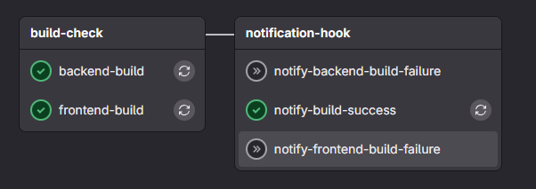
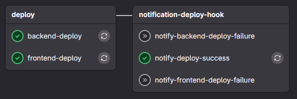

# GitLab Runner CI/CD (Docker Compose) 

이 문서는 **Docker Compose로 GitLab Runner를 등록/실행**하고, `.gitlab-ci.yml`에서 **캐시/아티팩트**를 간단히 사용하는 방법을 요약합니다. (Windows/WSL2 환경 포함)

---

## 1) 사전 정보

- GitLab URL: `[GitLab Server IP]`
- 등록 토큰: `[공용계정 Token]` (만료시 GitLab 공용 계정 토큰 받기) 
  - 현재는 GitLab Repo Setting 의 Validable 에서 볼 수 있음 

- 러너 이름: `docker-compose-runner`
- 캐시 디렉터리(호스트): 
  - `/home/meta/git-runner/runner-cache` (cache로 Node_modules 사용)

- 빌드 산출물 바인드 (원하는 빌드 경로로 수정 가능) 
  1. Backend : `/mnt/d/app/kleverTwin/backend/dt`
  2. Frontend : `/mnt/d/app/kleverTwin/frontend/twin`

```bash
#####
##### docker compose 명령어는 compose 파일이 있는 경로에서 실행해야 합니다!!
#####

# docker compose 삭제 
docker compose -f docker-compose-run.yml down -v 
docker compose -f docker-compose-register.yml down -v 

# (필요시) 볼륨 정리
docker volume prune -f

# docker compose 이용 container 생성
docker compose -f docker-compose-register.yml up -d # register : Gitlab runner 와 연결하기 위해 필요 
docker compose -f docker-compose-run.yml up -d # run: runner 컨테이너 실행 


################### 기타 ###################

# 컨테이너 삭제 (볼륨 삭제 안됨)
docker rm gitlab-runner-register

# 이미지 삭제 
docker rmi gitlab/gitlab-runner:latest
```

---

## 2) 파일 구조 

```
cicd/docker/
├─ config/                 # runner 설정(config.toml)이 생성/보관될 폴더
├─ docker-compose-register.yml
├─ docker-compose-run.yml
└─ README.md
```

---

## 3) GitLab Runner 등록(1회성)

- 등록은 **일회성** 컨테이너로 실행하고 종료 시 **자동 삭제**(`--rm`)하는 방식을 권장합니다.
- 등록이란, Docker Runner를 GitLab Server 의 Runner 에 연결하는 작업을 뜻함 

### `docker-compose-register.yml`

```bash
# gitlab runner 등록 방법 
docker compose -f docker-compose-register.yml up -d --rm gitlab-runner-register
```

> 기존 설정을 **완전 초기화**하려면 `docker-compose-register.yml`, `docker-compose-run.yml` 을 이용해 container 삭제 후 다시 등록 

---

## 4) Docker Container 실행(상시)

- 실제 Gitlab runner 로 동작하는 컨테이너로, 해당 컨테이너가 실행되고 있어야 GitLab 의 Runner 와 연결됩니다. 
- Docker GitLab Runner 를 실행시켜 CI/CD 파이프라인이 동작하도록 한다. 

### `docker-compose-run.yml`

```bash
# 실행
docker compose -f docker-compose-run.yml up -d

# 정지
docker compose -f docker-compose-run.yml down -v 

# 고아 컨테이너/볼륨까지 정리
docker compose -f docker-compose-run.yml down -v --remove-orphans
```

---

## 5) `config.toml` 

- GitLab Runner 컨테이너의 설정값
- `docker-compose-run.yml` 실행시 ./config/config.toml` 설정 기반으로 Runner 컨테이너가 실행됩니다.
- **잡 컨테이너 마운트**는 여기서 제어합니다.
  - [runners.docker] : 잡 컨테이너 설정값 

> **중요**: 등록 명령에서 `--docker-volumes /cache`처럼 **컨테이너 경로만** 주지 마세요(익명/해시 볼륨 생성 원인).

---

## 6) `.gitlab-ci.yml` 

- .gitlab-ci.yml은 GitLab에서 프로젝트의 CI/CD 파이프라인을 정의하는 파일로, 단계(stages)와 잡(jobs), 실행 조건(rules), 사용 이미지·스크립트 등을 선언한다.
- 캐시·아티팩트·변수·서비스 등을 지정해 러너가 빌드·테스트·배포 과정을 자동으로 수행하도록 제어한다.
- Stage에 따라 Job 이 실행되고 이때 GitLab Runner 가 익명 컨테이너를 별도 생산하여 Script 내용들을 실행한다. 
  - 이렇게 실행된 익명 컨테이너를 Job Container 라고 생각하면 됩니다. 


##### 캐시 

- 더 빠른 Build 를 위해 캐시를 사용하도록 제작했습니다. 
  - 현재는 Node_modules 에 대한 내용만 캐시로 사용합니다. (추후 추가 가능)
- 저장 경로
  - 캐시는 로컬의 `/home/git-runner/runner-cache` 경로에 캐시값을 저장하고 불러와 사용합니다. 
  - 캐시 ID는 package-lock.json 의 해시값으로 만들어지고 관리됩니다. 

##### 동작 파이프 라인 

1. Build

   

2. Deploy

   

---

## 7) 동작구조

```bash
┌────────────┐        ┌─────────────────────────────────── GitLab 서버 ───────────────────────────────────┐
│  개발자    │  MR    │  Web/UI  │  Git 저장소  │  CI Coordinator(파이프라인/잡 큐) │ Artifacts/Logs 저장소 │
└────┬───────┘  이벤트└───────┬──┘───────────┬──┘───────────────┬──────────────────────┘───────────┬─────┘
     │                         │              │                   │                                   │
     │                         │              │               (폴링)                                   │
     │                         │              │                   ▼                                   │
     │                         │              │        ┌──────────────────┐                           │
     │                         │              └────────►   Runner 토큰/태그  ◄─────────────────────────┘
     │                         │                       └──────────────────┘
     │                         │
     │                         │                    (docker-compose로 상시 실행 중)
     │                         │         ┌──────────────────────────────────────────────────────────────┐
     │                         └────────►│   Runner 호스트(러너 PC)                                     │
     │                                   │  ┌─────────────────────────────────────────────────────────┐ │
     │                                   │  │  gitlab-runner (서비스)                                 │ │
     │                                   │  │  - executor: docker                                    │ │
     │                                   │  │  - config.toml, tags, 토큰                            │ │
     │                                   │  └───────────────┬───────────────────────────────────────┘ │
     │                                   │                  │(Docker API)                              │
     │                                   │         ┌────────▼────────┐                                 │
     │                                   │         │  Docker Engine  │                                 │
     │                                   │         └───┬─────────┬───┘                                 │
     │                                   │   pull img  │         │create/run                           │
     │                                   │             │         │                                      │
     │                                   │   ┌─────────▼──┐   ┌──▼───────────────────┐                 │
     │                                   │   │  이미지    │   │   Job 컨테이너        │                 │
     │                                   │   └────────────┘   │ - before/script/after│                 │
     │                                   │                    │ - /cache 마운트      │                 │
     │                                   │                    └───┬───────────┬──────┘                 │
     │                                   │         캐시 복원/저장 │           │ 아티팩트 업로드         │
     │                                   │                      ▼           │                           │
     │                                   │            ┌────────────────┐    │                           │
     │                                   │            │  /cache 볼륨   │◄───┘                           │
     │                                   │            │ (바인드/명명)  │                                │
     │                                   │            └────────────────┘                                │
     │                                   └──────────────────────────────────────────────────────────────┘
     │
     └──────────────────────────────────────── 결과(성공/실패)·로그·아티팩트가 MR 화면에 반영 ────────────►

```

---

## 8) 권장 운영 습관 체크리스트

- 등록은 `run --rm`으로 **일회성** 실행 → 고아 컨테이너 방지  
- 러너 기동/중지 시 `down -v --remove-orphans`로 **볼륨/고아 정리**  
- 캐시는 **바인드 또는 명명된 볼륨**(이름 고정) 사용, 익명 볼륨 지양  
- 토큰/민감정보는 **GitLab 설정의 Valiable 로 환경변수/CI 변수** 로 관리