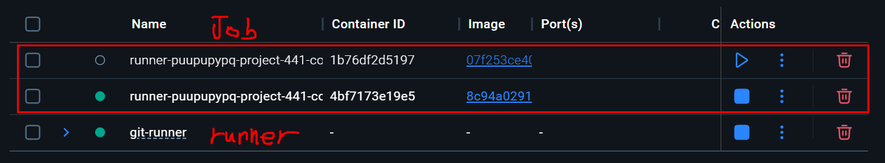

# GitLab Runner Docker 이용 

---

>[GitLab Docker Excutor](https://docs.gitlab.com/runner/executors/docker/)
>
>[WSL2 에 Docker 설치 참고 사이트1](https://www.lainyzine.com/ko/article/how-to-install-docker-on-wsl/)

## 실행 흐름

```bash
.gitlab-ci.yml
  ↓
GitLab Server에서 Job 트리거
  ↓
Runner가 수신
  ↓
Runner가 Docker 이미지 기반 컨테이너 생성 (예: openjdk:17-jdk)
  ↓
컨테이너 안에서 스크립트 실행 (ex: ./gradlew build)
  ↓
완료 후 컨테이너 삭제
```

## 주요 개념

| 항목                 | 설명                                                         |
| -------------------- | ------------------------------------------------------------ |
| **gitlab-runner**    | runner 역할을 하는 주체 (**컨테이너일 수도 있고 직접 설치된 바이너리**일 수도 있음) |
| **executor: docker** | Job 수행 시 docker 명령어를 통해 **별도 컨테이너를 생성**하여 script 실행 |
| **Job 컨테이너**     | `image:`로 지정한 컨테이너 (예: `gradle:7.6.0`)에서 `.gitlab-ci.yml` script 실행 |
| **컨테이너 위치**    | Docker의 기본 원리에 따라 **Runner가 설치된 호스트 OS에 생성**됨 (즉, gitlab-runner "밖") |
| **컨테이너 수명**    | Job 시작 시 생성되고, Job 끝나면 자동으로 삭제됨             |

## Dokcer Excutor 란? 

- GitLab Runner에서의 Docker Excutor 는 **CI/CD 작업을 Docker 컨테이너 안에서 실행**할 수 있게 만들어준다. 
  - `docker` executor는 CI 환경을 컨테이너로 고립시키고, 항상 동일한 환경에서 반복 가능한 빌드를 가능하게 해준다. 
  - `image:` 는 `docker` executor 전용 문법이다. 
- Docker executor는 **GitLab Runner 컨테이너 "외부"에서, 독립적인 컨테이너를 생성해 Job을 실행**한다. 
  - gitlab runner 컨테이너 내부에서 실행하려면 `/var/run/docker.sock:/var/run/docker.sock` 설정과 `docker:dind` 이미지를 사용해야한다. 


## Docker Excutor 방법

- 일반적인 CI/CD (build/test/deploy 등) 에서는 외부 Docker (docker.sock 공유)를 많이 사용한다. 

##### 1. 외부 Docker 사용 (bind-mount 방식)

```bash
-v /var/run/docker.sock:/var/run/docker.sock
```

- Runner 컨테이너가 **호스트 Docker 데몬을 직접 조작**함
- 장점:
  - 빠르고 효율적 (이미지 캐시 공유)
  - 복잡한 설정 불필요
  - 대부분의 CI/CD 용도에 충분
- 단점:
  - 보안 리스크 있음 → runner가 **호스트의 루트 권한**을 가짐
  - 보안 민감 환경에서는 권장 안함

##### 2. DinD (Docker-in-Docker)

```yml
image: docker:20.10
services:
  - docker:dind
```

- Job 컨테이너 안에서 **또 다른 Docker 엔진을 실행**
- GitLab 공식 문서에서도 제공함
- 장점
  - 완전한 격리 (호스트 제어 안함)
  - 복잡한 Docker 빌드 또는 도커 이미지 테스트 가능
- 단점
  - 느림, 불안정
  - 캐시 공유 안됨 → 매번 새로 pull/build
  - Docker 데몬을 컨테이너 안에서 실행해야 해서 `--privileged` 필요 (추가 보안 이슈)

## Docker 접속

```bash
docker exec -it gitlab-runner /bin/sh
```

## Docker Container 등록 방법

### 1. 단일 Docker 로 실행

```bash
docker run -d --name gitlab-runner \
  --restart always \
  -v /srv/gitlab-runner/config:/etc/gitlab-runner \
  -v /var/run/docker.sock:/var/run/docker.sock \  
  gitlab/gitlab-runner:latest
```

- `/var/run/docker.sock`을 마운트
  -  job이 수행될 때 **Runner 내부에서 직접 도커 실행이 아니라, 외부 Docker 데몬을 호출하여 Job 컨테이너 생성**

### 2. Docker Compose 이용 실행 (여러 container 실행시 사용 추천)

```bash
#  GitLab 서버에 Runner 등록
version: "3"

services:
  gitlab-runner-1:
    container_name: gitlab-runner-1
    image: 'gitlab/gitlab-runner'
    restart: always
    volumes:
      - './config:/etc/gitlab-runner'
      - '/var/run/docker.sock:/var/run/docker.sock'
      - '/c/docker-mount:/output/build'
    command:
      - register
      - --non-interactive
      - --locked=false
      - --name=p1
      - --executor=docker
      - --docker-image=docker:20-dind
      - --docker-volumes=/var/run/docker.sock:/var/run/docker.sock
    environment:
      - CI_SERVER_URL=http://[ip]:[port]
      - REGISTRATION_TOKEN=[gitlab-runner registor token]
    networks:
      - docker-network

networks:
  docker-network:
```

```yaml
version: "3"

services:
  gitlab-runner-1:
    container_name: gitlab-runner-1
    image: 'gitlab/gitlab-runner'
    restart: always
    volumes:
      - './config:/etc/gitlab-runner'
      - '/var/run/docker.sock:/var/run/docker.sock'
      - '/c/metabuild/backend/:/output/backend/'
    command:
      - run
    environment:
      - CI_SERVER_URL=http://[ip]:[port]
      - REGISTRATION_TOKEN=[gitlab-runner registor token]
    networks:
      - docker-network

networks:
  docker-network:
```

##### docker-compose 실행

- `up` : compose 로되어있는 container  실행
- `down` : compose 로되어있는 container 삭제
- `-d` : 백그라운드로 실행 ( 안하면 포그라운드라 계속 로그 출력되고 작업하려면 다른 편집기 켜야함 )

```bash
# GitLab 서버에 Runner 등록 (최초 1회)
docker-compose -f docker-compose-register.yml up --abort-on-container-exit

# 실행 
docker-compose -f docker-compose-run.yml up -d

 # 컨테이너 삭제
docker compose -f docker-compose-register.yml down
```

## Build 파일 확인 



- `gitlab-runner` 컨테이너는 **Runner 관리용 컨테이너**일 뿐이고,**CI/CD Job은 이 Runner가 새롭게 띄우는 컨테이너 안에서 실행된다.**

- GitLab Runner는 Job을 실행할 때, **임시 컨테이너를 생성하고 작업이 끝나면 삭제**한다. 

  - 따라서 **Job이 실행 중일 때가 아니면 그 컨테이너는 존재하지 않아 build 된 파일을 확인할 수 없다.**

- 확인방법

  - `pipelines` 에 들어가서 build 파일 다운로드 가능 

  

| 컨테이너         | 용도                                            |
| ---------------- | ----------------------------------------------- |
| `gitlab-runner`  | Runner 등록/제어 용                             |
| `runner-job-xxx` | 실제 빌드 작업 수행 (Gradle 실행, .jar 생성 등) |

